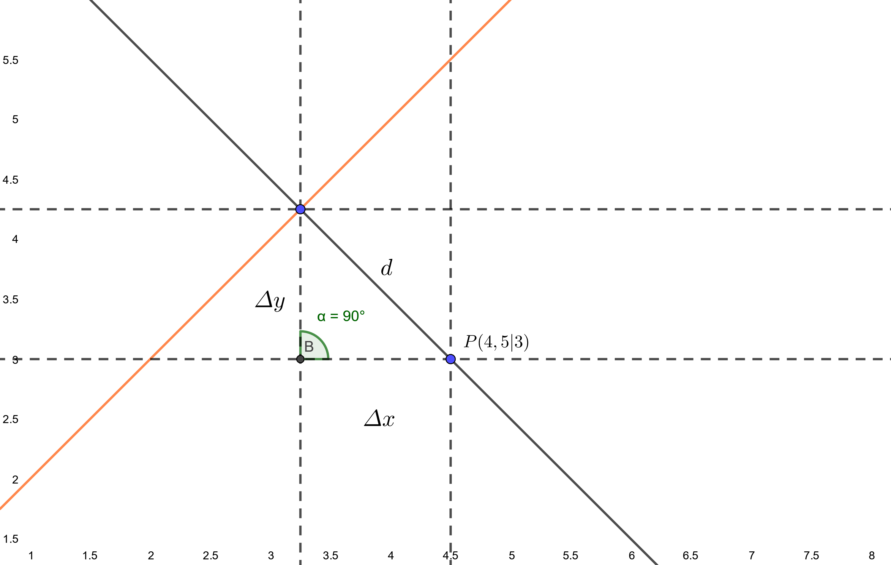
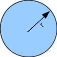
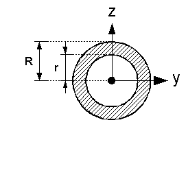
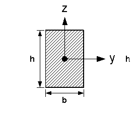
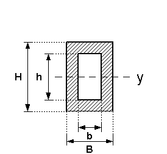
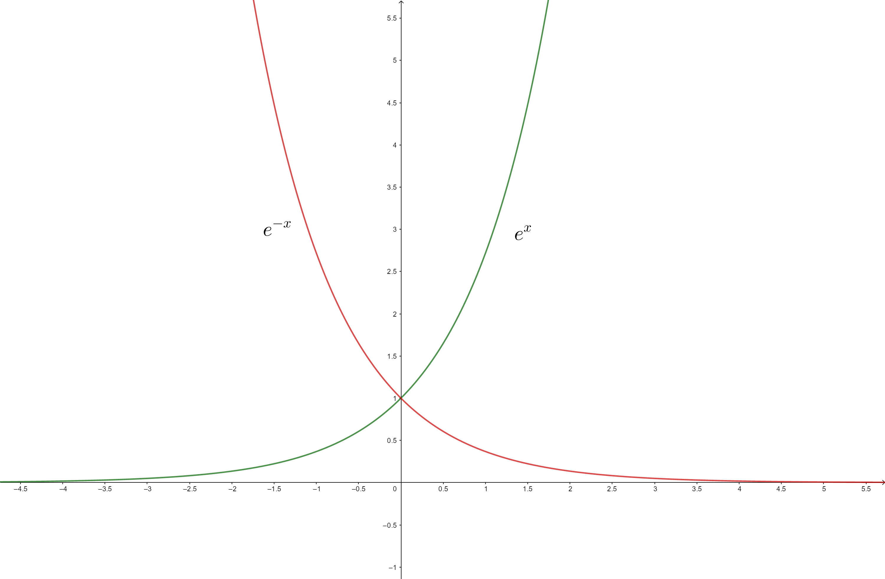

# Taschenrechnerbefehle

| Funktion                                                       | Befehl                                                                                                              |
| -------------------------------------------------------------- | ------------------------------------------------------------------------------------------------------------------- |
| **Analysis**                                                   |
| nach Variable lösen                                            | Weiterführend > *solve*                                                                                             |
| Ableitung                                                      | Berechnungen > *diff*                                                                                               |
| Integral                                                       | Berechnungen > $\int$   *oder*   Keyboard >  Math2 > $\int\limits_\square^\square \blacksquare\!\blacksquare$ |
| LGS                                                            | Keyboard > Math1 > $\begin{cases}\blacksquare\!\blacksquare\\\square\!\square\end{cases}$                           |
| **Stochastik**                                                 |
| Punktwahrscheinlichkeit einer Bernoulli-Kette                  | Verteilungsfunktionen > Diskret > *binominalPDf*                                                                    |
| kumulierte Wahrscheinlichkeit einer Bernoulli-Kette            | Verteilungsfunktionen > Diskret > *binominalCDf*                                                                    |
| Punktwahrscheinlichkeit mit der lokalen Näherungsformel        | Verteilungsfunktionen > Fortlaufend > *normPDf*                                                                     |
| kumulierte Wahrscheinlichkeit mit der globalen Näherungsformel | Verteilungsfunktionen > Fortlaufend > *normCDf*                                                                     |
| Quantile einer Normalverteilung                                | Verteilungsfunktionen > Fortlaufend > *invNormCDf*                                                                  |
| **Vektoren**                                                   |
| Vektor                                                         | Keyboard > Math2 > $\begin{bmatrix}\blacksquare\!\blacksquare\\\square\!\square\end{bmatrix}$                       |
| Betrag                                                         | Vektoren > *norm*                                                                                                   |
| Skalarprodukt                                                  | Vektoren > *dotP*                                                                                                   |
| Kreuzprodukt                                                   | Vektoren > *crossP*                                                                                                 |
| Winkel                                                         | Vektoren >  *angle*                                                                                                 |

# Lineare Gleichungssysteme - LGS
Mit einem LGS kann man Gleichungen mit mehreren Unbekannten/Gleichungen lösen. Ein LGS kann zum Beispiel verwendet werden, wenn man überprüfen möchte, ob ein Punkt auf einer Geraden liegt oder um die Unbekannten einer neuen Trasse zu finden.

Punkt $X(0, -1, 1)$
Gerade 
$$g: \vec{x}=
\begin{pmatrix}
    0 \\
    -2 \\
    0
\end{pmatrix}
+r\cdot
\begin{pmatrix}
    0 \\
    2 \\
    2
\end{pmatrix}
$$
LGS:
$$
\begin{cases}
    I. &\thickspace 0=0+r\cdot 0 \\
    II. &\thickspace -1=-2+r\cdot2 \\
    III. &\thickspace 1=0+r\cdot2
\end{cases}
$$
Hieraus kann man den Wert $\frac{1}{2}$ für den Parameter r ermitteln. Somit liegt der Punkt auf der Gerade $g$

___

# Analysis
## Ableiten
| $f(x)$  |      $x^n$       |
| :-----: | :--------------: |
| $f'(x)$ | $n\cdot x^{n-1}$ |

## Aufleiten
| $f(x)$ |             $x^n$             |
| :----: | :---------------------------: |
| $F(x)$ | $\dfrac{1}{n+1}\cdot x^{n+1}$ |

## Produktregel
$$f(x)=u(x)\cdot v(x)$$

$$f' = u'\cdot v +u\cdot v'$$

## Kettenregel
## Kurvendiskussion
### 1. Symmetrie
### 2. Nullstellen
> $f(x)=0$

### 3. Extrema
> $f'(x)=0$
> 
> $f''(x_E) < 0 \Rightarrow$ Maximum
> 
> $f''(x_E) > 0 \Rightarrow$ Minimum
> 
> $f''(x_E) = 0 \Rightarrow$ kein Extremum, sondern Sattelpunkt

### 4. Wendepunkte
> $f''(x)=0$  
> 
> $f'''(x_W) < 0 \Rightarrow$ Wendepunkt(L-r) 
> 
> $f'''(x_W) > 0 \Rightarrow$ Wendepunkt(R-l) 
> 
> $f'''(x_W) = 0 \Rightarrow$ kein Wendepunkt 

## Abstände
Der Abstand zwischen einem Punkt $P$ und einer Funktion $f$ kann mit dem Satz des Pythagoras hergeleitet werden und resultiert in der folgenden Gleichung für $d$.

$$d(x)=\sqrt{\varDelta x+\varDelta y}$$

$$d(x)=\sqrt{(x-P_x)-(f(x)-P_y)}$$

Möchte man den minimalsten Abstand herausfinden, so muss man das Minimum ermitteln (Ansatz $d'(x)=0$). Hat man das Minimum berechnet, kann der Abstand zwischen den beiden Punkten einfach ausgerechnet werden.

{ height=250px }

## Trassierung
Eine Trassierung ist eine Ansammlung von Funktionen, welche eine gemeinsame Linie bilden. Jede einzelne Funktion hat einen Gültigkeitsbereich. Sie werden folgender Maßen notiert:

$$ f(x)
\begin{cases}
    p_1(x)=-x-3 &\text{für} \thickspace < -2 \cr
    p_2(x)=0,25x^2-2 &\text{für} \thickspace -2 \leq x < 2 \\
    p_3(x)=0,5x-2,25 &\text{für} \thickspace 1 \leq x
\end{cases}
$$

Der zugehörige Graph

{ height=250px }

### Bedingungen
Fehlt eine der Funktionen nicht vorhanden und soll ermittelt werden, so müssen die gegebenen Bedingungen erfüllt werden. Es gibt drei mögliche Bedingungen, welche den Übergang zwischen zwei Funktionen beschreiben: **versatzfrei**, **knickfrei** und **krümmungsruckfrei**. Diese Bedingungen legen fest wie *glatt* ein Übergang ist. Die Anzahl der Bedingungen legt auch automatisch den Grad der Funktion fest. Der Grad einer Funktion ist immer 1 kleiner als die Anzahl der Bedingungen, da man in einem LGS mit $n$ Unbekannten $n+1$ Bedingungen braucht. Soll eine Funktion also an 2 Stellen versatz-, knick- und krümmungsruckfrei sein, so bilden sich 6 Bedingungen und die Funktion ist eine GRF5 (**G**anz**r**ationale **F**unktion 5. Grades).

#### versatzfrei
Ist eine Funktion versatzfrei mit einer anderen verbunden, so laufen sie durch den gleichen Übergangspunkt. Die Bedingung für die Versatzfreiheit lautet demnach:

$$p_1(x_0)=p_2(x_0)=d$$

Mit der Übergangsstelle $x_0$ und y-Koordinate $d$

#### knickfrei
Ist eine Funktion knickfrei mit einer anderen verbunden, so sind haben sie beide die gleiche Steigung am Übergangspunkt. Die Bedingung für die Knickfreiheit lautet demnach:

$$p_1'(x_0)=p_2'(x_0)=d$$

Mit der Übergangsstelle $x_0$ und der Steigung $d$

Wenn die Steigung als Winkel $\alpha$ angegeben ist, so kann dieser mit der folgenden Gleichung in die Steigung $m_p$ umgewandelt werden, um in einer Bedingung verwendet werden zu können.

$$m_p=\tan(\alpha)$$

#### krümmungsruckfrei
Ist eine Funktion krümmungsruckfrei mit einer anderen verbunden, so haben sie beide die gleiche Krümmung am Übergangspunkt. Die Bedingung für die Krümmungsruckfreiheit lautet demnach:

$$p_1''(x_0)=p_2''(x_0)=d$$

Mit der Übergangsstelle $x_0$ und der Krümmung $d$ (meist $0$)

#### Trasse bilden
Möchte man eine Trasse bilden, so muss man zuerst alle Bedingungen aufstellen. Zusätzlich hilft es, sich die allgemeinen Gleichungen mit den dazugehörigen Ableitungen zu notieren.

**Beispiel**: Eine Funktion soll zu einer Trasse hinzugefügt werden. Sie soll an Zwei stellen versatz- und knickfrei sein. Sie soll die Punkte $A(0|3)$ und $B(5|5)$ schneiden und die Steigung an Punkt $A$ $-0,5$ und an Punkt $B$ $0,5$ besitzen.

Allgemeine Gleichungen GRF3:

$$
\begin{aligned}
    p(x)&=ax^3+bx^2+cx+d \\
    p'(x)&=3ax^2+2bx+c
\end{aligned}
$$

|   Punkte:    | Bedingungen: | Gleichungen:                             |
| :----------: | ------------ | ---------------------------------------- |
| $A(0\vert3)$ | $p(0)=3$     | $a\cdot0^3+b\cdot0^2+c\cdot0+d=3$        |
| $B(5\vert5)$ | $p(5)=5$     | $a\cdot5^3+b\cdot5^2+c\cdot5+d=5$        |
|  $m_A=-0,5$  | $p'(0)=-0,5$ | $3\cdot a\cdot0^2+2\cdot b\cdot0+c=-0,5$ |
|  $m_B=0,5$   | $p'(5)=0,5$  | $3\cdot a\cdot5^2+2\cdot b\cdot5+c=0,5$  |

Lässt man dieses LGS nun mit dem CAS lösen, ergeben sich für die Parameter folgende Werte:

$$a=-\dfrac{1}{125}, b=\dfrac{17}{50}, c=-\dfrac{1}{2}, d=3$$

und somit die Funktionsgleichung $p(x)=-\dfrac{1}{125}x^3+\dfrac{17}{50}x^2-\dfrac{1}{2}x+3$

der zugehörige Graph:

{ height=250px }

## Biegelinie

Eine Biegelinie (auch Biegungslinie, Durchbiegungslinie, elastische Linie) ist eine mathematisch einfach beschreibbare Kurve $w$ für die Verformung eines geraden Balkens bei mechanischer Belastung. Sie ist eine ganzrationale Funktion 4. Gerades.

|              |                                  |                                            |
| -----------: | :------------------------------- | :----------------------------------------- |
| Durchbiegung | [w]=$\text{m}$                   | $w(x)=\int{w'(x)dx}$                       |
|     Steigung | [w']=$\text{- -}$                | $E\cdot I\cdot w'(x)=-\int{M(x)}dx$        |
|       Moment | [M]=$\text{N}\cdot \text{m}$     | $E\cdot I\cdot w''(x)=-M(x)=-\int{Q(x)dx}$ |
|    Querkraft | [Q]=$\text{N}$                   | $E\cdot I\cdot w'''(x)=-Q(x)=\int{q(x)dx}$ |
| Streckenlast | [q]=$\dfrac{\text{N}}{\text{m}}$ | $E\cdot I\cdot w''''(x)=q(x)$              |

**daraus folgt:**

|              |                                                       |
| -----------: | :---------------------------------------------------- |
| Durchbiegung | $w(x)=-\dfrac{1}{E\cdot I}\cdot(ax^4+bx^3+cx^2+dx+e)$ |
|     Steigung | $w'(x)=-\dfrac{1}{E\cdot I}\cdot(4ax^3+3bx^2+2cx+d)$  |
|       Moment | $w''(x)=-\dfrac{1}{E\cdot I}\cdot(12ax^2+6bx+2c)$     |
|    Querkraft | $w'''(x)=-\dfrac{1}{E\cdot I}\cdot(24ax+6b)$          |
| Streckenlast | $w''''(x)=-\dfrac{1}{E\cdot I}\cdot24ax$ mit $24a=q$  |

### Flächenträgheitsmoment I
Das Flächenträgheitsmoment $I$ in $m^4$ ist ein Querschnittskennwert. Es kann mit den folgenden Formeln für die jeweiligen Profile berechnet werden:

|          |                                                                        |                                                                          |
| -------: | ---------------------------------------------------------------------- | ------------------------------------------------------------------------ |
|          | { height=120px }       | { height=120px }       |
|    Kreis | $I=\dfrac{\pi\cdot R^4}{4}$                                            | $I=\dfrac{\pi\cdot (R^4 - r^4)}{4}$                                      |
|          | { height=120px } | { height=120px } |
| Rechteck | $I=\dfrac{B\cdot H^3}{12}$                                             | $I=\dfrac{B\cdot H^3-b\cdot h^3}{12}$                                    |

### Elastizitätsmodul E
Das Elastizitätsmodul $E$ in $Pa$ ist eine Materialkonstante. Für technische Biegebalken wird von einem konstanten $E$ ausgegangen, welches dem Tafelwerken entnommen wird.

### Rahmenbedingungen

| Festeinspannung         | Loses Ende                      |
| :---------------------- | :------------------------------ |
| $w(x_{\text{fest}})=0$  | $w''(x_{\text{Loses Ende}})=0$  |
| $w'(x_{\text{fest}})=0$ | $w'''(x_{\text{Loses Ende}})=0$ |

| Fest-Loslagerung(Auflager) | Fest-Loslagerung(Auflager) |
| :------------------------- | :------------------------- |
| $w(x_{\text{Lager}})=0$    | $w(x_{\text{Lager}})=0$    |
| $w''(x_{\text{Lager}})=0$  | $w''(x_{\text{Lager}})=0$  |

### Ermitteln der Biegelinie w

__*Ansatz 1:*__ Streckenlast, Kenngröße $E\cdot I$ und Randbedingungen gegeben

1. ermitteln der Kenngröße $E\cdot I$
2. $w''''(x)$ mit Hilfe der Kenngröße und der Streckenlast aufstellen
3. 4 mal integrieren
4. Rahmenbedingungen nutzen und $w(x)$ mit LGS ermitteln

__*Ansatz 2:*__ Durchbiegung, Kenngröße $E\cdot I$ und Randbedingungen gegeben

1. gegebene Eigenschaften auswerten
2. LGS aufstellen und lösen, um $w(x)$ zu ermitteln

## e-Funktionen
{ height=250px }

### Kurvendiskussion
$$f(x)=x\cdot e^x$$

#### Nullstellen
Ansatz: $f(x)=0$

$$0=\underbrace{x}_{x_1=0}\cdot \underbrace{e^x}_{\ne0}$$

#### Ableitung
Produktregel: $f'=u'\cdot v +u\cdot v'$

##### Erste Ableitung
$$
\begin{aligned}    
f(x)&=\underbrace{x}_{u}\cdot\underbrace{e^x}_{v} \\\\
f'(x)&=1\cdot e^x+x\cdot e^x \\
&=e^x\cdot (1+x)
\end{aligned}
$$

##### Zweite Ableitung
$$
\begin{aligned}
f'(x)&=\underbrace{e^x}_{u}\cdot\underbrace{(1+x)}_{v} \\\\
f''(x)&=e^x\cdot (1+x)+e^x\cdot 1\\
&=e^x\cdot(1+x+1) \\
&=e^x\cdot(2+x)
\end{aligned}
$$

## Integration
Mit der Integration lässt sich der Flächeninhalt unter einer Funktion berechnen.

$$\int\limits_a^bf(x)dx$$

|  Name  | Bedeutung                 |
| :----: | :------------------------ |
|  $a$   | untere Integrationsgrenze |
|  $b$   | obere Integrationsgrenze  |
| $f(x)$ | Integral                  |
|  $dx$  | Differenzial              |

**Beispiel:** Berechnung der Fläche zwischen den Graphen $f_1$ und $f_2$ von $1$ bis $7,5$

$f_1(x)=x+1$

$f_2(x)=\dfrac{1}{2}x$

$$A=\int\limits_1^{7,5}f_1(x)-f_2(x)dx=\int\limits_1^{7,5}(x+1)-(\dfrac{1}{2}x)dx=20,31$$

{ height=250px }

### Integration händisch lösen
Um ein Integral zu lösen, muss zuerst die Stammfunktion $F(x)$ gebildet werden. In diese wird nun zuerst die obere Grenze und dann die untere Grenze eingesetzt.

**Beispiel:**

$f(x)=0,5x$ A=Fläche von $1$ bis $7,5$

$$A=\int\limits_1^{7,5}(0,5x)dx$$

Stammfunktion bilden:

$$F(x)=0,25x^2$$

einsetzen der Grenzen:

$$
\begin{aligned}
    A&=\int\limits_1^{7,5}(0,5x)dx \\
    &= [0,25x^2]^{7,5}_{1} \\\\
    &=(0,25\cdot7,5^2)-(0,25\cdot1^2)\\ 
    &\approx13,81\text{FE}
\end{aligned}
$$

die passende Grafik:

{ height=250px }

___

# Stochastik
## Bernoulli-Ketten
Ein **Bernoulli-Versuch** ist ein Experiment mit genau zwei Ausgängen Treffer und kein Treffer mit der Trefferwahrscheinlichkeit p.

Eine **Bernoulli-Kette** ist die $n$-fache wiederholung dieses Experiments.

$n$: Länge der Kette

$k$: Treffer

$p$: Trefferwahrscheinlichkeit

### Punktwahrscheinlichkeiten:

genau $k$ Treffer:

$$\text{P}(X=k)=\text{B}(n;p;k)=\dbinom{n}{k}\cdot p^k\cdot (1-p)^{n-k}$$

> CAS Verteilungsfunktionen > Diskret > binominalPDf

### kumulierte Wahrscheinlichkeiten:

mehr als $a$ Treffer:

$$\text{P}(X\le a)=\sum_{k=0}^{a}\text{B}(n;p;k)$$

> CAS Verteilungsfunktionen > Diskret > binominalCDf

## Binominalverteilung

Erwartungswert: $\mu=E(X)=n\cdot p$

Varianz: $V(X)=n\cdot p\cdot(1-p)$

Standardabweichung: $\sigma (x)=\sqrt{n \cdot p \cdot (1-p)}$

## Standardabweichung Sigma
### Laplace-Bedingung:

$$\sigma (x)  = \sqrt{n \cdot p \cdot (1-p) } > 3$$

### Sigma-Umgebungen
Die Standardabweichung $\sigma$ legt fest, wie stark die Werte eine Zufallsgröße $X$ um den Erwartungswert $\mu$ streuen.

Wenn die **Laplace-Bedingung** erfüllt ist, dann fällt die Anzahl der Treffer $X$ einer Bernoulli-Kette (der Länge $n$, Erwartungswert $\mu$ und der Standardabweichung $\sigma$) mit:

68% in das Intervall $[\mu-\sigma;\mu+\sigma]$,

95,5% in das Intervall $[\mu-2\sigma;\mu+2\sigma]$,

99,7% in das Intervall $[\mu-3\sigma;\mu+3\sigma]$

### Sigma/n-Umgebungen
Die $\frac{\sigma}{n}$-Umgebungen beschreiben die Abweichung der relativen Häufigkeit ($\frac{X}{n}$) in einer Bernoulli-Kette von der Trefferwahrscheinlichkeit $p$.

Wenn die **Laplace-Bedingung** erfüllt ist, dann fällt die relativen Häufigkeit $\frac{X}{n}$ einer Bernoulli-Kette (der Länge $n$, Erwartungswert $\mu$ und der Standardabweichung $\sigma$) mit:

68% in das Intervall $[p-\frac{\sigma}{n};p+\frac{\sigma}{n}]$,

95,5% in das Intervall $[p-2\frac{\sigma}{n};p+2\frac{\sigma}{n}]$,

99,7% in das Intervall $[p-3\frac{\sigma}{n};p+3\frac{\sigma}{n}]$

## Konfidenzintervalle für eine unbekannte Wahrscheinlichkeit p
Wird bei einer unbekannten Wahrscheinlichkeit $p$ die relative Häufigkeit $h=\frac{X}{n}$ als Schätzwert für $p$ genutzt, so liegt $p$ mit:

68% im Vertrauensintervall $[h-\frac{\sigma}{n};h_n+\frac{\sigma}{n}]$,

95,5% im Vertrauensintervall $[h-2\frac{\sigma}{n};h_n+2\frac{\sigma}{n}]$,

99,7% im Vertrauensintervall $[h-3\frac{\sigma}{n};h_n+3\frac{\sigma}{n}]$

## Sigma-Umgebung c aus Sicherheitswahrscheinlichkeit
Quantile (Anteilswerte) einer Normalverteilung bzw. Hilfsgröße c mit Sicherheitswahrscheinlich $\gamma$ berechnen.

$$c = \Phi^{-1}(\gamma)$$

> CAS Verteilungsfunktionen > Umkehrfkt. > invNormCDf

### Konfidenzellipse
Wird bei einer unbekannten Wahrscheinlichkeit $p$ die relative Häufigkeit $h=\frac{X}{n}$ als Schätzwert für $p$ genutzt, so kann das Vertrauensintervall folgender Maßen bestimmt werden:

VI: $p=h\mp c\cdot\sqrt{\dfrac{p\cdot(1-p)}{n}}$

Mit $c$ als Sigma-Umgebung (wird aus der Sicherheitswahrscheinlichkeit $\gamma$ ermittelt TW S39), h als relative Häufigkeit und n als Stichproben.

## Normalverteilung
Jede binominalverteilte Zufallsgröße $X$ kann näherungsweise mit der Gauß'schen Glockenkurve $\varphi$ beschrieben werden.

### lokale Näherungsformel
Wenn die Laplace-Bedingung erfüllt ist, kann die die Punktwahrscheinlichkeit mit folgender Vorgehensweise berechnet werden:

$$\text{P}(X=k)=\text{B}(n;p;k)\approx\frac{1}{\sigma\cdot\sqrt{2\pi}}e^{-\frac{1}{2}z^2}$$
mit $z=\frac{k-\mu}{\sigma}$

> CAS Verteilungsfunktionen > Fortlaufend > normPDf

### globale Näherungsformel
Wenn die Laplace-Bedingung erfüllt ist, kann die die kumulierte Wahrscheinlichkeit mit folgender Vorgehensweise berechnet werden:

$$\Phi(z)=\frac{1}{\cdot\sqrt{2\pi}}\int\limits_{-\infty}^{z}e^{-\frac{1}{2}t^2}dt$$

$$\text{P}(X\le a)=\sum_{k=0}^{a}\text{B}(n;p;k)\approx\Phi(z)$$
mit $z=\frac{k-\mu+0,5}{\sigma}$

> CAS Verteilungsfunktionen > Fortlaufend > normCDf

#### stetige Zufallsgrößen
Eine stetige Zufallsgröße kann innerhalb eines bestimmtes Intervalls jeden beliebigen Zahlenwert annehmen. (z.B. Körpergröße, Länge einer Schraube, Gewicht)

Bei einer stetig normalverteilten Zufallsgröße muss die Hilfsgröße für $\Phi(z)$ mit: $z=\frac{r-\mu}{\sigma}$ berechnet werden. Da die Punktwahrscheinlichkeit eines Werts $0$ beträgt, muss auch immer eine Intervallwahrscheinlichkeit berechnet werden ($\text{P}(X\le r), \text{P}(X> r),\text{P}(a\le X\le b)$).

___

# Analytische Geometrie
## Vektoren
### Betrag eines Vektors
Der Betrag eines Vektors ist seine Länge.

Beispiel
$$\overrightarrow{AB} = 
\begin{pmatrix}
    2 \\
    4 \\
    4
\end{pmatrix}
$$

$$|\overrightarrow{AB}|=\sqrt{2^2+4^2+4^2} = \sqrt{36} = 6$$

> CAS Vektor > norm

### Skalarprodukt

$$ \vec{a} = 
\begin{pmatrix}
    a_{1} \\
    a_{2} \\
    a_{3}
\end{pmatrix}
,
\vec{b} = 
\begin{pmatrix}
    b_{1} \\
    b_{2} \\
    b_{3}
\end{pmatrix}
$$

$$\vec{a}\cdot\vec{b}=a_{1}b_{1}+a_{2}b_{2}+a_{3}b_{3}$$

> $\vec{a}\cdot\vec{b}$ ist eine reelle Zahl

> CAS Vektor > dotP

### Kreuzprodukt/Normalenvektor

{ height=250px }

$$\vec{a}\times\vec{b}=\vec{c}$$

> $\vec{a}\times\vec{b}$ ist ein Vektor

> CAS Vektor > crossP

### Winkel zwischen zwei Vektoren

$$\cos\alpha=\frac{\vec{a}\cdot\vec{b}}{|\vec{a}|\cdot|\vec{b}|}$$

> CAS Vektor > angle

## Geraden
### Geradengleichungen
Parametergleichung

{ height=250px }

$$g: \vec{x} = \vec{a} + r \cdot \vec{m}$$

* $\vec{x}$ : beliebiger Raumvektor
* $\vec{a}$ : Stützvektor/Ortsvektor
* $\vec{m}$ : Richtungsvektor
* $r$ : Geradenparameter

Normalenform

$$g:\vec{n}_{g}\cdot(\vec{x}-\vec{a})=0$$

* $\vec{x}$ : beliebiger Raumvektor
* $\vec{a}$ : Stützvektor/Ortsvektor
* $\vec{n}_{g}$ : Normalenvektor von $g$

### Punkt auf der Gerade
Wenn der Punkt $X$ (somit der Vektor $\vec{x}$) auf einer Gerade liegt, wird die Geradengleichung

in der Parameterform:

* einen Wert für den Geradenparameter ermöglichen

in der Normalenform:

* $0$ ergeben

### Schnittpunkt zweier Geraden

Schneiden sich zwei Geraden $g_1$ und $g_2$, so kann der Schnittpunkt ermittelt werden, indem die beiden Gleichungen gelichgesetzt werden. Danach wird in einem LGS die Lösung für die beiden Geradenparameter gefunden. Jetzt kann der jeweilige Parameter in eine der Parameter in seine Geradengleichung eingesetzt werden, um ein Vektor $\vec{x}$ zu ermitteln.

$$g_1=g_2$$

$$\vec{a_1} + r \cdot \vec{m_1}=\vec{a_2} + s \cdot \vec{m_2}$$

#### Schnittwinkel zweier Geraden
Schnittwinkel mit den Richtungsvektoren $\vec{m_g}$ und $\vec{m_h}$ der Geraden $g$ und $h$:

$$\cos\varphi=\frac{|\vec{m_g}\cdot\vec{m_h}|}{|\vec{m_g}|\cdot|\vec{m_h}|}$$

### Abstand Punkt von Gerade

Der Abstand zwischen einem Punkt $X$ und einer Gerade $g$ kann mithilfe einer Hilfsebene $H$ berechnet werden.

### Schnittpunkt Gerade und Ebene
Schneidet sich eine Gerade $g$ und eine Ebene $E$, so kann der Schnittpunkt ermittelt werden, indem die Geradengleichung (in Parameterform) in die Ebendengleichung (in Koordinatenform) eingesetzt wird. Danach wird nach den Geradenparameter gelöst, welcher danach für eine Lösung für den Vektor $\vec{x}$ in die Geradengleichung eingesetzt werden muss.

$$
\begin{aligned}
    g&: \vec{x} = \vec{a} + r \cdot \vec{m} \\\\
    E&:ax+by+cz=d
\end{aligned}
$$

$g$ in $E$

$$(a_1+r\cdot m_1) \cdot x + (a_2+r\cdot m_2) \cdot y + (a_3+r\cdot m_3) \cdot z=d$$

#### Schnittwinkel Gerade und Ebene
Schnittwinkel mit dem Richtungsvektor $\vec{m_g}$ der Geraden und dem Normalenvektor $\vec{n}$ der Ebene:

$$\sin\varphi=\frac{|\vec{n}\cdot\vec{m_g}|}{|\vec{n}|\cdot|\vec{m_g}|}$$

## Ebenen
### Ebenengleichung

Parameterform

{ height=250px }

$$E: \vec{x} = \vec{a} + r \cdot \vec{b}+s\cdot\vec{c}$$

* $\vec{x}$ : beliebiger Raumvektor
* $\vec{a}$ : Stützvektor/Ortsvektor
* $\vec{b},\vec{c}$ : Spannvektor
* $r,s$ : Ebenenparameter

Normalenform

{ height=250px }

$$E:\vec{n}_{E}\cdot(\vec{x}-\vec{a})=0$$

* $\vec{x}$ : beliebiger Raumvektor
* $\vec{a}$ : Stützvektor/Ortsvektor
* $\vec{n}_{E}$ : Normalenvektor von $E$

Koordinatenform

$$E:ax+by+cz=d$$

* $a,b,c$ : Koordinaten des Normalenvektors
* $d$ : Skalarprodukt von $\vec{n}$ (Normalenvektor) und $\vec{a}$ (Stützvektor/Ortsvektor)

### Schnittgerade zweier Ebenen
Schneiden sich zwei Ebenen $E_1$ und $E_2$, so kann die Schnittgerade $g$ ermittelt werden, indem eine der beiden Ebenengleichungen (in Koordinaten) in die andere (in Parameterform ) eingesetzt wird. Danach wird nach einen der zwei Parameter gelöst. Die Lösung enthält den anderen Parameter und wird dann in die Ebenengleichung in Parameterform eingesetzt. Diese Ebenengleichung hat jetzt nur noch ein Parameter und macht sie zu einer Geradengleichung.

$$
\begin{aligned}
    E_1&: \vec{x} = \vec{a} + r \cdot \vec{b}+s\cdot\vec{c} \\\\
    E_2&:ax+by+cz=d
\end{aligned}
$$

$E_1$ in $E_2$

$$(a_1+r\cdot b_1+s\cdot c_1) \cdot x + (a_2+r\cdot b_2+s\cdot c_2) \cdot y + (a_3+r\cdot b_3+s\cdot c_3) \cdot z=d$$

resultiert in $g$

$$g: \vec{x} = \vec{a} + r \cdot \vec{m}$$

#### Schnittwinkel zweier Ebenen
Schnittwinkel mit den Normalenvektoren $\vec{n_1}$ und $\vec{n_2}$ der beiden Ebenen:

$$\cos\varphi=\frac{|\vec{n_1}\cdot\vec{n_2}|}{|\vec{n_1}|\cdot|\vec{n_2}|}$$

### Abstand Punkt und Ebene

Der Abstand zwischen dem Punkt $X$ (Vector $\vec{x}$) und der Ebene $E$ (in Normalenform) kann mit folgender Formel berechnet werden. 

$$d(X,E)= \begin{vmatrix}\dfrac{\vec{n}\cdot (\vec{x}-\vec{a})}{|\vec{n}|}\end{vmatrix}$$
