# Lernzettel Physik
## Elektrische und Magnetische Felder 
### Einheiten und Größen
|Größe|Formelzeichen|Einheiten|
|--|--|--|
### Elektrische Felder
#### Coulombsches Kraftgesetz
Das Coulombsche Kraftgesetzt beschreibt die Kraft zwischen zwei punktförmigen Ladungen $q_1$ und $q_2$.

{ height=250px }

$$F_el=\dfrac{1}{4\cdot \pi\cdot \epsilon_0}\cdot \dfrac{Q_1\cdot Q_2}{r^2}$$

* $\epsilon_0$ (Epsilon Null): Elektrische Feldkonstante, abhängig vom Material zwischen den beiden Ladungen

Da die Feldkonstante meist bekannt ist bleibt der erste Teil der Gleichung ($\frac{Q_1\cdot Q_2}{r^2}$) konstant ist, hängt die Kraft nun nur noch vom Abstand und natürlich von den beiden Ladungen ab.

**Folgerungen:**

> Sind die Vorzeichen beider Ladungen gleich, stoßen sie sich ab.

> Sind die Vorzeichen unterschiedlich, ziehen sie sich an.

> Je größer der Abstand, desto kleiner die Anziehungs-/ Abstoßungskraft

#### Die Feldidee
"Gleichnamige Ladungen stoßen sich ab" und "ungleichnamige Ladungen stoßen ziehen sich an" ist eine einfache Beobachtung, die von der Vorstellung ausgeht Kräfte unmittelbar über Entfernungen wirksam werden. Faraday ordnete dem Umfelder von Ladungen eine Eigenschaft zu, die er elektrisches Feld nannte. Das elektrische Feld trifft nun als Vermittler für die die wirkenden Kräfte auf.

Zur Untersuchung von Feldern bringt man eine kleine Ladung in den Raum zwischen zwei Ladungen und ermittelt die Kraft auf diese Ladung. DIe Kräfte zeigen entlang von Linien, den sogenannten Feldlinien, welche von "+" nach "-" gehen.

> Elektrisches Feld $\Rightarrow$ Kraft pro Ladung

> Feldlinien von "+" nach "-"

Formel für das Elektrische Feld:

$$\vec{E}=\dfrac{\vec{F}}{q}\text{in}\dfrac{\text{N}}{\text{C}}$$

#### Plattenkondensator

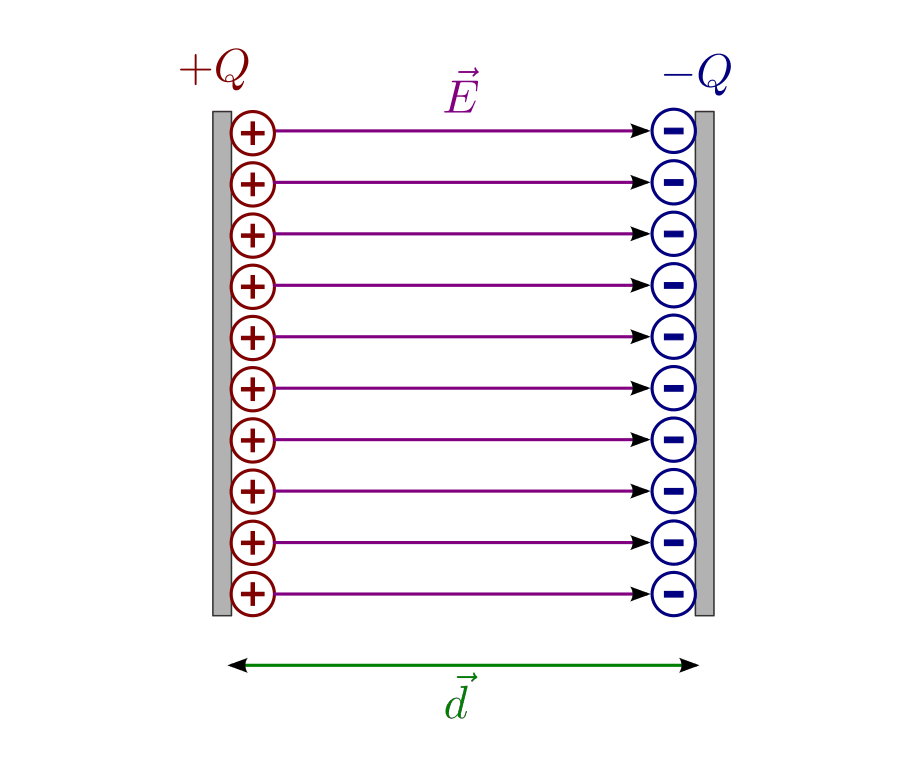{ height=250px }

Da die Spannung = Energie pro Ladung,

$$U=\dfrac{W}{q}$$

und die Energie/Arbeit = Kraft mal Distanz

$$W=F\cdot d$$

Lässt sich folgender Zusammenhang ermitteln:

$$
%U=\dfrac{E\cdot \sout{q}\cdot d}{\sout{q}}=E\cdot d
U=\dfrac{E\cdot q\cdot d}{q}=E\cdot d
$$

Daraus resultiert die Formel für das homogene Feld im Plattenkondensator:

$$E=\dfrac{U}{d}$$

#### Kondensator
### Magnetische Felder
#### Feldlinien und Feldgrößen
##### Pole und Richtung des Magnetfeldes
Ungleichnamige Pole ziehen sich an, gleichnamige stoßen sich ab. Wird ein Magnet zerbrochen, so ergibt sich wieder die entsprechende Ausrichtung und auch Kräfte zwischen dem zerbrochenen Magneten bleibt qualitativ erhalten. Daraus kann unmittelbar gefolgert werden, dass es keine magnetischen Monopole gibt. Magnete sind Dipole.

> Im Raum um einen Magneten besteht ein magnetisches Feld. Die **Feldlinienrichtung** wird außerhalb eines Magneten als vom **Nordpol zum Südpol** laufend festgelegt.

> Es ist üblich, dass der N**o**rdpol r**o**t und der S**ü**dpol gr**ü**n (oder bla**u**) gekennzeichnet wird.

> Magnetische Feldlinien haben keinen Anfang und kein Ende, sie sind in sich geschlossen.

> Je dichter die Feldlinien, desto größer ist die magnetische Flussdichte an diesem Ort.

##### Magnetischer Fluss
Beschreibt die gesamte magnetische Wirkung eines Magneten auf seine Umgebung. Er ist ein Maß für die "Gesamtzahl der Feldlinien"

> **Formelzeichen:** $\Phi$ (Phi)

> **Einheit:** $[\Phi]=1\text{Wb}=1\text{Vs}$ (Weber, Voltsekunde)

##### Magnetische Flussdichte/Feldstärke
Die Flussdichte gibt an, wie viel Fluss pro senkrecht durechsetzter Fläche vorhanden ist. Sie ist also ein Maß dafür wie dicht die Feldlinien beieinander liegen und damit, wie stark die Wirkung des Magnetfeldes an einem Ort ist.

> **Formelzeichen:** $B=\dfrac{\Phi}{\text{A}}$

> **Einheit:** $[B]=1\text{T}=1\dfrac{\text{Vs}}{\text{m}^2}=1\dfrac{\text{N}}{\text{Am}}$ (Tesla)

#### Magnetfeld eines stromdurchflossenen Leiters und Spule
##### einzelner Leiter
{ height=250px }
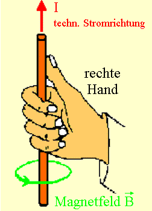{ height=250px }

Die magnetische Flussdichte/Feldstärke eines stromdurchflossenen Leiters mit dem Abstand $r$ beträgt:

$$B=\mu_0\cdot \dfrac{I}{2\cdot\pi\cdot r}$$

mit der magnetische Feldkonstanten $\mu_0$.

##### Spule
Mehrere Leiterschleifen ergeben eine Spule mit $N$ Windungen. Das Feldbild ergibt sich aus der Überlagerung des Stromes in den Windungen. Im inneren der Spule drängen sich die Feldlinien eng beieinander, die Flussdichte ist gegenüber einem gesteckten Leiter größer. Spulen haben im Außenraum ein sehr schwaches Magnetfeld, wohingehend der Innenraum ein sehr starkes Magnetfeld besitzt, welches näherungsweise homogen ist.

{ height=250px }

Die Richtung des Feldes erhält man mithilfe der Rechten-Faust-Regel (wie beim einzelnen Leiter, jedoch sind die Bezeichnungen getauscht) mit dem Daumen als B-Feld Richtung und den restlichen Fingern als Stromrichtung.

Die Flussdichte einer Spule kann unter der Voraussetzung, dass sie lang ist (Länge erheblich länger als Durchmesser) mit folgender Gleichung berechnet werden:

$$B=\mu_0\cdot\dfrac{N\cdot I}{l}$$

$\Rightarrow$ Die Flussdichte ist unabhängig vom Durchmesser!

Die Flussdichte kann (bei sonnst gleichen Bedingungen) durch Einbringen eines ferromagnetisches Werkstoffes in das Feld erhöht werden. Oft verwendet wird z.B. ein Eisenkern. Zunächst liegen die Elementarmagnete im Eisen regellos durcheinander, ihre magnetische Wirkungen heben sich nach außen auf. Nach dem Einschalten des Spulenstroms richten sich die Elementarmagnete - aufgrund der magnetischen Wirkung der Spule - aus. Nun "addieren" sich ihre magnetischen Wirkungen und verstärken diejenige der Spule.

##### Spulenpaar
Das Helmholtz Spulenpaar besteht aus zwei sehr kurzen identischen Spulen. Sie sind in einem Abstand angeordnet, der genau ihrem Radius entspricht und werden vom selben Strom gelichsinnig durchflossen. Die stark homogenen Felder der beiden Einzelspulen überlagern (addieren sich vektoriell) gerade so, dass das Feld zwischen den Spulen näherungsweise homogen und konstant ist.

{ height=250px }

#### Kraft auf einen stromdurchflossenen Leiter
Befindet sich ein stromdurchflossener Leiter in einem Magnetfeld (Beispiel Stromwaage), so ist die Kraft proportional zur Länge $l$ des Leiters als auch der Strom $I$. Damit kann die magnetische Flussdichte/Feldstärke $B$ mit 
$$\tag*{definiert werden.}B=\dfrac{F}{l\cdot I}$$

Diese gilt aber nur wenn alle drei Größen vektoriell senkrecht aufeinander stehen.

{ height=250px }

Möchte man die Kraft berechnen, die auf diesen Leiter wirkt, so ergibt sich:

$$F=l\cdot I\cdot B\cdot\sin(\alpha)$$

mit $\alpha$ als Winkel zwischen $I$ und $B$.

#### Lorentzkraft
Wenn man sich die [Kraft die auf einen stromdurchflossenen Leiter](#kraft-auf-einen-stromdurchflossenen-leiter) wirkt genauer anguckt, stellt man fest, dass die Kraft nicht auf den Leiter in dem Sinne wirkt, sondern eher auf die Ladungsträger innerhalb des Leiters. Die auf den Leiter wirkende Kraft ist die Summe der Kräfte die jeweils auf die bewegten Ladungsträger im Magnetfeld wirken. Die Kraft die auf bewegte Ladungsträger im Magnetfeld wirkt, nennt man Lorentzkraft.

{ height=250px }

Der Strom $I$ besteht aus $N$ Elektronen mit der Elementarladung $e$, die mit der Driftgeschwindigkeit $v$ durch den Leiterquerschnitt strömen. Die [Gesamtkraft](#kraft-auf-einen-stromdurchflossenen-leiter) setzt sich aus den $N$ Einzelkräften $F_L$ auf jedes der $N$ Elektronen, das zum Stromfluss beiträgt.

$$F_L=q\cdot v\cdot B$$

#### Hall-Effekt
{ height=250px }

Wenn in einem Leiter der Strom $I$ fließt, so bewegen sich die Ladungsträger (hier Elektronen) in ihm. Wenn dieser auch zusätzlich von einem $B$-Feld durchsetzt werden, dann werden sie (in der Grafik) in Betrachterrichtung durch die [Lorentzkraft](#lorentzkraft) abgelenkt. Die Elektronen sammeln sich an dieser Seite. So entsteht auf der betrachternahen Seite ein Elektronenüberschuss und gegenüber eine Elektronenmangel.

Daraus folgend baut sich ein elektrisches Feld über die Seite b auf. Das bedeutet, dass nun zusätzlich eine elektrische Feldkraft $F_{el}$ in entgegengesetzter Betrachterrichtung wirkt. Die Ladungstrennung endet (nach einer sehr kurzer Zeit), wenn sich die Feldkräfte Lorentzkraft $F_L$ und Coulombkraft $F_{el}$ das Gleichgewicht halten. Die Ladungsträger fließen also tatsächlich (wieder) in Längsrichtung des Leiters.

Die sogenannte Hallspannung lässt sich dann zwischen den beiden Seiten mit den getrennten Ladungsträgern messen.

Sie lässt sich vereinfacht aus dem Kräftegleichgewicht herleiten (laut KC):

$$
\begin{aligned}
    F_{el}&=F_L\\
    E\cdot e&=e\cdot v\cdot B\\
    U_H&=E\cdot e=e\cdot v\cdot B
\end{aligned}
$$

Die komplette Gleichung für die Hallspannung lautet (Mit der Hallkonstanten $R_H$, eine Materialkonstante):

$$U_H=R_H\cdot \dfrac{I\cdot B}{d}$$

Da die Hallspannung proportional zu $B$ ist, ist sie sehr gut geeignet um die Flussdichte $B$ zu messen. Eine Vergrößerung des Querstroms $I$ ist auch sinnvoll, da die Hallspannung auch proportional zur Driftgeschwindigkeit $v$ ist. Wichtig ist noch, dass für die tatsächliche technische Ausführung meist keine metallische Leiter, sondern Halbleiter genutzt werden, da diese weniger freie Ladungsträger haben, welche bei gleichem Strom eine deutlich höhere Driftgeschwindigkeit besitzen.

#### Induktion
#### Drei-Finger-Regel
{ height=250px }

* **Daumen** - Ursache:

    Zeigt in die technische Stromrichtung (von + nach -)

* **Zeigefinger** - Vermittlung:
  
    Zeigt in die Magnetfeldrichtung (von N nach S)

* **Mittelfinger** - Wirkung:

    Gibt die Kraftrichtung an

## Schwingungen und Wellen

## Quanten und Atomphysik
### Versuche
#### Wiensches Geschwindigkeitsfilter
##### Verwendung
Ein Geschwindigkeitsfilter dient hauptsächlich dazu, aus dem Teilchenstrahl einer Ionenquelle nur diejenigen Teilchen den Filter passieren zu lassen, die eine bestimmte Geschwindigkeit besitzen, während alle übrigen im Filter „hängenbleiben“ – anders gesagt, kann man damit einen Teilchenstrom mit nur einer genau definierten Geschwindigkeit „präparieren“, aber auch die Geschwindigkeit unbekannter geladener Teilchen bestimmen. Das Filter wird zum Beispiel in einem [Massenspektrometer](#massenspektrometer) genutzt.

##### Aufbau
{ height=250px }

Im Filter stehen ein homogenes elektrisches Feld und ein homogenes magnetisches Feld senkrecht aufeinander und senkrecht zur Einschussrichtung der geladenen Teilchen. Damit ein Teilchen nach dem Passieren der Eintrittsblende in gerader Bahn die Austrittsblende erreichen kann, muss an jedem Punkt Kräftegleichgewicht $F_\text{el}=F_{\text{L}}$ herrschen:
$$
\begin{aligned}
    F_\text{el}&=F_{\text{L}}\\
    q\cdot E&=q\cdot v\cdot B\\\\
    v&=\dfrac{E}{B}
\end{aligned}
$$
Nur Teilchen mit dieser Geschwindigkeit können das Filter passieren. Alle anderen werden nach oben oder unten abgelenkt und erreichen daher die Öffnung der Ausgangsblende nicht.

#### Massenspektrometer
##### Aufbau
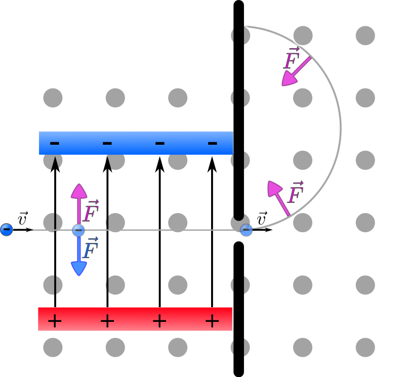{ height=250px }

##### Verwendung
Bei einem Massenspektrometer werden Teilchen eines Ionenstrahls zuerst mithilfe eines [Geschwindigkeitsfilters](#wiensches-geschwindigkeitsfilter) mit einer bekannten Geschwindigkeit rausgefiltert, um dann z.B. mittels eines Magnetfeldes die verschiedenen Massen zu trennen.

##### Bewegung von Teilchen im homogenen Feld
Die Teilchen bewegen sich auf einem Kreisbogen. Dies wird durch den Zusammenhang $F_\text{L}=F_{\text{Z}}$ beschrieben:
$$
\begin{aligned}
    F_\text{L}&=F_{\text{Z}}\\
    q\cdot v\cdot B&=\dfrac{m\cdot v^2}{r}\\\\
    r&=\dfrac{m\cdot v}{e\cdot B}
\end{aligned}
$$

Da die Geschwindigkeit $v$ und die Größe der Flussdichte $B$ bekannt sind, hängt der Radius der Kreisbahn von der Masse $m$ des Teilchens ab. Somit bewegen sich Teilchen verschiedener Massen auf verschieden Kreisbahnen. Dies wird genutzt, um Teilchen eines Ionenstrahls zu trennen.

#### Franck-Hertz-Versuch
##### Aufbau
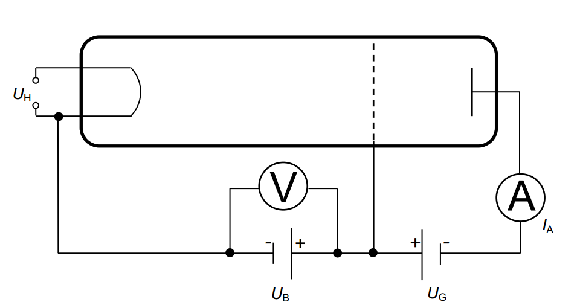{ height=250px }

##### Bestandteile

* $\text{U}_\text{H}$ **Heizspannung**:
  
    Die Heizspannung hat die Funktion, mittels Glühelektrischem Effekt freie Elektronen in der Röhre zur Verfügung zu stellen.

* $\text{U}_\text{B}$ **Beschleunigungsspannung**:

    Die Beschleunigungsspannung hat die Funktion, zwischen Kathode und Gitter ein elektrisches Feld zur Verfügung zu stellen, in dem Elektronen beschleunigt werden.

* $\text{U}_\text{G}$ **Gegenspannung**:

    Die Gegenspannung sorgt dafür, dass zwischen Gitter und Anode ein Gegenfeld erzeugt wird. Dadurch wird erreicht, dass nur Elektronen, die eine Mindestenergie beim Durchfliegen des  Gitters haben, die Anode erreichen und vom Strommesser gemessen werden.

* $\text{I}_\text{A}$ **Strommesser**:
  
    Das Strommessgerät misst den Anodenstrom und damit die Anzahl der Elektronen je Zeiteinheit, die die Anode erreicht.

##### Bewegung eines Elektrons in der Röhre

Elektronen treten aufgrund des [Glühelektrischen Effekts](#glühelektrischer-effekt) aus der Kathode aus. Sie werden im elektrischen Feld zwischen Kathode und Gitter beschleunigt. Dabei kommt es zu Zusammenstößen mit den Hg-Atomen (Quecksilber-Atomen). Aufgrund ihrer Trägheit durchfliegen die meisten Elektronen das Gitter und gelangen in das Gegenfeld. Nur Elektronen, die im Bereich des Gitters genügend Energie besitzen, können das Gegenfeld überwinden und die Anode erreichen. Sie fließen über die Anode ab und bilden den Anodenstrom $\text{I}_\text{A}$. Ansonsten kehren sie im Gegenfeld um und fließen über das Gitter ab.

So bildet sich ein Minimum im Messschrieb, wenn sich eine Anregungszone direkt vor dem Gitter befindet, da die Elektronen von dieser Anregungszone bis zum Gitter nicht ausreichend beschleunigt werden, um das Gegenfeld zu überwinden.

##### Diagramm

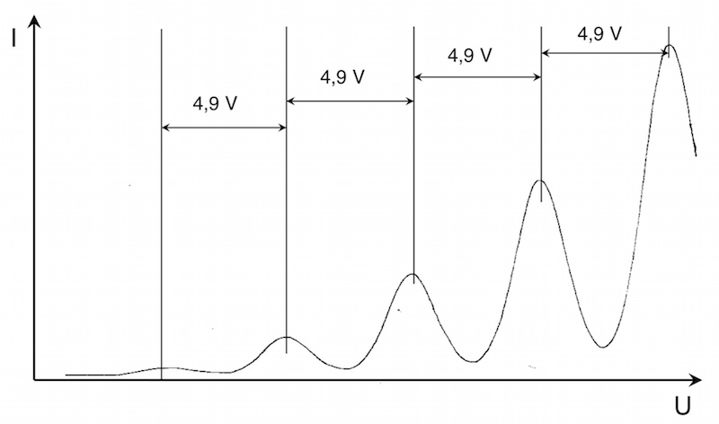{ height=250px }

**Hinweis:** Es werden die Maxima genutzt um die Anregungsenergie festzustellen, da diese gegenüber den Minima leichter zu Identifizieren sind. Dies ist möglich, da die Maxima und Minima ungefähr den gleichen Abstand haben.

##### Stöße der Elektronen mit den Hg-Atomen

Die Elektronen stoßen ständig mit Hg-Atomen zusammen. Haben sie eine Energie bis zu 4,8eV, so sind die Zusammenstöße elastisch und die Elektronen behalten ihre Energie. Haben die Elektronen genügend Energie (bei Quecksilber ca. 4,8eV) so ist der Stoß unelastisch und die Elektronen geben ihre Energie an die Hg-Atome ab. Anschließend werden die Elektronen erneut beschleunigt.

Das Hg-Atom hat die Energie aufgenommen und befindet sich nun in einem angeregten Zustand. Dieses möchte in sein Grundzustand zurück (Abregung) und gibt die Energiedifferenz in Form eines Photons ab. Die Energiedifferenz legt die Frequenz/Wellenlänge des Photons fest:

$$
\begin{aligned}
    \text{E}_\text{Ph}&=h\cdot f \\\\
    f&=\dfrac{\text{E}}{h}
\end{aligned}
$$

##### Ergebnisse des Franck-Hertz-Versuchs

* Elektronen können bei Stößen mit Atomen nur ganz bestimmte Energieportionen abgeben
* Die Größe der Energie ist abhängig von der Atomsorte/Element
* Elektronen einer Sorte können nur diskrete Anregungszustände einnehmen
* Die möglichen Energien werden in Energieniveauschema/Termschema dargestellt

#### Röntgenröhre
##### Aufbau

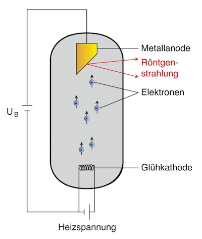{ height=250px }

##### Bestandteile

* $\text{U}_\text{H}$ **Heizspannung**:

    Die Heizspannung hat die Funktion, mittels Glühelektrischem Effekt freie Elektronen in der Röhre zur Verfügung zu stellen.

* $\text{U}_\text{B}$ **Beschleunigungsspannung**:

    Die Beschleunigungsspannung hat die Funktion, zwischen Kathode und Anode ein elektrisches Feld zur Verfügung zu stellen, in dem Elektronen beschleunigt werden. 

* **Anode**:

    Die Anode ist das Ziel der beschleunigten Elektronen, In ihr wird die Röntgenstrahlung ausgelöst.

##### Durchführung

Bei der Röntgenröhre werden Elektronen mit kinetischer Energie genutzt, um Photonen zu erzeugen. Die Energie der Elektronen wird durch Abbremsung ganz oder teilweise (in Stufen) in Photonen umgesetzt. Hierbei entsteht die sogenannte [Bremsstrahlung](#bremsstrahlung).

#### Beugung und Interferenz am Gitter
Mit dem folgenden Versuch können Wellenlängen von unbekannten Lichtquellen bestimmt werden.

##### Aufbau
Um Interferenzmuster auf einem Schirm zu erzeugen wird eine kaum divergente Lichtquelle (meistens ein Laser) und ein ein Doppelspalt oder Gitter benötigt.

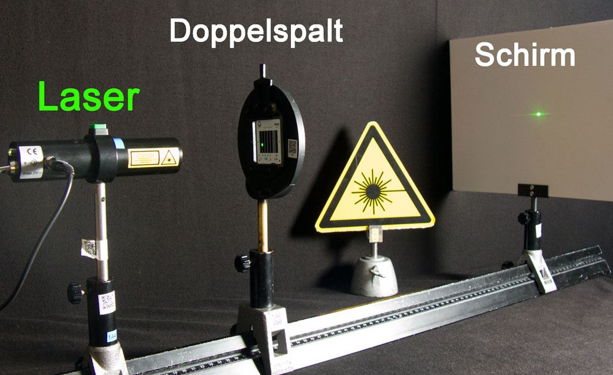{ height=250px }

{ height=250px }

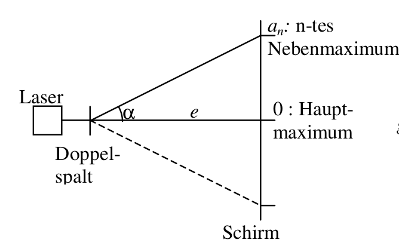{ height=250px }

Wenn der Abstand zwischen Spalt und Schirm deutlich größer als der Spaltabstand ist (~ einige Meter bis <1mm), dann kann man die Ausbreitungsrichtungen als näherungsweise parallel annehmen und die folgenden Zusammenhänge aufstellen:

$$\sin(\alpha)=\dfrac{\Delta s}{g}$$

Für Maxima:
$$\sin(\alpha)=\dfrac{n\cdot \lambda}{g}$$

Für Minima:
$$\sin(\alpha)=\dfrac{(2n-1) \cdot \dfrac{\lambda}{2}}{g}$$

##### Entstehung der Maxima
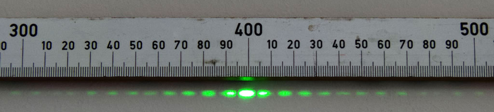{ height=250px }

Trifft kohärentes Licht z.B. aus einem Laser auf ein Gitter, so entsteht im Wellenmodell des Lichts an jeder Öffnung eine Elementarwelle, die untereinander alle gleichphasig sind. Bis zum entfernt aufgestellten Schirm müssen sie, abhängig vom Winkel zum betrachteten Ort auf dem Schirm, unterschiedlich lange Wegstrecken zurücklegen, so dass ein Gangunterschied zwischen den Elementarwellen auftritt. Alle Elementarwellen interferrieren am Ort des Schirms. Ist der Gangunterschied ein ganzzahlig Vielfaches der Wellenlänge, interferrieren sie konstruktiv und es kann eine große Lichtintensität beobachtet werden, die als Maximum bezeichnet wird. Interferrieren sie destruktiv kann ein Minimum, also die "Abwesenheit" von Licht beobachtet werden.

#### Vakuum Photozelle
##### Aufbau
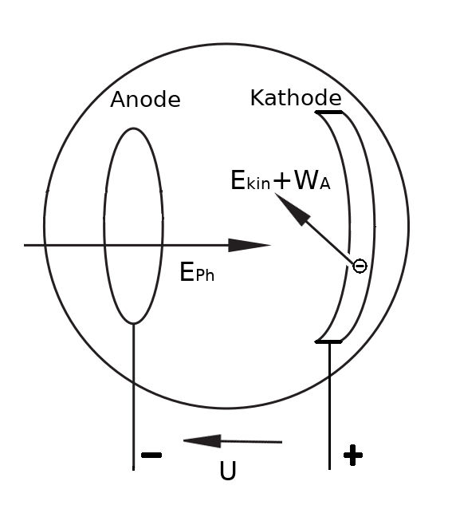{ height=250px }

Eine Anodenring und eine Kathode werden innerhalb eines Vakuumgefäßes platziert. Zusätzlich wird eine Photonenquelle benötigt, welche monoenergetisch sein sollte und genügend Anzahl von Photonen zur Verfügung stellen muss. Hierzu wird eine Hg-Dampflampe eingesetzt. Mit sehr schmalbandigen Filtern wird jeweils eine Spektrallinie des Hg-Linienspektrums ausgefiltert.

##### Theorie
Treffen Photonen auf eine Metalloberfläche, so können sie ihre Energie an Elektronen im Metall abgeben. Ist die Energie größer als die Austrittsarbeit $W_A$, so können die Elektronen die Metalloberfläche verlassen. Sie lagern sich im Anodenring an, der sich dadurch negativ auf die Spannung U auflädt und ein E-Feld zwischen Anodenring und Kathode aufbaut. Die weitere Aufladung findet solange statt, bis die kinetische Energie $E_{kin}$ der Elektronen beim Austritt aus der Oberfläche nicht mehr ausreicht, um gegen das E-Feld anzukommen. Die Elektronen haben im Anodenring gegenüber der Kathode die potentielle Energie
$$E_{pot}=\text{e}\cdot\text{U}=E_{kin}$$

Eine Energiebilanz liefert: $\text{e}\cdot\text{U}=h\cdot f-W_A$

Werden $f$ und $\text{U}$ gemessen, so sind das Wirkungsquantum $h$ und die Austrittsarbeit $W_A$ des verwendeten Metalls bestimmbar.

##### Diagramm

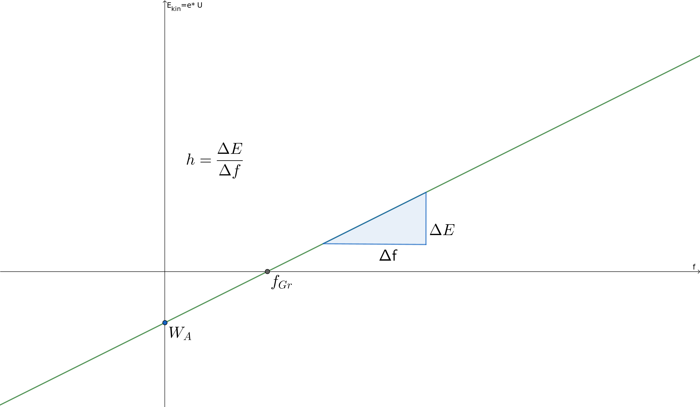{ height=250px }

#### Fluoreszenz an Kunststoffplatte
Beobachtungen beim Durchgang und Streuung von Photonen an einer transparenten Kunststoffplatte, die fluoreszierende Farbstoffe enthält.

##### Aufbau
{ height=250px }

##### Diagramme
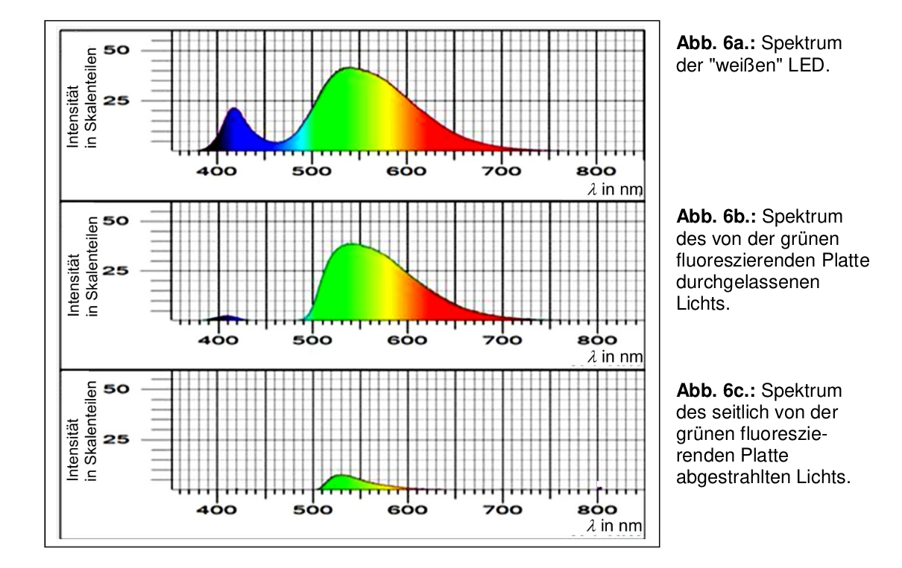{ height=250px }

##### Deutung
In der Platte nimmt der Leuchtstoff kurzwellige Photonen auf und strahlt mittels [Fluoreszenz](#fluoreszenz) langwellige Photonen ab. Die Emission erfolgt in beliebige Richtungen, so dass die Photonen die Platte auch seitlich verlassen können.

#### Michelson-Interferometer
##### Aufbau
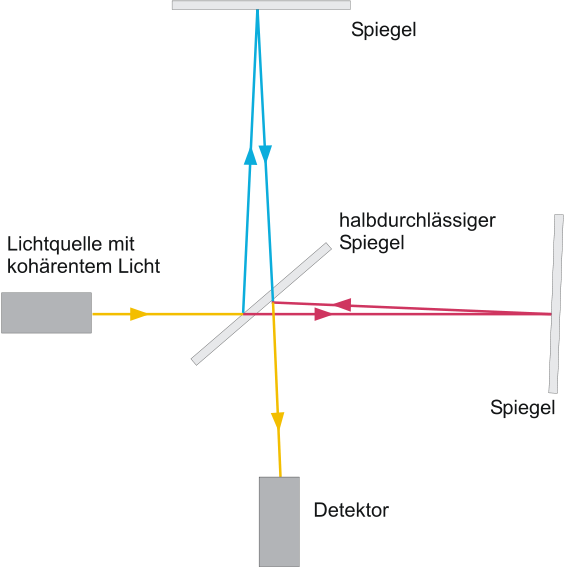{ height=250px }

##### Ablauf
Beim Michelson-Interferometer trifft das Licht der Lichtquelle als erstes auf den halbdurchlässigen Spiegel, an dem es sich aufteilt. Ein Teil der des Licht durchläuft den Spiegel (rot), der andere wird reflektiert (mit Einfallswinkel = Ausfallswinkel)(blau). Beide werden dann jeweils nocheinmal von einem undurchlässigen Spiegel reflektiert und treffen wieder auf den halbdurchlässigen Spiegel, wobei sie ihn wieder so durchlaufen, dass sie in Richtung des Detektors parallel verlaufen. Beide Wellen haben jetzt einen gewissen Weg zurückgelegt. Ist die Differenz beider Wege ein vielfaches der Wellenlänge, kommt es zur [konstruktiven Interferenz](#interferenz).

Das Michelson-Interferometer kann somit genutzt werden, um die Wellenlänge der Lichtquelle zu bestimmen.

Für die Wegdifferenz $\Delta x$ und zwei benachbarten Maxima gilt:

$$\Delta x = \dfrac{\lambda}{2}$$

Dieser Zusammenhang gilt, da bei Verschiebung eines einzelnen Spiegels die Welle den Wegunterschied der beiden Spiegel $\Delta x$ doppelt durchlaufen muss (Hin- und Rückweg). Somit beträgt die Wellenlängenänderung/Gangunterschied $2\cdot \Delta x$.

#### He-Ne-Laser
Laser steht für light amplification by stimulated emission of radiation.
Ein Laser stahlt mithilfe  der [stimulierten Emission](#absorption-und-emission) ein intensives, kaum divergentes Lichtbündel aus.

##### Aufbau
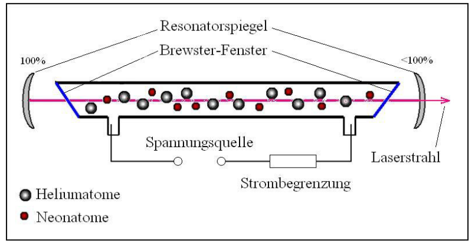{ height=250px }

##### Optimierter Aufbau
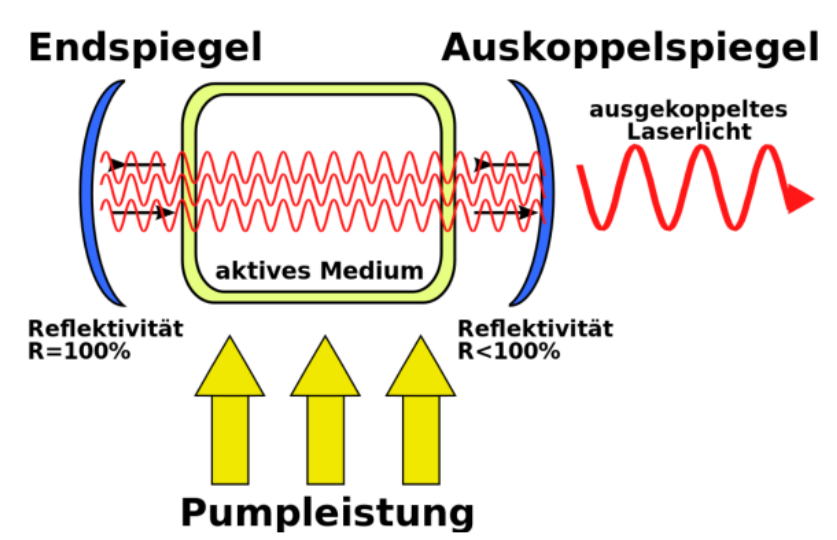{ height=250px }

Nach einer ersten spontanen Emission in einem Gasvolumen könnte sich in einem gepumpten Medium die verstärkte Laserwelle (theoretisch) in jede beliebige Richtung ausbreiten. Damit es zu einer sehr großen Verstärkung kommt und um die Richtung der Verstärkung vorzugeben, wird das Gas in einer Kapilarröhre (kleiner Durchmesser, große Länge) zwischen zwei Spiegeln betrieben.

Die Welle bildet sich als stehende Welle zwischen den Spiegeln aus, die Photonen durchlaufen also das Medium mehrfach. Der Abstand der Endspiegel wird auf ein ganzzahliges Vielfaches der Wellenlänge eingestellt, so dass konstruktive Interferenz innerhalb des Aufbaus besteht. Er wird daher auch als Resonator bezeichnet. 

Ein Endspiegel ist teildurchlässig (wenige Prozent). Hier wird das Laserlicht zur Nutzung ausgekoppelt. (Auch) Die ausgekoppelte Leistung muss durch das Pumpen ständig nachgeliefert werden.

##### Vorraussetzungen für einen Laser
Da Atome eines Gases am meisten sich im Grundzustand befinden, würde die simple Vorhandenheit eines Gases nicht viel Erfolg in einem Laser bringen. Das liegt daran, dass sich nur ein paar Atome im angeregten Zustand befinden. Wenn diese ihre Energie durch eine spontane Emission über ein Photon abgeben, ist es sehr wahrscheinlich, dass dieses von einem anderen Atom absorbiert (Resonanzabsorption) wird. Das führt dazu das die eingebrachte Energie in beliebige Richtungen abgestrahlt wird.

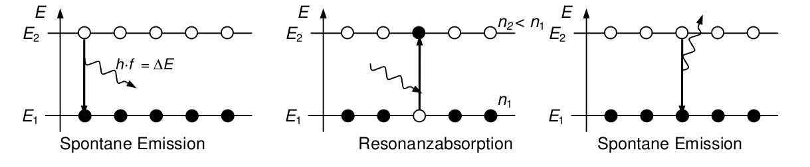{ height=250px }

Um eine möglichst hohe Wahrscheinlichkeit für eine stimulierte Emission zu erreichen, muss eine Besetzungsinversion des Gases vorhanden sein (also mehr Atome in einem höheren Energiezustand). Durch die Besetzungsinversion ist es wahrscheinlicher, dass ein Photon eine stimulierte Emission auslöst, als dass es absorbiert wird. Geht nun eine Atom in den Grundzustand, kann das emittierte Photon eine stimulierte Emission in den anderen Atomen auslösen. Da Photonen einer stimulierten Emission mit gleicher Phasenlage und Raumrichtung emittiert werden, findet eine Lichtverstärkung statt.

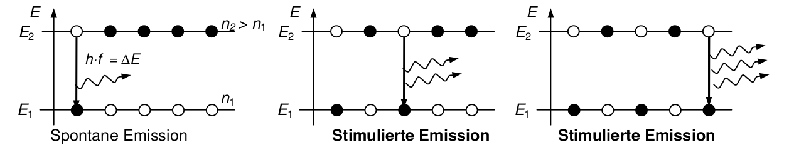{ height=250px }

Da eine Besetzung normalerweise nicht vorkommt, wird sie künstlich hervorgerufen, in dem das Neongas gepumpt wird.

##### Pumpen des Neongas
Im Helium-Neon Laser wird Neon als aktives (Laser-)Medium und Helium für das Pumpen genutzt, wobei etwa 5 mal so viele Heliumatome wie Neonatome im Gasvolumen vorhanden sind.

Vereinfachte Darstellung:

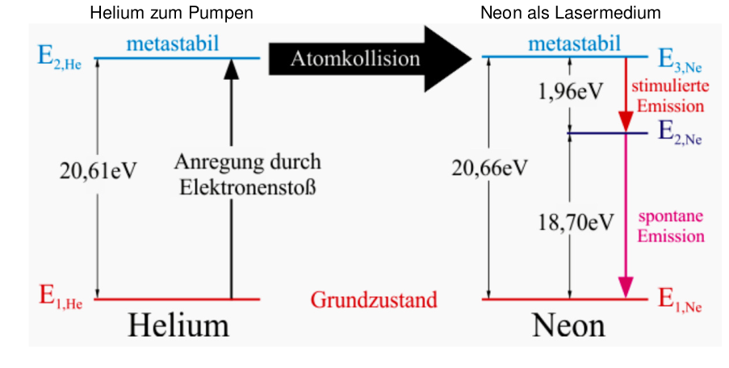{ height=250px }

Durch einen Elektronenstoß werden die Heliumatome auf das Anregungsniveau $E_{2, He}$=20,61eV. Dieses Niveau ist relativ langlebig, was das Helium daran hindert, durch die Emission eines Photons in den Grundzustand gelangen. Wenn nun eines dieser angeregten Heliumatome auf ein Neonatom trifft, kann es seine Energie bei der Atomkollision an das Neonatom abgeben. Diese Energie hebt das Neonatom ein den angeregten Zustand. Das Heliumatom (jetzt wieder im Grundzustand) wird dann recht schnell wieder durch einen Elektronenstoß angeregt.

Da Neon ein metastabiles Energieniveau bei $E_{3, Ne}$ hat, eignet es sich gut für Laseranwendungen. Es bleibt relativ lange in diesem Zustand, was genug Zeit von einem Photon zu einer stimulierten Emission auf das Energieniveau $E_{2, Ne}$ gesenkt zu werden. Von da aus geht das Neonatom recht schnell in den Grundzustand und kann dann wieder bei einem Zusammenstoß mit einem Helium angeregt werden.

### Themen
#### Glühelektrischer Effekt
Der glühelektrische Effekt (auch Richardson- oder Edison-Effekt) ist das Phänomen, dass eine glühende Metall- oder Halbleiteroberfläche Elektronen emittiert (Glühemission). Mit steigender Temperatur nimmt die kinetische Energie der Leitungselektronen im erhitzten Körper so weit zu, dass immer mehr von ihnen imstande sind, die Potenzialschwelle an der Oberfläche (Austrittsarbeit) zu überwinden.

#### #Interferenz
Interferenz beschreibt die Änderung der Amplitude bei der Überlagerung von zwei oder mehreren Wellen.

Bei der destruktiven Interferenz ist die Summe der Amplituden null.
Bei der konstruktiven Interferenz ist die Summe der Amplituden maximal.

#### Bremsstrahlung
Die Bremsstrahlung (auch Röntgenstrahlung) entsteht bei der Erzeugung in der [Röntgenröhre](#röntgenröhre).

##### Entstehung der Bremsstrahlung
Die Elektronen werden im elektrischen Feld beschleunigt und nehmen dabei die kinetische Energie
$$\tag*{auf.}\text{E}_\text{kin}=\dfrac{1}{2}m\cdot v^2 = \text{e}\cdot\text{U}_\text{B}$$
Beim Aufprall auf die Anode werden die Elektronen sehr stark abgebremst. Ihre Energie kann dabei ganz oder teilweise auf ein Photon (Röntgenquant) übertragen werden. Das entstehende Spektrum ist kontinuierlich mit einer kürzesten Wellenlänge $\lambda_0$ bzw. $\lambda_\text{min}$ (max. Photonenenergie).

$$\text{E}_\text{Ph}=h\cdot f=\dfrac{h\cdot c}{\lambda}$$

$$\text{E}_\text{kin}= \text{e}\cdot\text{U}_\text{B}$$

Energieerhaltungssatz EES
$$\dfrac{h\cdot c}{\lambda}=\text{e}\cdot\text{U}_\text{B}$$

##### Diagramm
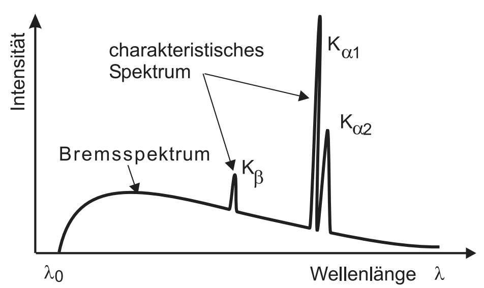{ height=250px }

**Hinweis:** In dieser Grafik ist auf der Querachse die Wellenlänge aufgetragen, dies ist aber nicht immer der Fall, da manchmal auch die Frequenz aufgetragen ist!

##### Messung des Spektrums

Zur Messung wird folgender Aufbau genutzt, um das Spektrum mit der [Bragg-Reflexion](#bragg-reflexion) zu messen. Dabei wird ein Kristall mit Röntgenstrahlung bestrahlt. Die am Kristall reflektierte Röntgenstrahlung wird mit Hilfe eines Zählrohrs gemessen:

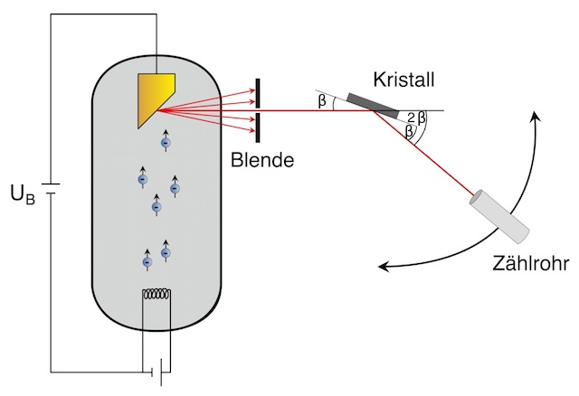{ height=250px }

#### Bragg-Reflexion
In einigen Fällen beobachtet man, dass Wellen an regelmäßigen Strukturen nur unter ganz bestimmten Winkeln besonders stark reflektiert werden. Diese Winkel werden Glanzwinkel genannt, sie sind von der Wellenlänge und dem Strukturabstand abhängig. Die Bedingung wird als Bragg-Bedingung bezeichnet, die Reflexion als Bragg Reflexion. Es ist eine Interferenzerscheinung.

Typisch ist, dass Reflexion nicht nur an der Oberfläche erfolgt, sondern die Welle auch tief in das Material eindringen. Dies ist z.B. bei [Röntgenstrahlung](#bremsstrahlung) der Fall. Bragg Reflexion wird typisch bei Wellenlängen beobachtet/genutzt, die in der gleichen Größenordnung oder kleiner als die Gitterkonstante ist. Als Gitter werden Kristallgitter eingesetzt. Die Atome in Kristallen haben konstante Abstände, im einfachsten Fall in allen Richtungen die gleichen. Die Atome bilden Streuzentren für die einlaufende Welle. Das bedeutet, von jedem Atom geht in alle Richtungen eine Elementarwelle aus. Genzeichnet wurden hier aber nur die Ausbreitungsrichtungen, die für konstruktive Interferenz in Reflexionsrichtung von Bedeutung sind.

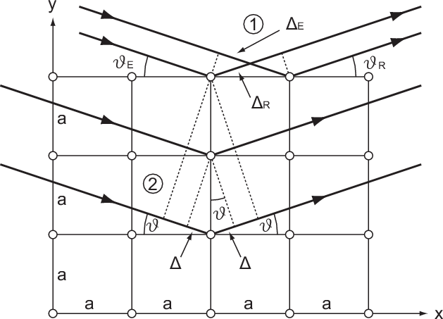{ height=250px }

Zwei Bedingungen müssen erfüllt sein:

1. "Normale Reflexion":
   
    An jeder Gitterebene (z.B. Oberfläche des Kristalls) wird an jedem Atom die einlaufende Welle gestreut. FÜr die Richtung Einfallswinkel = Ausfallswinkel entsteht konstruktive Interferenz, da die Welle ausgehend keinen Gangunterschied zur Welle einlaufend hat.

2. Bragg Reflexion:

    Ein Teil der Welle dringt tiefer in den Kristall ein und wird dann an tieferliegenden Ebenen gestreut. Diese Anteile haben den Gangunterschied $2\cdot\Delta s$ gegenüber den gestreuten Anteilen aus der darüberliegenden Ebene. Konstruktive Interferenz kann nur entstehen, wenn dieser Gangunterschied ein vielfaches der Wellenlänge ist.

Treffen beide Bedingungen zu, so entsteht eine kräftige Reflexion in diese Richtung, der Winkel wird daher auch Glanzwinkel genannt. Die zusammengefasste Bedingung wird als Bragg-Beziehung bezeichnet:

$$2\cdot \Delta s=2\cdot a \cdot\sin\beta=\text{k}\cdot\lambda$$

#### Absorption und Emission
Atome besitzen nur diskrete Energieniveaus. Ein sich selbst überlassenes Atom strebt immer den niedrigsten Energiezustand an (Grundzustand). Atome mit einem erhöhten Energie zustand wird als angeregt bezeichnet

Die **Anregung** erfolgt z.B. durch Absorption eines Photons oder durch äußere Stöße z.B. mit Elektronen ([Franck-Hertz-Versuch](#franck-hertz-versuch), Entladungslampen, ...).

Die **Abregung**, also der Übergang zu einem niedrigen Energieniveau wird auch als Zerfall bezeichnet. Er erfolgt unter Emission (Aussendung) eines Photons mit der passenden Energiedifferenz.
Der energetische Zerfall erfolgt entweder (meist innerhalb kurzer Zeit, z.B. 10 s) spontan oder stimuliert. Die stimulierte Emission wird technisch z.B. beim Laser ausgenutzt.

Weil die **Energiezustände** der gebundenen Elektronen **diskret** sind, können auch nur diskrete Energien aufgenommen (Absorption) oder abgegeben (Emission) werden. Als Ausnahme hiervon muss aber die Grenzenergie beachtet werden. Wird mehr als die **Grenzenergie** zugeführt, so wird ein Elektron vollständig vom Atom abgetrennt (freies Elektron, geht ins Kontinuum über). Das Atom wird also **ionisiert**. Das freie Elektron kann (meistens, hier vereinfachte Darstellung) beliebige 'überschüssige Energie' als kinetische Energie haben.

{ height=250px }

Bei der **spontanen Emission** wird das Photon in **zufälliger Raumrichtung** emittiert.

Bei der **stimulierten Emission** sind beide Photonen **phasengleich** und breiten sich in die **selbe Raumrichtung** aus.

#### Fluoreszenz
(Grundlage: [Absorption und Emission](#absorption-und-emission))

Einige Stoffe neigen dazu, von einem höheren angeregten Zustand nicht direkt in den Grundzustand zu zerfallen, sondern zunächst einen weiteren vorhandenen und erlaubten Zustand einzunehmen.

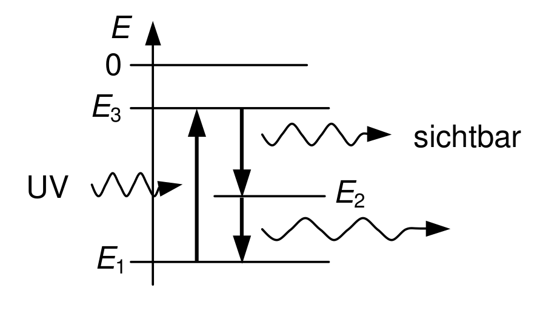{ height=250px }

Dazu wird der Rücksprung vom angeregten Energieniveau $E_3$ in den Grundzustand $E_1$ z.B. in zwei Sprünge aufgeteilt. Es kann also grundsätzlich nur energiereiche/kurzwellige Strahlung in energieärmere/langwellige Strahlung umgesetzt werden.

Technisch wird dies für Leuchtstoffe ausgenutzt, z.B. für "weiße LEDs".

#### #Nahfeldinterferenz
## Kernphysik
Atome haben einen Durchmesser von ca. $10^{-10}$m (ungefähr konstant). Aus Streuversuchen (Rutherford) ist bekannt, dass der Kern nur einen Durchmesser von ca. $10^{-14}$m hat (nicht konstant). Der Kern (Nukleus) besteht aus den Kernbaussteinen (Nukleonen) Protonen und Neutronen. **Grobe** Massenangaben
$$
\begin{aligned}
    m_P&=1\text{u}\\
    m_N&=1\text{u}\\
    m_e&=0\text{u}\\
    \text{u-atomare Masseneinheit, }1\text{u}&=1,661\cdot10^{-27}\text{kg}
\end{aligned}
$$
Nukleonen sind auch Quanten. Sind sie im Kern gebunden, so haben sie eine Bindungsenergie. Diese kann näherungsweise mit dem Modell des [linearen Potentialtopfs](#linearer-Potenzialtopf) bestimmt werden.

$$
\begin{aligned}
    E&=-\dfrac{n^2}{8m\cdot l^2}n^2\\\\
    E&=-\dfrac{(6,6261\cdot 10^{-34}\text{J}\cdot \text{s})}{8\cdot 1,661\cdot 10^{-27}\text{kg}\cdot (10^{-15}\text{m})^2}\\
    E&\approx 2\text{MeV}
\end{aligned}
$$

### linearer Potenzialtopf
### Zerfälle
#### Alpha-Zerfall
Ein instabiler Kern wandelt sich ein einen anderen Kern um, indem er ein $\alpha$-Teilchen emittiert.

$$^A_Z\text{X}\Rightarrow^{A-4}_{Z-2}\text{Y}+^4_2\text{He}$$

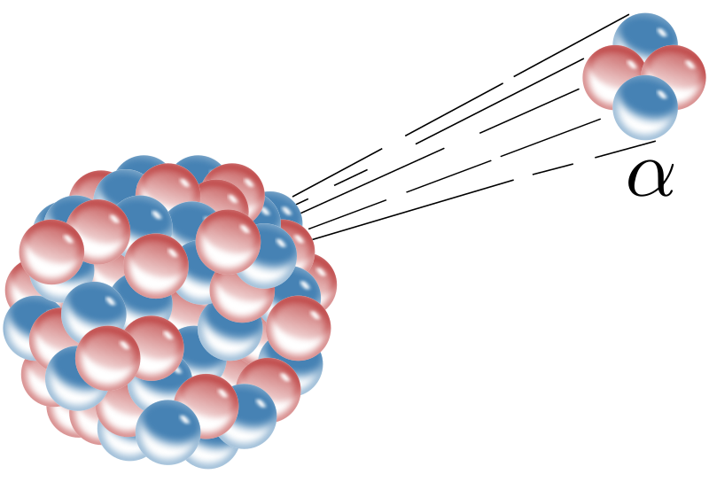{ height=250px }

##### Energie
Alpha-Strahlung besteht aus Heliumkernen. Diese haben eine für das instabile Nuklid typische feste Energie im Bereich von MeV.

##### Reichweite
Alpha-Strahlung hat in Luft eine Reichweite von wenigen cm und wird z.B. von einem Blatt Papier absorbiert.

##### Zerfallsreihe
{ height=250px }

#### Beta-Zerfall
Es gibt mehrere $\beta$-Zerfälle, hier wird nur der $\beta^-$ Zerfall beschrieben.

Beim $\beta^-$ Zerfall wird ein Neutron des Kerns in ein Proton umgewandelt. Dabei wird unter anderem ein Elektron emittiert.

Damit einige Erhaltungssätze gültig bleiben, muss dabei auch ein weiteres leichtes elektrisch neutrales Teilchen, im falle des $\beta^-$ Zerfalls ein Elektron-Antineutrino, emittiert werden.

$$^A_Z\text{X}\Rightarrow^A_{Z+1}\text{Y}+^0_{-1}\text{e}+ \overline{v}_e$$

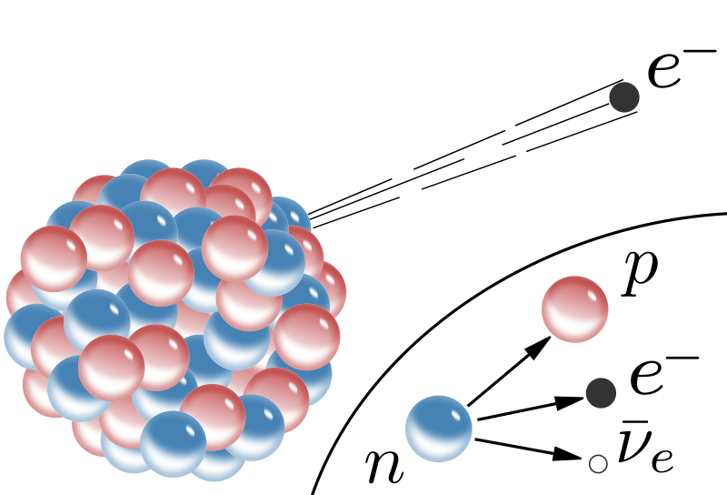{ height=250px }

##### Energie
Das Spektrum von $\beta^-$ Teilchen ist kontinuierlich, es treten also alle Energien bis zu einer Maximalenergie für diesen Zerfall auf. Diese betragen typisch bis zu einigen MeV.

##### Reichweite
Betastrahlung hat in Luft eine Reichweite (energieabhängig) von bis zu mehreren Metern. Eine wenige mm dicke Aluminiumschicht absorbiert Betastrahlung vollständig.

##### Zerfallsreihe
{ height=250px }

#### Gamma-Zerfall
Häufig befindet sich ein Kern nach einem vorangegangenem $\alpha$ oder $\beta$-Zerfall noch in einem energetisch angeregtem Zustand die "überschüssige" Energie wird dann als ein (oder mehrere) $\gamma$-Quanten (Photonen) abgegeben. Die Nukleonen bleiben unverändert, dass Nuklid gibt lediglich Energie ab.

$$^A_Z\text{X}^*\Rightarrow^A_Z\text{Y}+\gamma$$

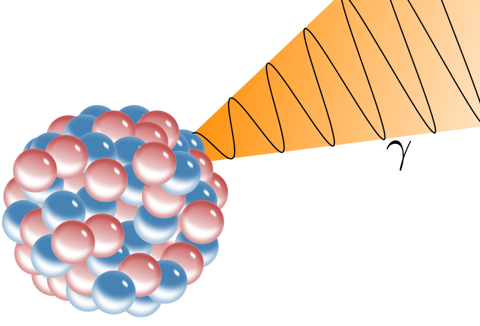{ height=250px }

##### Energie
Die häufigst auftretende Energie wird genannt. Oft sind verschiedene und mehrere Übergänge möglich. DIe Energien bilden dann ein scharfes charakteristisches Linienspektrum.

##### Reichweite
Gammastrahlung durchdringt Papier und auch größere Aluminiumschichten fast ungehindert und kann nur durch besondere Abschirmungen (z.B. Blei) geschwächt werden.

#### Zerfallsgesetz
Zerfallsgesetz für die Anzahl der Kerne $N(t)$:

$$N(t)=N_0\cdot e^{-\lambda\cdot t}$$
mithilfe der Halbwertszeit:
$$N(t)=N_0\cdot\Big(\dfrac{1}{2}\Big)^{\frac{1}{T_1/2}}$$

Zerfallsgesetz für die Zerfälle je Zeiteinheit Aktivität $A(t)$:
$$A(t)=A_0\cdot e^{-\lambda\cdot t}$$
mithilfe der Halbwertszeit:
$$A(t)=A_0\cdot\Big(\dfrac{1}{2}\Big)^{\frac{1}{T_1/2}}$$