# Elektrische und Magnetische Felder 
## Elektrische Felder
### Coulombsches Kraftgesetz
Das Coulombsche Kraftgesetzt beschreibt die Kraft zwischen zwei punktförmigen Ladungen $q_1$ und $q_2$.

{ height=250px }

$$F_el=\dfrac{1}{4\cdot \pi\cdot \epsilon_0}\cdot \dfrac{Q_1\cdot Q_2}{r^2}$$

* $\epsilon_0$ (Epsilon Null): Elektrische Feldkonstante, abhängig vom Material zwischen den beiden Ladungen

Da die Feldkonstante meist bekannt ist bleibt der erste Teil der Gleichung ($\frac{Q_1\cdot Q_2}{r^2}$) konstant ist, hängt die Kraft nun nur noch vom Abstand und natürlich von den beiden Ladungen ab.

**Folgerungen:**

> Sind die Vorzeichen beider Ladungen gleich, stoßen sie sich ab.

> Sind die Vorzeichen unterschiedlich, ziehen sie sich an.

> Je größer der Abstand, desto kleiner die Anziehungs-/ Abstoßungskraft

### Die Feldidee
"Gleichnamige Ladungen stoßen sich ab" und "ungleichnamige Ladungen stoßen ziehen sich an" ist eine einfache Beobachtung, die von der Vorstellung ausgeht Kräfte unmittelbar über Entfernungen wirksam werden. Faraday ordnete dem Umfelder von Ladungen eine Eigenschaft zu, die er elektrisches Feld nannte. Das elektrische Feld trifft nun als Vermittler für die die wirkenden Kräfte auf.

Zur Untersuchung von Feldern bringt man eine kleine Ladung in den Raum zwischen zwei Ladungen und ermittelt die Kraft auf diese Ladung. DIe Kräfte zeigen entlang von Linien, den sogenannten Feldlinien, welche von "+" nach "-" gehen.

> Elektrisches Feld $\Rightarrow$ Kraft pro Ladung

> Feldlinien von "+" nach "-"

Formel für das Elektrische Feld:

$$\vec{E}=\dfrac{\vec{F}}{q}\text{in}\dfrac{\text{N}}{\text{C}}$$

### Plattenkondensator

{ height=250px }

Da die Spannung = Energie pro Ladung,

$$U=\dfrac{W}{q}$$

und die Energie/Arbeit = Kraft mal Distanz

$$W=F\cdot d$$

Lässt sich folgender Zusammenhang ermitteln:

$$
%U=\dfrac{E\cdot \sout{q}\cdot d}{\sout{q}}=E\cdot d
U=\dfrac{E\cdot q\cdot d}{q}=E\cdot d
$$

Daraus resultiert die Formel für das homogene Feld im Plattenkondensator:

$$E=\dfrac{U}{d}$$

### Kondensator
Die Spannung zwischen den beiden Platten an einem Kondensator ist proportional zur Ladung auf den Platten. Das Verhältnis von Ladung $Q$ zur Spannung $U$ ist die Kapazität $C$ des Kondensators.

Definition:

$$C=\dfrac{Q}{U}\\$$

Einheiten:

$$[C]=\dfrac{[Q]}{[U]}=\dfrac{1\text{As}}{1\text{V}}=1\text{F}$$

#### Kapazität

$$C=\epsilon_r\epsilon_0\dfrac{A}{d}$$

* $\epsilon_r$: relative Permittivität (Dielektrizitätszahl), Material zwischen den Platten
* $\epsilon_0$: elektrische Feldkonstante
* $A$: Plattenfläche
* $d$: Plattenabstand

Schlussfolgerungen:
> Je höher die Spannung zwischen den Platten, ...

> Je größer die Fläche der Platten, ...

> Je kleiner der Plattenabstand, ...

> Je höher die relative Permittivität, ...

..., desto größer die Kapazität.

#### Arbeit und Energie am Kondensator
Um einen Kondensator zu laden, muss man an ihm arbeiten. (Man muss gegen die Feldkräfte weiter Ladungen trennen und auf seine Platten aufbringen.) Ist er geladen, so kann er Arbeit verrichten. Er hat also Energie gespeichert und kann damit z.B. eine Lampe zum Leuchten bringen, bis er wieder entladen ist.

Um die gespeicherte Energie zu berechnen, wird auf die Definition der Spannung zurück gegriffen.

Definition Spannung: $U=\dfrac{W}{Q}\bigg(=\dfrac{\Delta W}{\Delta Q}\bigg)$ für konstantes elektrisches Feld!!

Weil die Spannung $U$ von der gespeicherten Ladung $Q$ abhängig ist und diese sich ändert. Aber wenn man jeweils nur "ein kleines bisschen Ladung transportiert" kann man so tun als wenn die Spannung sich dabei nicht ändert.

{ height=250px }

Arbeit um ein geladenen Kondensator ein bisschen weiter zu laden: $\Delta W=U\cdot\Delta Q$

Die Fläche unter dem $Q$-$U$-Graphen ergibt die Arbeit, die insgesamt aufgebracht werden muss, auf die Endspannung $U_0$ aufzuladen. Die Integration aller $\Delta W$ ergibt eine Dreiecksfläche die sich einfach berechnen lässt.

Arbeit zum Laden = gespeicherte Energie: 
$$W=\dfrac{1}{2}\cdot Q_0\cdot U_0=\dfrac{1}{2}C\cdot U^2_0$$

#### Feldenergie, Energiedichte des elektrischen Feldes
Man sagt zwar umgangssprachlich "der Kondensator speichert Energie". Fachlich korrekt wäre: "der Kondensator speichert Ladung auf seinen Platten" und "Kondensatoren sind Bauteile, die elektrische Felder in sich binden/einfangen". Die Energie steckt im elektrischen Feld innerhalb des Kondensators! Dies wird klar, wenn man sich erneut veranschaulicht, wie der Kondensator geladen wird. Dabei werden Ladungen gegen die Feldkräfte im elektrischen Feld um eine Wegestecke verschoben (der einen Platteentnommen und zur anderen Platte geführt). Es wird also am Feld gearbeitet und somit wird Energie dem Feld hinzugeführt!

Einfaches Umformen mit der "Kondensatorformel" liefert:

$$W=\frac{1}{2}\cdot\epsilon_0\cdot\dfrac{A}{d}\cdot(E\cdot d)^2=\dfrac{1}{2}\epsilon_0\cdot E^2\cdot V$$

#### Laden eines Kondensators

## Magnetische Felder
### Feldlinien und Feldgrößen
#### Pole und Richtung des Magnetfeldes
Ungleichnamige Pole ziehen sich an, gleichnamige stoßen sich ab. Wird ein Magnet zerbrochen, so ergibt sich wieder die entsprechende Ausrichtung und auch Kräfte zwischen dem zerbrochenen Magneten bleibt qualitativ erhalten. Daraus kann unmittelbar gefolgert werden, dass es keine magnetischen Monopole gibt. Magnete sind Dipole.

> Im Raum um einen Magneten besteht ein magnetisches Feld. Die **Feldlinienrichtung** wird außerhalb eines Magneten als vom **Nordpol zum Südpol** laufend festgelegt.

> Es ist üblich, dass der N**o**rdpol r**o**t und der S**ü**dpol gr**ü**n (oder bla**u**) gekennzeichnet wird.

> Magnetische Feldlinien haben keinen Anfang und kein Ende, sie sind in sich geschlossen.

> Je dichter die Feldlinien, desto größer ist die magnetische Flussdichte an diesem Ort.

> $\bigotimes\Rightarrow$ B-Feld zeigt in vom Betrachter weg  
> $\bigodot\Rightarrow$ B-Feld kommt auf den Betrachter zu

#### Magnetischer Fluss
Beschreibt die gesamte magnetische Wirkung eines Magneten auf seine Umgebung. Er ist ein Maß für die "Gesamtzahl der Feldlinien"

> **Formelzeichen:** $\Phi$ (Phi)

> **Einheit:** $[\Phi]=1\text{Wb}=1\text{Vs}$ (Weber, Voltsekunde)

#### Magnetische Flussdichte/Feldstärke
Die Flussdichte gibt an, wie viel Fluss pro senkrecht durchsetzter Fläche vorhanden ist. Sie ist also ein Maß dafür wie dicht die Feldlinien beieinander liegen und damit, wie stark die Wirkung des Magnetfeldes an einem Ort ist.

> **Formelzeichen:** $B=\dfrac{\Phi}{\text{A}}$

> **Einheit:** $[B]=1\text{T}=1\dfrac{\text{Vs}}{\text{m}^2}=1\dfrac{\text{N}}{\text{Am}}$ (Tesla)

### Magnetfeld eines stromdurchflossenen Leiters und Spule
#### einzelner Leiter
{ height=250px }
{ height=250px }

Die magnetische Flussdichte/Feldstärke eines stromdurchflossenen Leiters mit dem Abstand $r$ beträgt:

$$B=\mu_0\cdot \dfrac{I}{2\cdot\pi\cdot r}$$

mit der magnetische Feldkonstanten $\mu_0$.

#### Spule
Mehrere Leiterschleifen ergeben eine Spule mit $N$ Windungen. Das Feldbild ergibt sich aus der Überlagerung des Stromes in den Windungen. Im inneren der Spule drängen sich die Feldlinien eng beieinander, die Flussdichte ist gegenüber einem gesteckten Leiter größer. Spulen haben im Außenraum ein sehr schwaches Magnetfeld, wohingehend der Innenraum ein sehr starkes Magnetfeld besitzt, welches näherungsweise homogen ist.

{ height=250px }

Die Richtung des Feldes erhält man mithilfe der Rechten-Faust-Regel (wie beim einzelnen Leiter, jedoch sind die Bezeichnungen getauscht) mit dem Daumen als B-Feld Richtung und den restlichen Fingern als Stromrichtung.

Die Flussdichte einer Spule kann unter der Voraussetzung, dass sie lang ist (Länge erheblich länger als Durchmesser) mit folgender Gleichung berechnet werden:

$$B=\mu_0\cdot\dfrac{N\cdot I}{l}$$

$\Rightarrow$ Die Flussdichte ist unabhängig vom Durchmesser!

Die Flussdichte kann (bei sonnst gleichen Bedingungen) durch Einbringen eines ferromagnetisches Werkstoffes in das Feld erhöht werden. Oft verwendet wird z.B. ein Eisenkern. Zunächst liegen die Elementarmagnete im Eisen regellos durcheinander, ihre magnetische Wirkungen heben sich nach außen auf. Nach dem Einschalten des Spulenstroms richten sich die Elementarmagnete - aufgrund der magnetischen Wirkung der Spule - aus. Nun "addieren" sich ihre magnetischen Wirkungen und verstärken diejenige der Spule.

#### Spulenpaar
Das Helmholtz Spulenpaar besteht aus zwei sehr kurzen identischen Spulen. Sie sind in einem Abstand angeordnet, der genau ihrem Radius entspricht und werden vom selben Strom gelichsinnig durchflossen. Die stark homogenen Felder der beiden Einzelspulen überlagern (addieren sich vektoriell) gerade so, dass das Feld zwischen den Spulen näherungsweise homogen und konstant ist.

{ height=250px }

### Kraft auf einen stromdurchflossenen Leiter
Befindet sich ein stromdurchflossener Leiter in einem Magnetfeld (Beispiel Stromwaage), so ist die Kraft proportional zur Länge $l$ des Leiters als auch der Strom $I$. Damit kann die magnetische Flussdichte/Feldstärke $B$ mit 
$$\tag*{definiert werden.}B=\dfrac{F}{l\cdot I}$$

Diese gilt aber nur wenn alle drei Größen vektoriell senkrecht aufeinander stehen.

{ height=250px }

Möchte man die Kraft berechnen, die auf diesen Leiter wirkt, so ergibt sich:

$$F=l\cdot I\cdot B\cdot\sin(\alpha)$$

mit $\alpha$ als Winkel zwischen $I$ und $B$.

### Lorentzkraft
Wenn man sich die [Kraft die auf einen stromdurchflossenen Leiter](#kraft-auf-einen-stromdurchflossenen-leiter) wirkt genauer anguckt, stellt man fest, dass die Kraft nicht auf den Leiter in dem Sinne wirkt, sondern eher auf die Ladungsträger innerhalb des Leiters. Die auf den Leiter wirkende Kraft ist die Summe der Kräfte die jeweils auf die bewegten Ladungsträger im Magnetfeld wirken. Die Kraft die auf bewegte Ladungsträger im Magnetfeld wirkt, nennt man Lorentzkraft.

{ height=250px }

Der Strom $I$ besteht aus $N$ Elektronen mit der Elementarladung $e$, die mit der Driftgeschwindigkeit $v$ durch den Leiterquerschnitt strömen. Die [Gesamtkraft](#kraft-auf-einen-stromdurchflossenen-leiter) setzt sich aus den $N$ Einzelkräften $F_L$ auf jedes der $N$ Elektronen, das zum Stromfluss beiträgt.

$$F_L=q\cdot v\cdot B$$

### Hall-Effekt
{ height=250px }

Wenn in einem Leiter der Strom $I$ fließt, so bewegen sich die Ladungsträger (hier Elektronen) in ihm. Wenn dieser auch zusätzlich von einem $B$-Feld durchsetzt werden, dann werden sie (in der Grafik) in Betrachterrichtung durch die [Lorentzkraft](#lorentzkraft) abgelenkt. Die Elektronen sammeln sich an dieser Seite. So entsteht auf der betrachternahen Seite ein Elektronenüberschuss und gegenüber eine Elektronenmangel.

Daraus folgend baut sich ein elektrisches Feld über die Seite b auf. Das bedeutet, dass nun zusätzlich eine elektrische Feldkraft $F_{el}$ in entgegengesetzter Betrachterrichtung wirkt. Die Ladungstrennung endet (nach einer sehr kurzer Zeit), wenn sich die Feldkräfte Lorentzkraft $F_L$ und Coulombkraft $F_{el}$ das Gleichgewicht halten. Die Ladungsträger fließen also tatsächlich (wieder) in Längsrichtung des Leiters.

Die sogenannte Hallspannung lässt sich dann zwischen den beiden Seiten mit den getrennten Ladungsträgern messen.

Sie lässt sich vereinfacht aus dem Kräftegleichgewicht herleiten (laut KC):

$$
\begin{aligned}
    F_{el}&=F_L\\
    E\cdot e&=e\cdot v\cdot B\\
    U_H&=E\cdot e=e\cdot v\cdot B
\end{aligned}
$$

Die komplette Gleichung für die Hallspannung lautet (Mit der Hallkonstanten $R_H$, eine Materialkonstante):

$$U_H=R_H\cdot \dfrac{I\cdot B}{d}$$

Da die Hallspannung proportional zu $B$ ist, ist sie sehr gut geeignet um die Flussdichte $B$ zu messen. Eine Vergrößerung des Querstroms $I$ ist auch sinnvoll, da die Hallspannung auch proportional zur Driftgeschwindigkeit $v$ ist. Wichtig ist noch, dass für die tatsächliche technische Ausführung meist keine metallische Leiter, sondern Halbleiter genutzt werden, da diese weniger freie Ladungsträger haben, welche bei gleichem Strom eine deutlich höhere Driftgeschwindigkeit besitzen.

### Induktion
Eine Induktionsspannung wird in einem Leiter, einer Leiterschleife oder einer Spule durch Änderung der Magnetflussdichte $B$ oder Änderung der Fläche $A$ (die vom Magnetfeld sekrecht durchsetzt wird). Allgmein lässt sich eine Induktionsspannung durch Änderung des magnetischen Flusses $\Phi$ hervorrufen, da $\Phi=B\cdot A$.

#### Induktion in einem Bewegten Leiter
Wird ein Leiter senkrecht zu den Feldlinien eines homogenen Magnetfeldes bewegt, erfahren die im Leiter mitbewegten Ladungen eine Lorentzkraft. Als Folge davon werden die beweglichen Elektronen innerhalb des Leiters bewegt, es kommt längs des Leiters zu einer Verschiebung der Ladungsschwerpunkte (Ladungsüberschuss, Ladungsmangel).

Die Ladungsverschiebung bewirkt das Auftreten einer elektrischen Kraft (z.B. auf ein Elektron in der Leitermitte), die umso stärker ist, je mehr Ladungen getrennt wurden.

Im stationären Fall, d.h. bei Bewegung des Leiters mit konstanter Geschwindigkeit, halten sich die Lorentzkraft und die elektrische Kraft auf ein Elektron die Waage. Es gilt

$$
\begin{aligned}
    F_{el}&=F_L\\
    e\cdot E &= e\cdot v\cdot B
\end{aligned}
$$

Verknüpft mit dem als homogen angenommenen elektrischen Feld E, welches längs des Leiters der Länge $l$ wirkt, ist eine Spannung, die Induktionsspannung $U_i$:

$$E=\dfrac{U_i}{l}$$

Setzt man (2) in (1) ein, so erhält man:

$$U_i=B\cdot l\cdot v$$

#### Induktion durch Änderung der Fläche
{ height=250px }

Die Geschwindigkeit, mit der der Leiter aus dem Magnetfeld herausbewegt wird, kann auch als Änderung der Fläche aufgefasst werden, die vom Magnetfeld senkrecht durchsetzt wird.

Flächenänderung:
$$
\begin{aligned}
    \Delta A&=l\cdot \Delta s\\\\
    \dfrac{\Delta A}{\Delta t}&=l\cdot\dfrac{\Delta s}{\Delta t}=l\cdot v
\end{aligned}
$$
Wenn also $U_i=B\cdot l\cdot v$, dann:

$$U_i=B\cdot\dfrac{\Delta A}{\Delta t}$$

#### Induktion durch Änderung der Flussdichte
Die Änderung der Flussdichte kann z.B. durch Bewegung eines Permanentmagnets in einer Spule oder einer zweiten Spule bzw. Elektromagneten.

{ height=250px } 

Ein zeitlich veränderlicher Strom erzeugt in der Feldspule eine zeitlich veränderliche  Flussdichte B(t). An der innenliegenden Induktionsspule wird eine Induktionsspannung U(t) gemessen. Die Induktionsspannung ist proportional zur Änderungsrate der Flussdichte:

$$U_i=N\cdot A\cdot \dfrac{\Delta B}{\Delta t}$$

#### Allgemeines Induktionsgesetz
Beide Zusammanhänge lassen sich mit dem allgemeinen Induktionsgesetz zusammenfassen, da $\Phi=B\cdot A$.

Somit werden $U_i=B\cdot\dfrac{\Delta A}{\Delta t}=\dfrac{B\cdot \Delta A}{\Delta t}=\dfrac{\Delta\Phi}{\Delta t}$ und ebenso $U_i=N\cdot A\cdot \dfrac{\Delta B}{\Delta t}=N\cdot\dfrac{A\cdot\Delta B}{\Delta t}=N\cdot\dfrac{\Delta\Phi}{\Delta t}$

Lässt man allgemein also $N$ Windungen zu und führt für $\Delta t \rightarrow 0$ Differentiale ein, folgt eine einfache Darstellung des allgemeinen Induktionsgesetzes:

$$U_i=-N\cdot \dfrac{d\Phi}{dt}=-N\dot{\Phi}$$

Das Minuszeichen wird aufgrund der [Lenz'schen Regel](#lenz'sche-regel) eingeführt. 

### Lenz'sche Regel
#### Erläuterung am Beispiel
Wird ein Magnet in die Nähe einer kurzgeschlossenen, frei aufgehängten Spule gebracht, so bewegt sie sich.

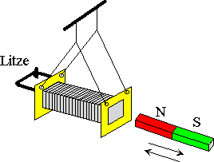{ height=250px }

Durch die Bewegung des Magneten ändert sich die Stärke des Magnetfelds, indem die Spule liegt. Somit wird eine Induktionsspannung hervorgerufen. Da die Spule kurzgeschlossen ist, fließt ein Strom, der Induktionsstrom. Dieser erzeugt selbst ein Magnetfeld, welches dem Magnetfeld des Magneten in Wechselwirkung tritt.

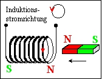{ height=250px }

Wenn der Magnet auf die Spule zubewegt wird, weicht sie nach links aus. Der Induktionsstrom fließt so, dass am rechten Ende der Spule ein Nordpol entsteht. Somit stoßen sich Magnet und Spule ab.

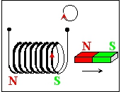{ height=250px }

Wenn der Magnet von der Spule wegbewegt wird, folgt sie der Bewegung des Magneten nach rechts. Der Induktionsstrom fließt so, dass am rechten Ende der Spule ein Südpol entsteht. Somit ziehen sich Magnet und Spule ab.

Diese Bewegung sind auch nach Umdrehen des Magneten zu beobachten!

Allgemein beschreibt Lenz:

> Der Induktionsstrom ist stets so gerichtet, dass er die Ursache seiner Entstehung zu hemmen sucht.

### Drei-Finger-Regel
{ height=250px }

* **Daumen** - Ursache:

    Zeigt in die technische Stromrichtung (von + nach -)

* **Zeigefinger** - Vermittlung:
  
    Zeigt in die Magnetfeldrichtung (von N nach S)

* **Mittelfinger** - Wirkung:

    Gibt die Kraftrichtung an

rechte Hand: technische Stromrichtung
linke Hand: Bewegung von Elektronen

# Schwingungen und Wellen

## Sinus-Exkurs
$$y=a\cdot\sin(b\cdot x)+c$$

* $a$: maximale Amplitude (y-Wert der Maxima bzw Minima)
* $b$: "Skalierung" der Sinusfunktion in x-Richtung, wie oft sie sich wiederholt nach gleicher Zeit
* $c$: Verschiebung der Sinusfunktion in y-Richtung

## Schwingungen
### Merkmale von Schwingungen
Gleichartige Bewegungsabläufe, bei denen sich die Richtung immer wieder umkehrt und die sich nach einer bestimmten Zeit wiederholen, heißen Schwingungen.

#### Begriffe

* *Auslenkung* $s$: Entfernung des Schwingkörpers zur Ruhelage
* *Amplitude* $\hat{s}$: Maximale Auslenkung
* *Periodendauer* $T$: Zeit die ein Schwingungsvorgang braucht, um sich zu wiederholen
* *Periode*: kleinstes, örtliches oder zeitliches Intervall nach dem sich der Vorgang wiederholt

Schwingungen mit abnehmender Amplitude nenn man auch **gedämpfte Schwingungen**.

### Periodische Schwingung
Periodische Schwingungen werden Bewegungen genannt, wenn der Körper nach gleichlangen Zeitabschnitten wieder den gleichen Ort, die gleiche Geschwindigkeit und die gleiche Beschleunigung besitzt.

Ein Körper bewegt sich periodisch mit der der Periodendauer $T=1\text{s}$, wenn er nach 1s den den gleichen Ort, die gleiche Geschwindigkeit und die gleiche Beschleunigung besitzt.

Die Frequenz $f$ ist der Kehrwert der Periodendauer $T$.

$$f=\dfrac{1}{T}$$

### Harmonische Schwingung
Harmonische Schwingungen werden Bewegungen genannt, wenn sie durch eine Sinusfunktion beschrieben werden kann.

Sie kann mit den folgenden Gleichungen beschrieben werden:

Zeit-Ort-Gesetz:
$$s(t)=\hat{s}\cdot\sin(\omega\cdot t+\varphi)$$

Zeit-Geschwindigkeits-Gesetz:
$$
\begin{aligned}
    v(t)&=\dot{s}=\hat{v}\cdot\cos(\omega\cdot t+\varphi)\\
    v(t)&=\dot{s}=\hat{s}\cdot\omega\cdot\cos(\omega\cdot t+\varphi)
\end{aligned}
$$

Zeit-Beschleunigungs-Gesetz:
$$ \begin{aligned}
    a(t)&=\ddot{s}=-\hat{a}\cdot\sin(\omega\cdot t+\varphi)\\
    a(t)&=\ddot{s}=-\hat{s}\cdot\omega^2\cdot\sin(\omega\cdot t+\varphi)
\end{aligned}
$$

* $s$ in $\text{m}$: Auslenkung
* $v$ in $\frac{\text{m}}{\text{s}}$: Geschwindigkeit
* $a$ in $\frac{\text{m}}{\text{s}^2}$: Beschleunigung
* $\omega$ in $\frac{\text{rad}}{\text{s}}$=$\frac{1}{\text{s}}$: Winkelgeschwindigkeit/Kreisfrequenz
* $\varphi$ in $\text{rad}$: Phasenverschiebung

#### Kräfte bei der harmonischen Schwingung
Bei einer harmonischen Schwingung sind Rückstellkraft und Auslenkung proportional zueinander.  
Unterliegt ein Oszillator einem linearen Kraftgesetz, so ergibt sich eine harmonische Schwingung mit:

$$D=m\cdot\omega^2=m\cdot\dfrac{4\pi^2}{T^2}$$

Die Winkelgeschwindigkeit/Kreisfrequenz lässt sich bestimmen mit:

$$\omega=2\cdot\pi\cdot f=\dfrac{2\cdot\pi}{T}$$

Die Periodendauer lässt sich bestimmen mit:

$$T=2\cdot\pi\sqrt{\dfrac{m}{D}}$$

* $m$: Masse
* $D$ in $\frac{\text{N}}{\text{m}}$: Federkonstante (beschreibt wie viel Kraft für eine bestimmte Auslenkung benötigt wird)

Trägheitskraft:

$$F=m\cdot\ddot{s}=-D\cdot s(t)$$

### Masse-Feder-Schwinger
Bei dem Masse-Feder-Schwinger wird eine Masse an einer Feder befestigt. Er ist ein Beispiel für eine [harmonische Schwingung](#harmonische-schwingung).

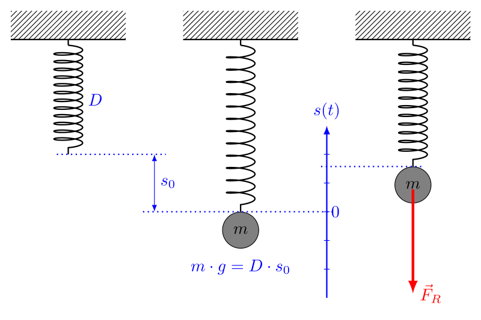{ height=250px }

### Fadenpendel
Generell ist das Fadenpendel nicht harmonisch, bei kleinen Auslenkungen jedoch schon ($\alpha<10°$).

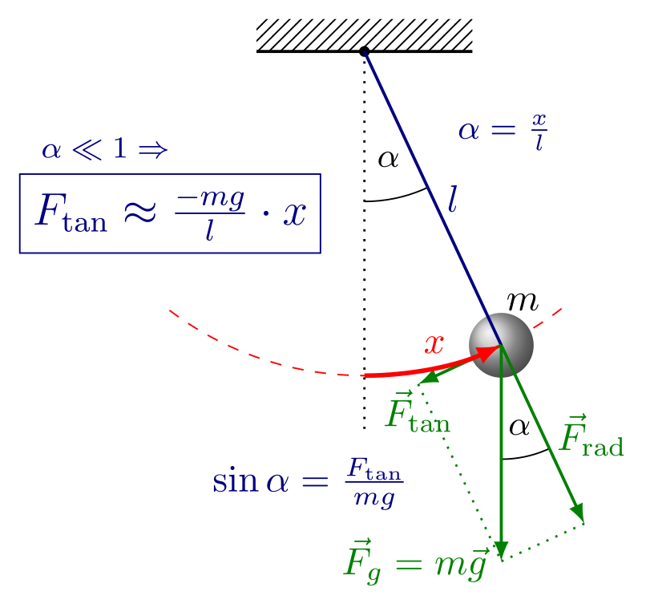{ height=250px }

Bei kleinen Auslenkungen gilt:  
Das Kraftgesetz lautet $F=-\dfrac{m\cdot g}{l}\cdot s=-D\cdot s$, mit $D=\dfrac{m\cdot g}{l}$

Somit folgt die Berechnung für die Periodendauer $T$:

$$T=2\cdot\pi\sqrt{\dfrac{l}{g}}$$

* $g$: Fallbeschleunigung ($9,81\frac{\text{m}}{\text{s}^2}$)
* $l$: Länge des Fadenpendels (siehe Grafik)

> Die Periodendauer ist in diesem Fall unabhängig von der Masse!

## Wellen
### Mechanische Wellen
Eine sich im Raum mit einer bestimmten Geschwindigkeit ausbreitende Störung heißt Welle. Eine Welle transportiert Energie und Impuls.  
Vorstellen kann man sich die Welle als räumlich ausbreitende Schwingung.

#### Entstehung von Wellen
Ein Erreger zwingt ein Teilchen (auch Oszillator) des Körpers aus seiner Ruhelage. Aufgrund seiner Trägheit übernimmt der nächste Oszillator etwas zeitversetzt diese Störung, es entsteht eine Phasenverschiebung $\Delta\varphi$ zwischen den Bewegungen benachbarter Oszillatoren. Die Energie, die der erste Oszillator durch die Störung erhalten hat, wird so auf die benachbarten Oszillatoren übertragen. Diese Übertragungen von Energie bewirken den Energietransport einer Welle.

#### Ausbreitung von Wellen
Die Ausbreitung mechanischer Wellen erfordert einen Träger in dem sich schwingungsfähige Teilchen befinden. Dieser Träger ist das **Medium**. Von ihm hängt die **Ausbreitungsgeschwindigkeit** $c$ ab mit der sich die Störung durch den Träger bewegt.

Diese schwingungsfähigen Teilchen müssen untereinander eine Kopplung aufweisen, so dass sich die von außen einwirkende Störung über das System fortpflanzen kann.

Nachdem ein Oszillator $\text{O}_1$ alle Phasen einer Schwingung durchlaufen ist (nach Ablauf der Periodendauer $T$), hat sich die Welle so weit ausgebreitet, dass ein weiterer Oszillator (z.B. $\text{O}_5$) synchron mit ihm zu schwingen beginnt. Die beiden Oszillatoren haben den Abstand einer **Wellenlänge** $\lambda$.

##### Querwellen/Transversalwellen
Wenn die Ausbreitungsrichtung senkrecht auf der Schwingungsrichtung steht, wird sie als Querwelle/Transversalwelle bezeichnet.

{ height=250px }

##### Längsquellen/Longitudinalwellen
Wenn die Ausbreitungsrichtung parallel zur Schwingungsrichtung steht, wird sie als Längswelle/Longitudinalwelle bezeichnet.

{ height=250px }

### Räumliche und Zeitliche Darstellung von Wellen
Man kann die Auslenkung $y$ sowohl in Abhängigkeit von der Zeit als auch vom Ort darstellen.

Ein y-t-Diagramm zeigt den zeitlichen Verlauf der Bewegung eines Oszillator an einem bestimmten Ort. Die y(t)-Funktion einer harmonischen Welle entspricht der einer harmonische Schwingung:

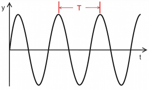{ height=250px }

In einem y-x-Diagramm lässt sich die Lage der Gesamtheit der Oszillatoren, also alle Auslenkungen, für einen bestimmten Zeitpunkt darstellen:

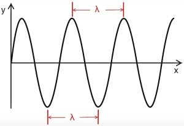{ height=250px }

### Harmonische Wellen
Eine **periodische Welle** ein zeitlich und räumlich periodischer Vorgang. Frequenz bzw. Periodendauer kennzeichnen die zeitliche, die Wellenlänge die räumliche Periodizität. 

Wellen deren räumliches Muster sich zu jedem Zeitpunkt durch eine Sinusfunktion darstellen lässt, heißt **harmonische Welle**.

Die Ausbreitungsgeschwindigkeit $c$ einer harmonischen Welle beträgt:

$$c=\lambda\cdot f$$

### Huygenssches Prinzip
Das huygenssche Prinzip besagt, dass jeder Punkt einer Wellenfront als Ausgangspunkt einer neuen Welle, der so genannten Elementarwelle, betrachtet werden kann.  
Durch dieses Prinzip lassen sich die Phänomene der Reflexion, Brechung und Beugung von Wellen beschreiben.

{ height=250px }

{ height=250px }

{ height=250px }

### Reflexion mechanischen Wellen
#### Reflexion am losen Ende
Bei einem losen Ende wird ein Berg als Berg und ein Tal als Tal reflektiert.

{ height=250px }

#### Reflexion am festen Ende
Bei einem feste Ende wird ein Berg als Tal und ein Tal als Berg reflektiert. Somit erfährt die Welle eine Phasensprung von $\pi$.

{ height=250px }

[Anschauliche Animation](https://de.wikibooks.org/wiki/Physik_Oberstufe/_Schwingungen_und_Wellen/_Mechanische_Wellen#/media/File:WaveReflect.gif)

### Stehende Welle
Eine stehende Welle entsteht bei der Überlagerung von gegenläufigen Wellen gleicher Amplitude und Frequenz.  
Zu beobachten ist:

* Die Amplituden sind an jedem Ort zeitlich konstant
* Stellen, an denen die Amplitude null ist, werden **Knoten** genannt
* Stellen, an denen die Amplitude maximal ist, werden **Bäuche** genannt
* Die Entfernung zwischen zwei benachbarten Knoten oder Bäuchen beträgt $\dfrac{\lambda}{2}$

Am losen Ende hat die reflektierte Welle die gleiche Phase wie die einlaufende Welle. Durch Überlagerung der einlaufenden mit der reflektierten Welle bildet sich eine stehende Welle mit einem Schwingungsbauch am losen Ende des Wellenträgers.

{ height=250px }

Am festen Ende hat die reflektierte Welle eine Phasenverschiebung um $\pi$ relativ zur einlaufenden Welle. Man spricht von einem Phasensprung um  $\pi$ am festen Ende. Wieder bildet sich eine stehende Welle, diesmal mit einem Knoten am festen Ende

{ height=250px }

#### Stehende Wellen zwischen zwei Reflektoren
Zwischen zwei Reflektoren mit dem Abstand $L$ können sich nur stehende Wellen mit bestimmten Wellenlängen bilden. Die Frequenzen zu diesen Wellenlängen werden als Eigenfrequenzen oder Eigenresonanzen bezeichnet.

{ height=250px }

Für die Grundschwingung, die Schwingung mit der kleinsten bzw. tiefsten Frequenz, findet man mit $c=\lambda \cdot f$:

$$f_{0}={\frac {c}{2L}}$$

Die nächste mögliche stehende Welle, die die Bedingung der Knoten an den Enden erfüllt, ist die erste Oberschwingung. Dabei passt genau eine Wellenlänge auf den Wellenträger und es gilt:

$$f_{1}={\frac {c}{L}}=2f_{0}$$

Und somit für die zweit Oberschwingung:

$$f_{2}={\frac {3c}{2L}}=3f_{0}$$

Welche Randbedingung dazu führt, dass die Wellenlängen nicht beliebig sein können, hängt von der Art der betrachteten Welle ab. Beispielsweise muss bei fest eingespannten Enden einer schwingenden Saite an beiden Enden jeweils ein Schwingungsknoten vorliegen.

Bei einer stehenden elektromagnetischen Welle gilt, dass die elektrische Feldstärke am reflektierenden Leiter null sein muss, wohingegen die magnetische Feldstärke dort immer einen Schwingungsbauch besitzt. Bei der resultierenden elektromagnetischen Welle sind nun elektrisches Feld und magnetisches Feld um 90° phasenverschoben, wobei das E- und B-Feld der hin- bzw. rücklaufenden Welle phasengleich sind.

### Dopplereffekt
Der Doppler-Effekt ist die zeitliche Stauchung bzw. Dehnung eines Signals bei Veränderungen des Abstands zwischen Sender und Empfänger während der Dauer des Signals. Ursache ist die Veränderung der Laufzeit. Dieser rein kinematische Effekt tritt bei allen Signalen auf, die sich mit einer bestimmten Geschwindigkeit, meist Lichtgeschwindigkeit oder Schallgeschwindigkeit, ausbreiten. Breitet sich das Signal in einem Medium aus, so ist dessen Bewegungszustand zu berücksichtigen.

{ height=250px }

Bei periodischen Signalen erhöht bzw. vermindert sich die beobachtete Frequenz. Das betrifft sowohl Tonhöhen als auch Modulationsfrequenzen, z. B. den Wechsel der Töne eines Martinhorns. Bei geringen Geschwindigkeiten im Verhältnis zur Ausbreitungsgeschwindigkeit gibt dieses Verhältnis zugleich die relative Frequenzänderung $\Delta f/f$ an. Bei reflektiertem Signal, wie beim Radar-Doppler und Ultraschall-Doppler, verdoppelt sich mit der Laufzeit auch die Doppler-Verschiebung $\Delta f$. 

### EM-Wellen
Elektromagnetische Wellen sind Wellen aus gekoppelten [elektrischen und magnetischen Feldern](#elektrische-und-magnetische-felder). Beispiele für elektromagnetische Wellen sind Radiowellen, Mikrowellen, Wärmestrahlung, Licht, Röntgenstrahlung und Gammastrahlung. Elektromagnetische Wellen im Vakuum sind [Transversalwellen](#Querwellen/Transversalwellen). Die Wechselwirkung elektromagnetischer Wellen mit Materie hängt von ihrer Frequenz ab, die über viele Größenordnungen variieren kann.

Anders als zum Beispiel Schallwellen benötigen elektromagnetische Wellen kein Medium, um sich auszubreiten, können dies aber.

Sie bewegen sich im Vakuum unabhängig von ihrer Frequenz mit Lichtgeschwindigkeit fort.

Im freien Raum stehen die Vektoren des elektrischen und des magnetischen Feldes senkrecht aufeinander und auf der Ausbreitungsrichtung.

Sie Entsteht z.B. durch die [spontane Emission](#absorption-und-emission) oder auch in der [Röntgenröhre](#röntgenröhre). 

[Ausbreitung einer EM-Welle](https://de.wikipedia.org/wiki/Elektromagnetische_Welle#/media/File:EM-Wave.gif)

#### Polarisation von EM-Wellen
Im Wellenmodell sind EM-Wellen eine senkrecht zur ihrer Ausbreitungsrichtung schwingende Welle, also eine Transversalwelle. Die Polarisation bzw. die Polarisationsrichtung der Welle beschreibt, in welcher Richtung die Welle schwingt. Dabei bezieht man sich meist auf die Richtung des E-Feld-Vektors. Der B-Feld-Vektor schwingt entsprechend senkrecht zur Polarisationsrichtung. 

# Quanten und Atomphysik
## Versuche
### Wiensches Geschwindigkeitsfilter
#### Verwendung
Ein Geschwindigkeitsfilter dient hauptsächlich dazu, aus dem Teilchenstrahl einer Ionenquelle nur diejenigen Teilchen den Filter passieren zu lassen, die eine bestimmte Geschwindigkeit besitzen, während alle übrigen im Filter „hängenbleiben“ – anders gesagt, kann man damit einen Teilchenstrom mit nur einer genau definierten Geschwindigkeit „präparieren“, aber auch die Geschwindigkeit unbekannter geladener Teilchen bestimmen. Das Filter wird zum Beispiel in einem [Massenspektrometer](#massenspektrometer) genutzt.

#### Aufbau
{ height=250px }

Im Filter stehen ein homogenes elektrisches Feld und ein homogenes magnetisches Feld senkrecht aufeinander und senkrecht zur Einschussrichtung der geladenen Teilchen. Damit ein Teilchen nach dem Passieren der Eintrittsblende in gerader Bahn die Austrittsblende erreichen kann, muss an jedem Punkt Kräftegleichgewicht $F_\text{el}=F_{\text{L}}$ herrschen:
$$
\begin{aligned}
    F_\text{el}&=F_{\text{L}}\\
    q\cdot E&=q\cdot v\cdot B\\\\
    v&=\dfrac{E}{B}
\end{aligned}
$$
Nur Teilchen mit dieser Geschwindigkeit können das Filter passieren. Alle anderen werden nach oben oder unten abgelenkt und erreichen daher die Öffnung der Ausgangsblende nicht.

### Massenspektrometer
#### Aufbau
{ height=250px }

#### Verwendung
Bei einem Massenspektrometer werden Teilchen eines Ionenstrahls zuerst mithilfe eines [Geschwindigkeitsfilters](#wiensches-geschwindigkeitsfilter) mit einer bekannten Geschwindigkeit rausgefiltert, um dann z.B. mittels eines Magnetfeldes die verschiedenen Massen zu trennen.

#### Bewegung von Teilchen im homogenen Feld
Die Teilchen bewegen sich auf einem Kreisbogen. Dies wird durch den Zusammenhang $F_\text{L}=F_{\text{Z}}$ beschrieben:
$$
\begin{aligned}
    F_\text{L}&=F_{\text{Z}}\\
    q\cdot v\cdot B&=\dfrac{m\cdot v^2}{r}\\\\
    r&=\dfrac{m\cdot v}{e\cdot B}
\end{aligned}
$$

Da die Geschwindigkeit $v$ und die Größe der Flussdichte $B$ bekannt sind, hängt der Radius der Kreisbahn von der Masse $m$ des Teilchens ab. Somit bewegen sich Teilchen verschiedener Massen auf verschieden Kreisbahnen. Dies wird genutzt, um Teilchen eines Ionenstrahls zu trennen.

### Franck-Hertz-Versuch
#### Aufbau
{ height=250px }

#### Bestandteile

* $\text{U}_\text{H}$ **Heizspannung**:
  
    Die Heizspannung hat die Funktion, mittels Glühelektrischem Effekt freie Elektronen in der Röhre zur Verfügung zu stellen.

* $\text{U}_\text{B}$ **Beschleunigungsspannung**:

    Die Beschleunigungsspannung hat die Funktion, zwischen Kathode und Gitter ein elektrisches Feld zur Verfügung zu stellen, in dem Elektronen beschleunigt werden.

* $\text{U}_\text{G}$ **Gegenspannung**:

    Die Gegenspannung sorgt dafür, dass zwischen Gitter und Anode ein Gegenfeld erzeugt wird. Dadurch wird erreicht, dass nur Elektronen, die eine Mindestenergie beim Durchfliegen des  Gitters haben, die Anode erreichen und vom Strommesser gemessen werden.

* $\text{I}_\text{A}$ **Strommesser**:
  
    Das Strommessgerät misst den Anodenstrom und damit die Anzahl der Elektronen je Zeiteinheit, die die Anode erreicht.

#### Bewegung eines Elektrons in der Röhre

Elektronen treten aufgrund des [Glühelektrischen Effekts](#glühelektrischer-effekt) aus der Kathode aus. Sie werden im elektrischen Feld zwischen Kathode und Gitter beschleunigt. Dabei kommt es zu Zusammenstößen mit den Hg-Atomen (Quecksilber-Atomen). Aufgrund ihrer Trägheit durchfliegen die meisten Elektronen das Gitter und gelangen in das Gegenfeld. Nur Elektronen, die im Bereich des Gitters genügend Energie besitzen, können das Gegenfeld überwinden und die Anode erreichen. Sie fließen über die Anode ab und bilden den Anodenstrom $\text{I}_\text{A}$. Ansonsten kehren sie im Gegenfeld um und fließen über das Gitter ab.

So bildet sich ein Minimum im Messschrieb, wenn sich eine Anregungszone direkt vor dem Gitter befindet, da die Elektronen von dieser Anregungszone bis zum Gitter nicht ausreichend beschleunigt werden, um das Gegenfeld zu überwinden.

#### Diagramm

{ height=250px }

**Hinweis:** Es werden die Maxima genutzt um die Anregungsenergie festzustellen, da diese gegenüber den Minima leichter zu Identifizieren sind. Dies ist möglich, da die Maxima und Minima ungefähr den gleichen Abstand haben.

#### Stöße der Elektronen mit den Hg-Atomen

Die Elektronen stoßen ständig mit Hg-Atomen zusammen. Haben sie eine Energie bis zu 4,8eV, so sind die Zusammenstöße elastisch und die Elektronen behalten ihre Energie. Haben die Elektronen genügend Energie (bei Quecksilber ca. 4,8eV) so ist der Stoß unelastisch und die Elektronen geben ihre Energie an die Hg-Atome ab. Anschließend werden die Elektronen erneut beschleunigt.

Das Hg-Atom hat die Energie aufgenommen und befindet sich nun in einem angeregten Zustand. Dieses möchte in sein Grundzustand zurück (Abregung) und gibt die Energiedifferenz in Form eines Photons ab. Die Energiedifferenz legt die Frequenz/Wellenlänge des Photons fest:

$$
\begin{aligned}
    \text{E}_\text{Ph}&=h\cdot f \\\\
    f&=\dfrac{\text{E}}{h}
\end{aligned}
$$

#### Ergebnisse des Franck-Hertz-Versuchs

* Elektronen können bei Stößen mit Atomen nur ganz bestimmte Energieportionen abgeben
* Die Größe der Energie ist abhängig von der Atomsorte/Element
* Elektronen einer Sorte können nur diskrete Anregungszustände einnehmen
* Die möglichen Energien werden in Energieniveauschema/Termschema dargestellt

### Röntgenröhre
#### Aufbau

{ height=250px }

#### Bestandteile

* $\text{U}_\text{H}$ **Heizspannung**:

    Die Heizspannung hat die Funktion, mittels Glühelektrischem Effekt freie Elektronen in der Röhre zur Verfügung zu stellen.

* $\text{U}_\text{B}$ **Beschleunigungsspannung**:

    Die Beschleunigungsspannung hat die Funktion, zwischen Kathode und Anode ein elektrisches Feld zur Verfügung zu stellen, in dem Elektronen beschleunigt werden. 

* **Anode**:

    Die Anode ist das Ziel der beschleunigten Elektronen, In ihr wird die Röntgenstrahlung ausgelöst.

#### Durchführung

Bei der Röntgenröhre werden Elektronen mit kinetischer Energie genutzt, um Photonen zu erzeugen. Die Energie der Elektronen wird durch Abbremsung ganz oder teilweise (in Stufen) in Photonen umgesetzt. Hierbei entsteht die sogenannte [Bremsstrahlung](#bremsstrahlung).

### Beugung und Interferenz am Gitter
Mit dem folgenden Versuch können Wellenlängen von unbekannten Lichtquellen bestimmt werden.

#### Aufbau
Um Interferenzmuster auf einem Schirm zu erzeugen wird eine kaum divergente Lichtquelle (meistens ein Laser) und ein ein Doppelspalt oder Gitter benötigt.

{ height=250px }

{ height=250px }

{ height=250px }

Wenn der Abstand zwischen Spalt und Schirm deutlich größer als der Spaltabstand ist (~ einige Meter bis <1mm), dann kann man die Ausbreitungsrichtungen als näherungsweise parallel annehmen und die folgenden Zusammenhänge aufstellen:

$$\sin(\alpha)=\dfrac{\Delta s}{g}$$

Für Maxima:
$$\sin(\alpha)=\dfrac{n\cdot \lambda}{g}$$

Für Minima:
$$\sin(\alpha)=\dfrac{(2n-1) \cdot \dfrac{\lambda}{2}}{g}$$

#### Entstehung der Maxima
{ height=250px }

Trifft kohärentes Licht z.B. aus einem Laser auf ein Gitter, so entsteht im Wellenmodell des Lichts an jeder Öffnung eine Elementarwelle, die untereinander alle gleichphasig sind. Bis zum entfernt aufgestellten Schirm müssen sie, abhängig vom Winkel zum betrachteten Ort auf dem Schirm, unterschiedlich lange Wegstrecken zurücklegen, so dass ein Gangunterschied zwischen den Elementarwellen auftritt. Alle Elementarwellen interferrieren am Ort des Schirms. Ist der Gangunterschied ein ganzzahlig Vielfaches der Wellenlänge, interferrieren sie konstruktiv und es kann eine große Lichtintensität beobachtet werden, die als Maximum bezeichnet wird. Interferrieren sie destruktiv kann ein Minimum, also die "Abwesenheit" von Licht beobachtet werden.

### Vakuum Photozelle
#### Aufbau
{ height=250px }

Eine Anodenring und eine Kathode werden innerhalb eines Vakuumgefäßes platziert. Zusätzlich wird eine Photonenquelle benötigt, welche monoenergetisch sein sollte und genügend Anzahl von Photonen zur Verfügung stellen muss. Hierzu wird eine Hg-Dampflampe eingesetzt. Mit sehr schmalbandigen Filtern wird jeweils eine Spektrallinie des Hg-Linienspektrums ausgefiltert.

#### Theorie
Treffen Photonen auf eine Metalloberfläche, so können sie ihre Energie an Elektronen im Metall abgeben. Ist die Energie größer als die Austrittsarbeit $W_A$, so können die Elektronen die Metalloberfläche verlassen. Sie lagern sich im Anodenring an, der sich dadurch negativ auf die Spannung U auflädt und ein E-Feld zwischen Anodenring und Kathode aufbaut. Die weitere Aufladung findet solange statt, bis die kinetische Energie $E_{kin}$ der Elektronen beim Austritt aus der Oberfläche nicht mehr ausreicht, um gegen das E-Feld anzukommen. Die Elektronen haben im Anodenring gegenüber der Kathode die potentielle Energie
$$E_{pot}=\text{e}\cdot\text{U}=E_{kin}$$

Eine Energiebilanz liefert: $\text{e}\cdot\text{U}=h\cdot f-W_A$

Werden $f$ und $\text{U}$ gemessen, so sind das Wirkungsquantum $h$ und die Austrittsarbeit $W_A$ des verwendeten Metalls bestimmbar.

#### Diagramm

{ height=250px }

### Fluoreszenz an Kunststoffplatte
Beobachtungen beim Durchgang und Streuung von Photonen an einer transparenten Kunststoffplatte, die fluoreszierende Farbstoffe enthält.

#### Aufbau
{ height=250px }

#### Diagramme
{ height=250px }

#### Deutung
In der Platte nimmt der Leuchtstoff kurzwellige Photonen auf und strahlt mittels [Fluoreszenz](#fluoreszenz) langwellige Photonen ab. Die Emission erfolgt in beliebige Richtungen, so dass die Photonen die Platte auch seitlich verlassen können.

### Michelson-Interferometer
#### Aufbau
{ height=250px }

#### Ablauf
Beim Michelson-Interferometer trifft das Licht der Lichtquelle als erstes auf den halbdurchlässigen Spiegel, an dem es sich aufteilt. Ein Teil der des Licht durchläuft den Spiegel (rot), der andere wird reflektiert (mit Einfallswinkel = Ausfallswinkel)(blau). Beide werden dann jeweils nocheinmal von einem undurchlässigen Spiegel reflektiert und treffen wieder auf den halbdurchlässigen Spiegel, wobei sie ihn wieder so durchlaufen, dass sie in Richtung des Detektors parallel verlaufen. Beide Wellen haben jetzt einen gewissen Weg zurückgelegt. Ist die Differenz beider Wege ein vielfaches der Wellenlänge, kommt es zur [konstruktiven Interferenz](#interferenz).

Das Michelson-Interferometer kann somit genutzt werden, um die Wellenlänge der Lichtquelle zu bestimmen.

Für die Wegdifferenz $\Delta x$ und zwei benachbarten Maxima gilt:

$$\Delta x = \dfrac{\lambda}{2}$$

Dieser Zusammenhang gilt, da bei Verschiebung eines einzelnen Spiegels die Welle den Wegunterschied der beiden Spiegel $\Delta x$ doppelt durchlaufen muss (Hin- und Rückweg). Somit beträgt die Wellenlängenänderung/Gangunterschied $2\cdot \Delta x$.

### He-Ne-Laser
Laser steht für light amplification by stimulated emission of radiation.
Ein Laser stahlt mithilfe  der [stimulierten Emission](#absorption-und-emission) ein intensives, kaum divergentes Lichtbündel aus.

#### Aufbau
{ height=250px }

#### Optimierter Aufbau
{ height=250px }

Nach einer ersten spontanen Emission in einem Gasvolumen könnte sich in einem gepumpten Medium die verstärkte Laserwelle (theoretisch) in jede beliebige Richtung ausbreiten. Damit es zu einer sehr großen Verstärkung kommt und um die Richtung der Verstärkung vorzugeben, wird das Gas in einer Kapilarröhre (kleiner Durchmesser, große Länge) zwischen zwei Spiegeln betrieben.

Die Welle bildet sich als stehende Welle zwischen den Spiegeln aus, die Photonen durchlaufen also das Medium mehrfach. Der Abstand der Endspiegel wird auf ein ganzzahliges Vielfaches der Wellenlänge eingestellt, so dass konstruktive Interferenz innerhalb des Aufbaus besteht. Er wird daher auch als Resonator bezeichnet. 

Ein Endspiegel ist teildurchlässig (wenige Prozent). Hier wird das Laserlicht zur Nutzung ausgekoppelt. (Auch) Die ausgekoppelte Leistung muss durch das Pumpen ständig nachgeliefert werden.

#### Vorraussetzungen für einen Laser
Da Atome eines Gases am meisten sich im Grundzustand befinden, würde die simple Vorhandenheit eines Gases nicht viel Erfolg in einem Laser bringen. Das liegt daran, dass sich nur ein paar Atome im angeregten Zustand befinden. Wenn diese ihre Energie durch eine spontane Emission über ein Photon abgeben, ist es sehr wahrscheinlich, dass dieses von einem anderen Atom absorbiert (Resonanzabsorption) wird. Das führt dazu das die eingebrachte Energie in beliebige Richtungen abgestrahlt wird.

{ height=250px }

Um eine möglichst hohe Wahrscheinlichkeit für eine stimulierte Emission zu erreichen, muss eine Besetzungsinversion des Gases vorhanden sein (also mehr Atome in einem höheren Energiezustand). Durch die Besetzungsinversion ist es wahrscheinlicher, dass ein Photon eine stimulierte Emission auslöst, als dass es absorbiert wird. Geht nun eine Atom in den Grundzustand, kann das emittierte Photon eine stimulierte Emission in den anderen Atomen auslösen. Da Photonen einer stimulierten Emission mit gleicher Phasenlage und Raumrichtung emittiert werden, findet eine Lichtverstärkung statt.

{ height=250px }

Da eine Besetzung normalerweise nicht vorkommt, wird sie künstlich hervorgerufen, in dem das Neongas gepumpt wird.

#### Pumpen des Neongas
Im Helium-Neon Laser wird Neon als aktives (Laser-)Medium und Helium für das Pumpen genutzt, wobei etwa 5 mal so viele Heliumatome wie Neonatome im Gasvolumen vorhanden sind.

Vereinfachte Darstellung:

{ height=250px }

Durch einen Elektronenstoß werden die Heliumatome auf das Anregungsniveau $E_{2, He}$=20,61eV. Dieses Niveau ist relativ langlebig, was das Helium daran hindert, durch die Emission eines Photons in den Grundzustand gelangen. Wenn nun eines dieser angeregten Heliumatome auf ein Neonatom trifft, kann es seine Energie bei der Atomkollision an das Neonatom abgeben. Diese Energie hebt das Neonatom ein den angeregten Zustand. Das Heliumatom (jetzt wieder im Grundzustand) wird dann recht schnell wieder durch einen Elektronenstoß angeregt.

Da Neon ein metastabiles Energieniveau bei $E_{3, Ne}$ hat, eignet es sich gut für Laseranwendungen. Es bleibt relativ lange in diesem Zustand, was genug Zeit von einem Photon zu einer stimulierten Emission auf das Energieniveau $E_{2, Ne}$ gesenkt zu werden. Von da aus geht das Neonatom recht schnell in den Grundzustand und kann dann wieder bei einem Zusammenstoß mit einem Helium angeregt werden.

## Themen
### Glühelektrischer Effekt
Der glühelektrische Effekt (auch Richardson- oder Edison-Effekt) ist das Phänomen, dass eine glühende Metall- oder Halbleiteroberfläche Elektronen emittiert (Glühemission). Mit steigender Temperatur nimmt die kinetische Energie der Leitungselektronen im erhitzten Körper so weit zu, dass immer mehr von ihnen imstande sind, die Potenzialschwelle an der Oberfläche (Austrittsarbeit) zu überwinden.

### Interferenz und Beugung
#### Beugung
Als Beugung bezeichnet man die Ablenkung einer Welle an einem Hindernis. Beugung tritt dabei sowohl bei mechanischen Wellen, wie z.B. Wasserwellen, auf als auch bei elektromagnetischen Wellen wie Licht.

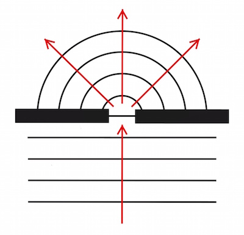{ height=250px }

Die Wellen werden am Spalt gebeugt, also abgelenkt und breiten sich hinter dem Spalt kugelförmig in sogenannten Elementarwellen aus.

#### Interferenz
Die Überlagerung von Wellen wird als Interferenz bezeichnet. Dabei sind zwei Fälle von besonderer Bedeutung: konstruktive Interferenz und destruktive Interferenz. Bei konstruktiver Interferenz verstärken sich die einzelnen Wellen, bei destruktiver Interferenz löschen sich die Wellen gegenseitig aus.

Damit konstruktive oder destruktive Interferenz zwischen den Wellen auftritt, müssen die Wellen einen bestimmten Gangunterschied (Wegdifferenz) $\Delta s$ besitzen.

Für konstruktive Interferenz, muss der Gangunterschied ein vielfaches der Wellenlänge $\lambda$ sein. ($\Delta s=n\cdot\lambda$)

Für destruktive Interferenz, muss der Gangunterschied $\Delta s=(n+\dfrac{1}{2})\cdot\lambda$ betragen.

### Bremsstrahlung
Die Bremsstrahlung (auch Röntgenstrahlung) entsteht bei der Erzeugung in der [Röntgenröhre](#röntgenröhre).

#### Entstehung der Bremsstrahlung
Die Elektronen werden im elektrischen Feld beschleunigt und nehmen dabei die kinetische Energie
$$\tag*{auf.}\text{E}_\text{kin}=\dfrac{1}{2}m\cdot v^2 = \text{e}\cdot\text{U}_\text{B}$$
Beim Aufprall auf die Anode werden die Elektronen sehr stark abgebremst. Ihre Energie kann dabei ganz oder teilweise auf ein Photon (Röntgenquant) übertragen werden. Das entstehende Spektrum ist kontinuierlich mit einer kürzesten Wellenlänge $\lambda_0$ bzw. $\lambda_\text{min}$ (max. Photonenenergie).

$$\text{E}_\text{Ph}=h\cdot f=\dfrac{h\cdot c}{\lambda}$$

$$\text{E}_\text{kin}= \text{e}\cdot\text{U}_\text{B}$$

Energieerhaltungssatz EES
$$\dfrac{h\cdot c}{\lambda}=\text{e}\cdot\text{U}_\text{B}$$

#### Diagramm
{ height=250px }

**Hinweis:** In dieser Grafik ist auf der Querachse die Wellenlänge aufgetragen, dies ist aber nicht immer der Fall, da manchmal auch die Frequenz aufgetragen ist!

#### Messung des Spektrums

Zur Messung wird folgender Aufbau genutzt, um das Spektrum mit der [Bragg-Reflexion](#bragg-reflexion) zu messen. Dabei wird ein Kristall mit Röntgenstrahlung bestrahlt. Die am Kristall reflektierte Röntgenstrahlung wird mit Hilfe eines Zählrohrs gemessen:

{ height=250px }

### Bragg-Reflexion
In einigen Fällen beobachtet man, dass Wellen an regelmäßigen Strukturen nur unter ganz bestimmten Winkeln besonders stark reflektiert werden. Diese Winkel werden Glanzwinkel genannt, sie sind von der Wellenlänge und dem Strukturabstand abhängig. Die Bedingung wird als Bragg-Bedingung bezeichnet, die Reflexion als Bragg Reflexion. Es ist eine Interferenzerscheinung.

Typisch ist, dass Reflexion nicht nur an der Oberfläche erfolgt, sondern die Welle auch tief in das Material eindringen. Dies ist z.B. bei [Röntgenstrahlung](#bremsstrahlung) der Fall. Bragg Reflexion wird typisch bei Wellenlängen beobachtet/genutzt, die in der gleichen Größenordnung oder kleiner als die Gitterkonstante ist. Als Gitter werden Kristallgitter eingesetzt. Die Atome in Kristallen haben konstante Abstände, im einfachsten Fall in allen Richtungen die gleichen. Die Atome bilden Streuzentren für die einlaufende Welle. Das bedeutet, von jedem Atom geht in alle Richtungen eine Elementarwelle aus. Genzeichnet wurden hier aber nur die Ausbreitungsrichtungen, die für konstruktive Interferenz in Reflexionsrichtung von Bedeutung sind.

{ height=250px }

Zwei Bedingungen müssen erfüllt sein:

1. "Normale Reflexion":
   
    An jeder Gitterebene (z.B. Oberfläche des Kristalls) wird an jedem Atom die einlaufende Welle gestreut. FÜr die Richtung Einfallswinkel = Ausfallswinkel entsteht konstruktive Interferenz, da die Welle ausgehend keinen Gangunterschied zur Welle einlaufend hat.

2. Bragg Reflexion:

    Ein Teil der Welle dringt tiefer in den Kristall ein und wird dann an tieferliegenden Ebenen gestreut. Diese Anteile haben den Gangunterschied $2\cdot\Delta s$ gegenüber den gestreuten Anteilen aus der darüberliegenden Ebene. Konstruktive Interferenz kann nur entstehen, wenn dieser Gangunterschied ein vielfaches der Wellenlänge ist.

Treffen beide Bedingungen zu, so entsteht eine kräftige Reflexion in diese Richtung, der Winkel wird daher auch Glanzwinkel genannt. Die zusammengefasste Bedingung wird als Bragg-Beziehung bezeichnet:

$$2\cdot \Delta s=2\cdot a \cdot\sin\beta=\text{k}\cdot\lambda$$

### De Broglie
Auch bewegten Teilchen mit Masse kann eine Wellenlänge zugeordnet werden:

$$\lambda=\dfrac{h}{p}$$

* $h$: Wirkungsquantum
* $p$: Impuls mit $p=m\cdot v$

#### Impuls des Elektrons - Elektronen im E-Feld beschleunigt
EES:

$$
\begin{aligned}
    E_{el}&=E_{kin}\\
    e\cdot U_B&=\dfrac{1}{2}\cdot m\cdot v^2\\
    v&=\sqrt{\dfrac{2\cdot e\cdot U_B}{m}}
\end{aligned}
$$

Somit ist $p=m\cdot\sqrt{\dfrac{2\cdot e\cdot U_B}{m}}$

mit $\dfrac{e}{m}=1,76\cdot10^{11}\text{C}\cdot\text{kg}^{-1}=1,76\cdot10^{11}\dfrac{\text{As}}{\text{kg}}$

### Absorption und Emission
Atome besitzen nur diskrete Energieniveaus. Ein sich selbst überlassenes Atom strebt immer den niedrigsten Energiezustand an (Grundzustand). Atome mit einem erhöhten Energie zustand wird als angeregt bezeichnet

Die **Anregung** erfolgt z.B. durch Absorption eines Photons oder durch äußere Stöße z.B. mit Elektronen ([Franck-Hertz-Versuch](#franck-hertz-versuch), Entladungslampen, ...).

Die **Abregung**, also der Übergang zu einem niedrigen Energieniveau wird auch als Zerfall bezeichnet. Er erfolgt unter Emission (Aussendung) eines Photons mit der passenden Energiedifferenz.
Der energetische Zerfall erfolgt entweder (meist innerhalb kurzer Zeit, z.B. 10 s) spontan oder stimuliert. Die stimulierte Emission wird technisch z.B. beim Laser ausgenutzt.

Weil die **Energiezustände** der gebundenen Elektronen **diskret** sind, können auch nur diskrete Energien aufgenommen (Absorption) oder abgegeben (Emission) werden. Als Ausnahme hiervon muss aber die Grenzenergie beachtet werden. Wird mehr als die **Grenzenergie** zugeführt, so wird ein Elektron vollständig vom Atom abgetrennt (freies Elektron, geht ins Kontinuum über). Das Atom wird also **ionisiert**. Das freie Elektron kann (meistens, hier vereinfachte Darstellung) beliebige 'überschüssige Energie' als kinetische Energie haben.

{ height=250px }

Bei der **spontanen Emission** wird das Photon in **zufälliger Raumrichtung** emittiert.

Bei der **stimulierten Emission** sind beide Photonen **phasengleich** und breiten sich in die **selbe Raumrichtung** aus.

### Fluoreszenz
(Grundlage: [Absorption und Emission](#absorption-und-emission))

Einige Stoffe neigen dazu, von einem höheren angeregten Zustand nicht direkt in den Grundzustand zu zerfallen, sondern zunächst einen weiteren vorhandenen und erlaubten Zustand einzunehmen.

{ height=250px }

Dazu wird der Rücksprung vom angeregten Energieniveau $E_3$ in den Grundzustand $E_1$ z.B. in zwei Sprünge aufgeteilt. Es kann also grundsätzlich nur energiereiche/kurzwellige Strahlung in energieärmere/langwellige Strahlung umgesetzt werden.

Technisch wird dies für Leuchtstoffe ausgenutzt, z.B. für "weiße LEDs".

### Nahfeldinterferenz
Wenn im Gegensatz zur [Beugung am Gitter](#) der Abstand $b$ zwischen zwei Quellen nicht klein gegenüber der Entfernung zum Beobachtungspunkt $E$ ist, dann wird von Nahfeldinterferenz gesprochen. (Beispiele hierfür sind z.B. zwei Tupfer in Wasser, Lautsprecher oder auch Mikrowellen)

#### konstruktive Interferenz
Zur konstruktiven Interferenz kommt es, wenn der Gangunterschied (Wegdifferenz) $\Delta s=n\cdot\lambda$ annimmt.

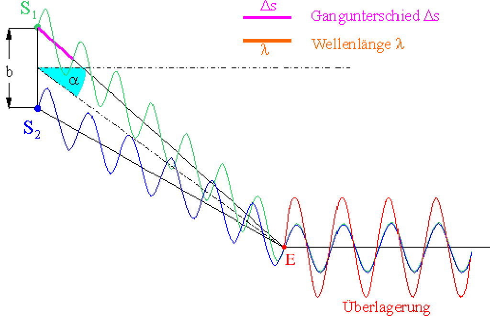{ height=250px }

#### destruktive Interferenz
Zur konstruktiven Interferenz kommt es, wenn der Gangunterschied (Wegdifferenz) $\Delta s=(n-\dfrac{1}{2})\cdot\lambda$ annimmt.

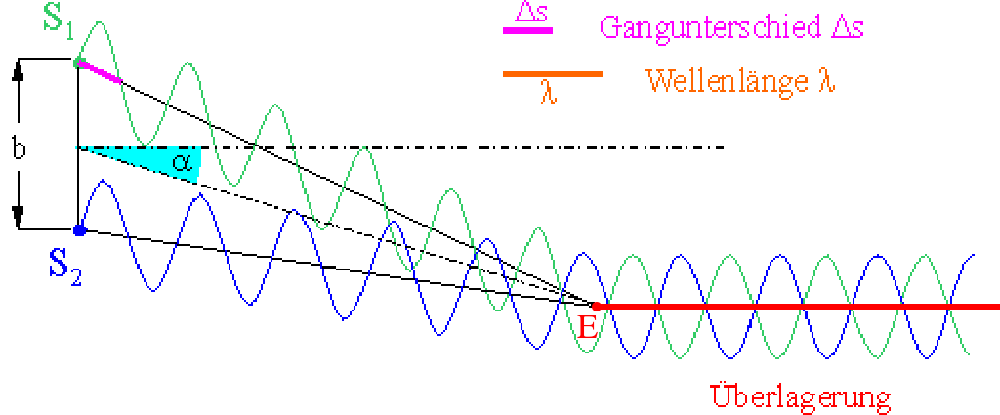{ height=250px }

> In diesen Fällen kann der Gangunterschied ds ganz simple ausgemessen werden mit $\Delta s=\overline{S_1E}-\overline{S_2E}$

# Kernphysik
Atome haben einen Durchmesser von ca. $10^{-10}$m (ungefähr konstant). Aus Streuversuchen (Rutherford) ist bekannt, dass der Kern nur einen Durchmesser von ca. $10^{-14}$m hat (nicht konstant). Der Kern (Nukleus) besteht aus den Kernbaussteinen (Nukleonen) Protonen und Neutronen. **Grobe** Massenangaben
$$
\begin{aligned}
    m_P&=1\text{u}\\
    m_N&=1\text{u}\\
    m_e&=0\text{u}\\
    \text{u-atomare Masseneinheit, }1\text{u}&=1,661\cdot10^{-27}\text{kg}
\end{aligned}
$$

Nukleonen sind auch Quanten. Sind sie im Kern gebunden, so haben sie eine Bindungsenergie. Diese kann näherungsweise mit dem Modell des [linearen Potentialtopfs](#linearer-Potenzialtopf) bestimmt werden.

$$
\begin{aligned}
    E&=-\dfrac{n^2}{8m\cdot l^2}n^2\\\\
    E&=-\dfrac{(6,6261\cdot 10^{-34}\text{J}\cdot \text{s})}{8\cdot 1,661\cdot 10^{-27}\text{kg}\cdot (10^{-15}\text{m})^2}\\
    E&\approx 2\text{MeV}
\end{aligned}
$$

## Elektronen in einem Atom
Elektronen in der Hülle verhalten sich wie Quanten. Ihnen kann kein genauer Ort zu einem Zeitpunkt und keine genaue Geschwindigkeit zugeordnet werden, sie können nicht auf "Elektronenbahnen" umlaufen (Bohr). Ihr Verhalten wird durch die Zustandsfunktion $\psi(\vec{x}, t)$  (psi) beschrieben. Für die Wellenlänge von $\psi$ gilt die De-Broglie-Beziehung $\lambda \cdot p = h$.

$\psi$ oder auch die Amplitude von $\psi$ haben keine unmittelbare physikalische Bedeutung. Das Quadrat der Zustandsfunktion $\psi^2$ hingegen ist hilfreich und beschreibt den Aufenthaltsort als Wahrscheinlichkeit(-sdichte).

$\psi^2(x)\cdot\Delta x$ gibt die Wahrscheinlichkeit an, das Elektron in einem Intervall der Länge $\Delta x$ in der Umgebung des Ortes $x$ zu finden.  
(bzw $\psi^2(x)\cdot\Delta V$ ... in einem Volumen $\Delta V$ in der Umgebung des Ortes $\vec{x}$ ....)

## linearer Potenzialtopf
Die Elektronen in einer Atomhülle können sich nicht völlig frei bewegen. Sie unterliegen z.B. den anziehenden
Coulombkräften des Kerns. Daher werden sie auch als gebundene Elektronen bezeichnet. Das Verhalten
solcher Elektronen soll in einem sehr einfachen Modell untersucht werden.
Das Elektron soll sich nur in einer Richtung bewegen können, auf einer Strecke der Länge L.
Man erreicht diese Einschränkung des Aufenthaltsbereiches dadurch, dass man die potenzielle Energie des
Elektrons außerhalb des Bereiches als unendlich groß annimmt und im einfachsten Fall innerhalb des
Bereiches zu Null setzt. Anschaulich spricht man daher von einem Potenzialtopf, in dem das Elektron gefangen
ist. Um den Potentialtopf zu verlassen, müsste das Elektron eine unendlich große Energie haben und dies ist
nicht möglich. Daher gilt außerhalb des Potenzialtopfs des Länge $L: \psi(x)=0 für x < 0 und x > L$.

Innerhalb des Potenzialtopfs bildet $\psi(x)$ stehende sinusförmige Wellen aus, vergleichbar denen, die Sie
z.B. von Schallwellen oder Mikrowellen zwischen festen Enden kennen.

{ height=250px }

Damit sich stehende Wellen ausbilden, muss gelten: $\lambda_n=\dfrac{2\cdot L}{n}$

Mit De-Broglie ergibt sich der Impuls dann zu: $p_n=\dfrac{h}{\lambda_n}=\dfrac{h\cdot n}{2\cdot L}$

Und damit die kinetische Energie des Elektrons: $E_n=\dfrac{p_n^2}{2\cdot m_e}=\dfrac{h^2\cdot n^2}{8\cdot m_e\cdot L^2}$  
Für den Einheitennachweis kann man das Wirkungsquantum $h$ in Js und eV verwendet, um wieder auf eV zu kommen.

Die Bindung eines Elektrons auf einen begrenzten Raumbereich führt immer zu diskreten Energieniveaus $E_n$.

Die Energieniveaus und die Zustandsfunktion und damit auch die Wahrscheinlichkeitsdichte sind eindeutig durch die Quantenzahl $n$ bestimmt.

## Zerfälle
### Alpha-Zerfall
Ein instabiler Kern wandelt sich ein einen anderen Kern um, indem er ein $\alpha$-Teilchen emittiert.

$$^A_Z\text{X}\Rightarrow^{A-4}_{Z-2}\text{Y}+^4_2\text{He}$$

{ height=250px }

#### Energie
Alpha-Strahlung besteht aus Heliumkernen. Diese haben eine für das instabile Nuklid typische feste Energie im Bereich von MeV.

#### Reichweite
Alpha-Strahlung hat in Luft eine Reichweite von wenigen cm und wird z.B. von einem Blatt Papier absorbiert.

#### Zerfallsreihe
{ height=250px }

### Beta-Zerfall
Es gibt mehrere $\beta$-Zerfälle, hier wird nur der $\beta^-$ Zerfall beschrieben.

Beim $\beta^-$ Zerfall wird ein Neutron des Kerns in ein Proton umgewandelt. Dabei wird unter anderem ein Elektron emittiert.

Damit einige Erhaltungssätze gültig bleiben, muss dabei auch ein weiteres leichtes elektrisch neutrales Teilchen, im falle des $\beta^-$ Zerfalls ein Elektron-Antineutrino, emittiert werden.

$$^A_Z\text{X}\Rightarrow^A_{Z+1}\text{Y}+^0_{-1}\text{e}+ \overline{v}_e$$

{ height=250px }

#### Energie
Das Spektrum von $\beta^-$ Teilchen ist kontinuierlich, es treten also alle Energien bis zu einer Maximalenergie für diesen Zerfall auf. Diese betragen typisch bis zu einigen MeV.

#### Reichweite
Betastrahlung hat in Luft eine Reichweite (energieabhängig) von bis zu mehreren Metern. Eine wenige mm dicke Aluminiumschicht absorbiert Betastrahlung vollständig.

#### Zerfallsreihe
{ height=250px }

### Gamma-Zerfall
Häufig befindet sich ein Kern nach einem vorangegangenem $\alpha$ oder $\beta$-Zerfall noch in einem energetisch angeregtem Zustand die "überschüssige" Energie wird dann als ein (oder mehrere) $\gamma$-Quanten (Photonen) abgegeben. Die Nukleonen bleiben unverändert, dass Nuklid gibt lediglich Energie ab.

$$^A_Z\text{X}^*\Rightarrow^A_Z\text{Y}+\gamma$$

{ height=250px }

#### Energie
Die häufigst auftretende Energie wird genannt. Oft sind verschiedene und mehrere Übergänge möglich. DIe Energien bilden dann ein scharfes charakteristisches Linienspektrum.

#### Reichweite
Gammastrahlung durchdringt Papier und auch größere Aluminiumschichten fast ungehindert und kann nur durch besondere Abschirmungen (z.B. Blei) geschwächt werden.

## Zerfallsgesetz
Wann ein einzelner Kern zerfällt ist nicht vorhersagbar, 'Kerne altern nicht und haben keine Lebensdauer'. Ein instabiler Kern 'entscheidet' sich in jeder Zeiteinheit erneut mit der gleichen Wahrscheinlichkeit, ob er zerfällt (oder nicht). Er hat kein Gedächtnis, so wie z.B. auch ein Würfel kein Gedächtnis hat. Es handelt sich also um einen stochastischen Prozess, $\lambda$ wird die Zerfallskonstante genannt (Wahrscheinlichkeit pro Zeiteinheit zu zerfallen). Sicherlich ist die Anzahl der Zerfälle proportional zur Anzahl der vorhandenen Kerne und zur Zerfallskonstanten. Die Zerfälle reduzieren die vorhandene Anzahl $N(t)$ , so dass zusätzlich ein negatives Vorzeichen eingefügt wird.

Zerfallsgesetz für die Anzahl der Kerne $N(t)$:

$$N(t)=N_0\cdot e^{-\lambda\cdot t}$$

Zerfallsgesetz für die Zerfälle je Zeiteinheit Aktivität $A(t)$:
$$A(t)=A_0\cdot e^{-\lambda\cdot t}$$

Sowohl der Bestand, als auch die Aktivität zerfallen also exponentiell.
Die Zerfallskonstante $\lambda$ kann unhandlich kleine Werte annehmen und ist wenig anschaulich. In Tafelwerken und Nuklidkarten wird daher die anschauliche Größe "Halbwertszeit" $T_{1 / 2}$ ( $T_H$ , $t_h$ )angegeben. Sie gibt an, nach welcher Zeitdauer der Bestand an Kernen auf die Hälfte zerfallen ist, bzw. nach welcher Zeitdauer die Aktivität auf die Hälfte zurückgegangen ist.

Zerfallsgesetze umgeschrieben mithilfe der Halbwertszeit:
$$N(t)=N_0\cdot\Big(\dfrac{1}{2}\Big)^{\frac{1}{T_1/2}}$$

$$A(t)=A_0\cdot\Big(\dfrac{1}{2}\Big)^{\frac{1}{T_1/2}}$$

Nachweisen des Zerfallsgesetz im Messgraphen:

{ height=250px }

## Abstandsgesetz
Wenn sonst keine weitere Behinderung oder Strahlung auftritt, nimm die Intensität der Strahlung einer punkförmigen Quelle mit dem Quadrat des Abstand von der Quelle ab.  
Die Leistung durchsetzt in größerem Abstand eine quadratische anwachsende Fläche. Die Intensität als Leistung pro Fläche nimmt also mit dem Quadrat der Entfernung ab.

$$I\sim Z\sim\dfrac{1}{d^2}$$

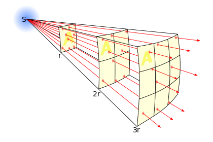{ height=250px }

Man denke sich für das A z.B. die Öffnung eines [Geiger-Müller-Zählrohres](#geiger-müller-zählrohr).

Dieses quadratische Abstandsgesetz gilt nur für punktförmige Quellen und Größen, die mit dem Energiebegriff, wie z.B. Leistung, Leistungsdichte, Intensität, Anzahl von Teilen pro Zeiteinheit, etc.

## Ablenkung von Strahlung
Alpha- und Betastrahlung wird auch als Teilchenstrahlung bezeichnet, da sie aus "klassischen Teilchen" besteht. Alphateilchen sind zweifach positiv geladen, $\beta^-$ Teilchen (Elektronen) einfach negativ.
Damit ergibt sich eine einfache Möglichkeit, die Strahlungsart mithilfe der Ablenkung in einem Magnetfeld zu unterscheiden ([Lorentzkraft](#lorentzkraft)).

{ height=250px }

## Radiokarbonmethode/C-14 Methode
Die Radiokarbonmethode oder auch C-14 Methode wird für die Datierung von kohlenstoffhaltiger, insbesondere organische Materialien.  
$^{14}$C kommt in der Natur so nicht vor. Es sollten nur die Isotope $^{12}$ und $^{12}$ vorkommen. $^{14}$C hat eine Halbwertszeit von 5730 Jahren.

In abgestorbene Organismen nimmt die Menge an $^{14}$C aufgrund des [Zerfallgesetzes](#zerfallsgesetz) ab. Lebende Organismen sind davon nicht betroffen, da diese ständig den "normalen" Anteil an $^{14}$C wieder aufnehmen. Wird die Konzentration eines toten Organismus gemessen, so kann der Todeszeitpunkt mithilfe des [Zerfallsgesetz](#zerfallsgesetz) berechnet werden.

z.B. mit umstellen der Zerfallsgesetze:

$$t=\dfrac{T_{1/2}}{\ln\dfrac{1}{2}}\cdot\ln\Big(\dfrac{N(t)}{N_0}\Big)$$

$$t=\dfrac{T_{1/2}}{\ln2}\cdot\ln\Big(\dfrac{A(t)}{A_0}\Big)$$

In der oberen Atmosphäre wird ständig neues $^{14}$C durch Kernumwandlung () gebildet. Zum einen zerfällt das gebildete Isotop $^{14}$C ständig, zum anderen wird es ständig neu gebildet. Es stellt sich ein Gleichgewicht ein, bei dem genau soviel neu gebildet, wie zeitgleich zerfällt.

Im Gleichgewicht beträgt die Konzentration ca.: $N(^{14}\text{C})=1,2\cdot 10^{-12}\cdot N(^{14}\text{C}_{\text{ges}})$

## Geiger-Müller-Zählrohr
In einem Metallzylinder, der z.B. mit Argon gefüllt ist, ist ein Metalldraht isoliert gespannt aufgehängt. Zwischen dem positiv geladenen Draht und er Hülle herrscht ein radiales elektrisches Feld, das in der Nähe des Drahtes eine sehr große Feldstärke hat.

Tritt ionisierende Strahlung (z.B. $\alpha$, $\beta$, $\gamma$) in das Rohr, so bilden sich entlang der Flugbahn Ionenpaare aus Elektronen und den (schweren) Atomionen. Die Elektronen werden zum Draht hin beschleunigt. Sie erreichen so hohe Energien, dass sie durch Stoßionisation weitere sogenannte Sekundärelektronen aus der Gasfüllung auslösen. Es entsteht eine Elektronenlawine.  
Erreichen diese Elektronen den Draht so führt diese Ladung zu einem Stromimpuls, der über den Wiederstand zur Quelle abfließt. Der Stromimpuls führt zu einem Spannungsimpuls am Widerstand. Die Spannungsimpulse können gezählt werden. **Jedes** eingedrungene **Teilchen** führt zu einem **Spannungsimpuls**.

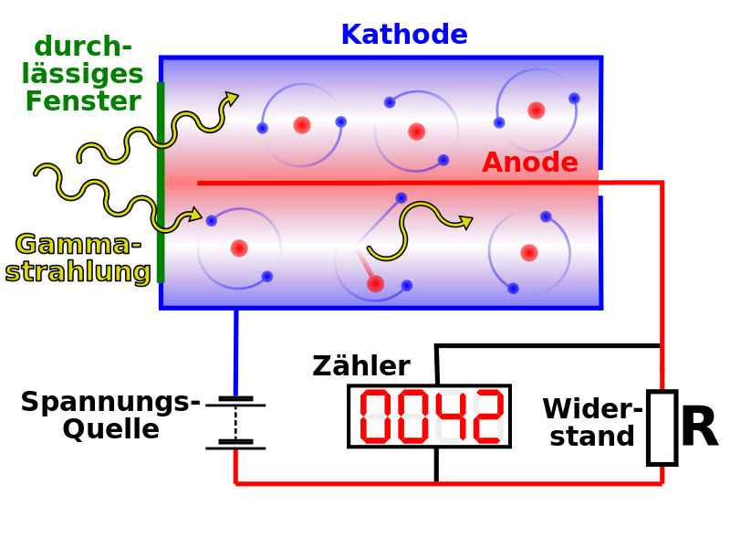{ height=250px }

Die **Impulse** werden **pro Zeiteinheit** gemessen, dies ist die **Zählrate**, z.B. in Impulsen je Sekunde.  
Die Atomionen sind schwer und benötigen einige Zeit, bis sie zur Hülse abgeflossen sind. Das Zählrohr hat eine sogenannte Totzeit, bis es das nächste Teilchen registrieren kann.  
So wie jedes Messgerät für ionisierende Strahlung hat auch das GMZ einen sogenannten Nulleffekt, der auch ohne ein vermessendes Präparat auftritt (Hintergrundstrahlung, Höhenstrahlung, ...). Die ohne Präparat gemessene Strahlung wird als Nullrate bezeichnet.

## Kernspaltung und Kernfusion
### Kernspaltung
Große Kerne, Nuklide mit hoher Ordnungszahl, können durch Neutronen gespalten werden. Dabei entstehen zumeist zwei Bruchstücke mittlerer Größe, die häufig im Massenverhältnis 2:3 stehen. Die frei werdende Energie beträgt ca. 200 MeV und tritt hauptsächlich als kinetische Energie der beiden Bruchstücke auf. Je Spaltung werden typisch 2 bis 3 Neutronen frei, die
nach Abbremsung auf wenige eV für neue Kernspaltungen zur Verfügung stehen.

{ height=250px }

Bei der Kernspaltung eines Uran-235-Isotops durch den Beschuss mit einem langsamen Neutron entsteht in bestimmten Fällen ein Krypton-89-Isotop, ein Barium-144-Isotop und 3 freie Neutronen. 
Bei der Kernspaltung eines Uran-235-Isotops durch den Beschuss mit langsamen Neutronen wird kurzzeitig ein instabiler Zwischenkern (Uran-236) gebildet, welcher in zwei mittelschwere Kernbruchstücke "zerplatzt". Bei diesem Spaltprozess entstehen 2 bis 3 sehr schnelle Neutronen, die nach einer Abbremsung weitere Kernspaltungen auslösen können (Kettenreaktion). Die bei der Spaltung entstandenen Kernbruchstücke sind radioaktiv und zerfallen weiter.

#### Kettenreaktion
Viele Neutronen gehen 'verloren' und stehen für weitere Kernspaltungen nicht zur Verfügung. Führt mindestens genau ein Neutron einer Generation zu einer Kernspaltung der Folgegeneration, so spricht man einer Kettenreaktion. Die Anzahl der genutzten Neutronen je Generation und damit die Anzahl der Kernspaltungen verhalten sich im Zeitverlauf exponentiell, das Verhältnis zur Folgegeneration wird als Multiplikationsfaktor $k$ (oder auch Kritikalität) bezeichnet. Ist die Kritikalität $k > 1$ , so kommt es zu einer unkontrollierten Kettenreaktion, dies wird für Kriegswaffen genutzt. Für die technische Nutzung muss für einen stationären Betrieb $k = 1$ zu jeder Zeit exakt eingehalten werden.

