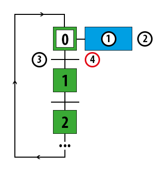

# Lernzettel Technik
## Inhaltsverzeichnis
## Netzwerktechnik
### Begriffe
#### BasisBand
* der gesamte nutzbare Frequenzbereich des Übertragungsmedium steht exklusiv für diese Datenkommunikation zur Verfügung
* Bsp.: analoges Telefon, Dosentelefon, Ethernet, Lautsprecherkabel

#### Breitband
* das nutzbare Frequenzspektrum/die nutzbare Bandbreite eines Übertragungsmediums wird in einzelne, diskrete Bereiche aufgeleitet, die von mehreren Diensten gleichzeitig genutzt werden können
* Bsp.: Luft-Radio, ISDN mit DSL

#### Punkt-zu-Punkt
* zwei Kommunikationspartner sind direkt mit einander verbunden
* Bsp.: Telefon, 2PCs mit TCP-IP

#### Punkt-zu-Mehrpunkt
* ein zentraler Sender, viele Empfänger
* Bsp.: Radio, Bahnhofsdurchsage

#### Mehrpunkt-zu-Punkt
* mehrere Sender, ein zentraler Empfänger
* Bsp.: Anmeldeserver eines Netzwerkes

#### paketorientierte Übertragung
* Daten werden in kleine Pakete verpackt, mit Empfänger- und Absenderadresse versehen und auf die Reise geschickt
* effektive Nutzung der Ressourcen (Kabel)
* Bsp.: Brief, Handy, ISDN

#### NAS
* Network Attached Storage

#### synchrone Datenübertragung
* Sender und Empfänger synchronisieren sich (Übertragungsrate, Takt, ...) und dann werden, nach Senden des Start-Bits, alle Daten gesendet
* schnell
* störanfällig
* Bsp.: Fax

#### asynchrone Datenübertragung
* es gibt ein Signal, das die Daten als gültig erklärt
* oder aber: variable Bit Raten, des Übetragungsprotokolls
* störungsempfindlich
* langsam
* Bsp.: PCI-Bus, Ethernet

#### symmetrische Datenübertragung
* Up- und Downstream sind gleich
* Bsp.: ISDN, Ethernet

#### asymmetrische Datenübertragung
* Up- und Downstream sind ungleich
* Bsp.: T-DSL, Sky-DSL, ADSL

#### Simplex
* Übertragung nur in eine Richtung
* Bsp.: Radio, Fernsehen

#### Duplex
* Übertragung in beide Richtungen gleichzeitig möglich
* Bsp.: Telefon, Handy

#### Halbduplex
* Übertragung in beide Richtungen möglich, aber nur eine Richtung zur Zeit nutzbar
* Bsp.: Walky-Talky

#### leistungsvermittelte Verbindung
* es existiert für die gesamter Dauer der Kommunikation eine fest aufgebaute direkte exklusive Verbindung, auch während der Pause
* ineffektive Nutzung der Ressourcen
Bsp.: Dosentelefon

#### verbingdungsorientiert:
* es wird quittiert, dass die Daten angekommen sind
* Bsp.: "hm ja" des Gesprächspartners

#### datagrammorientiert:
* Daten werden paketweise einfach aud den Weg geschickt
* Bsp.: Postwurfsendung

### Hardware
Netzwerkgeräte (Hub, Switch, Router) erfüllende folgende Aufgaben:

* Paket-Weiterleitung innerhalb eines logischen Netzes
* Verbindung zwischen logischen Netzen herstellen

#### Router
Der Router ist ein Netzwerkgerät welches Netzwerkpakete zwischen mehreren Rechnernetzen weiterleiten kann. Sie arbeiten auf der 3. Schicht (mit der IP-Adresse) des OSI Schichten Modells. Zusätzlich blockiert er Broadcasts vor dem verlassen des Netzwerks.

#### Switch
Ein Switch ist ein Kopplungselement, das mehrere Hosts in einem Netzwerk miteinander verbindet und den Datenaustausch zwischen diesen ermöglicht. In einem Netzwerk mit einer Stern-Topologie dient ein Switch als Verteiler für die Datenpakete. Er arbeitet auf der 2. Schicht (mit der MAC-Adresse) des OSI Schichten Modells.

#### Mac-Adresse
MAC - Media Access Control. Die MAC-Adresse (auch physische Adresse) eines Netzwerkadapters dient als eindeutiger Identifikator des Geräts in einem Netz. Ein Datenpaket benötigt eine Ziel- und Absender MAC-Adresse, um nicht nur basierend auf der IP-Adresse an den richtigen Host, sondern auch an den richtigen Netzwerkadapter zugestellt werden zu können.

### Uebertragungsmedien

| Art                   | Aufbau                                                                |
| :-------------------- | :-------------------------------------------------------------------- |
| **Twisted-Pair**      | meist mit 2 oder mehreren verdrillten Doppeladern                     |
| - UTP                 | ungeschirmt (Unshielded-Twisted-Pair)                                 |
| - STP                 | paarweise mit Aluminiumfolie geschirmt (Shielded-Twisted-Pair)        |
| - S/STP               | paarweise geschirmt mit zusätzlichen Gesamtschirm                     |
| **Lichtwellenleiter** | Kunststoffmantel mit Glaskern                                         |
| - Single-Mode Faser   | einfache Erscheinungsform, ohne Reflexion                             |
| - Multi-Mode Faser    | mehrfache Erscheinungsform, vielfache Reflexion                       |
| **Koaxialleitung**    |
| - Cu-Massiv-Draht     | dicke gelbe Leitung mit massivem Innendraht und Cu-Blechmantel        |
| - Cu-dünner-Draht     | dünnere schwarze Leitung mit Cu-Geflechtmantel und innerer Drahtlitze |

#### Twisted-Pair-Leitungen
Für Punkt-zu-Punkt Verbindungen z.B. vom Switch zu den Teilnehmern, für Halbduplex Datenübertragungen die die Doppelader.

> Leitungslängen: $\le$ 25m bis $\le$ 100m

#### Lichtwellenleiter
Für Punkt-zu-Punkt Verbindungen bei Halbduplexübertragung je Faser (z.B. Switch zu Switch)

> Leitungslängen: bis 3000m

#### Koaxialleitungen
Für Busverbindungen mit mehreren Teilnehmern an einer Leitung

> Leitungslängen:
> 
> * Thick Wire $\ge$ 500m
> * Thin Wire $\ge$ 185m

### Protokolle
#### IP
IP - Internet Protocol.

##### IPv4
Das IP ist eine wichtige Grundlage des Internets. Das Protokoll ist zur Vermittlung von Datenpaketen zuständig. Es wird genutzt Datenpakete zu adressieren und in einem dezentralen, verbindungslosen und paketorientierten Netzwerk zu übertragen. Zusätzlich dient es zur Identifikation eines Hosts und des Netzes.

#### DNS
DNS - Domain Name System. Dieses Protokoll ist für die Namensauflösung zuständig. Das bedeutet, wenn ein Benutzer eine url, wie z.B. google.com, dann wird diese URL von dem Protokoll in eine dezimale IP-Adresse umgewandelt.

#### DHCP
DHCP - Dynamic Host Configuration Protocol. Dieses Protokoll ist dafür zuständig automatisch Clients des Netzwerks Netzwerkonfigurationen zu zuweisen. Dies wird von einem DHCP Server gemacht. Inhalte dieser Konfigurationen sind unter anderem:

* IP-Adresse und Subnetzmaske
* Default-Gateway
* DNS-Server Adresse
* ...

> Server bzw. oft verwendete Geräte werden jedoch meist mit statischen Adressen versehen, um zu verhindern, dass Nutzer bzw. Zugriffe auf diesen Server die ändernde IP-Adresse suchen müssen. So werden z.B Drucker und Server eine statische Adresse zugewiesen.


#### ARP
ARP - Address Resolution Protocol. Das Protokoll ist dafür da einer MAC-Adresse eine IP-Adresse zuzuordnen. Diese Informationen sind wichtig um ein Paket über das Netzwerk nicht nur an den richtigen PC, sondern auch an die richtige Netzwerkschnittstelle zu schicken. Diese Informationen werden zusätzlich in sogenannten ARP-Tabllen von z.B. PCs und Switches gespeichert.

### Subnetze
Ein Netzwerk kann in mehrere kleine Netze, sogenannte Subnetze unterteilt werden, um z.B. die Netzlast sinnvoll und geordnet zu verteilen. Diese Subnetze werden daher oft nach örtlichen Gegebenheiten oder auch organisatorischen Punkten eingeteilt (z.B. alle Hosts der Abteilung "Verkauf" in einem Subnetz). Die **Subnetzmaske** spielt hierbei eine sehr wichtige Rolle. Sie legt fest wie groß der Host- bzw. der Netzanteil ist, also wie viele Netze gebildet werden können und demnach auch wie groß / wie viele Hosts diese beinhalten. Um es sich einfach zu machen kann man die Subnetzmaske zuerst in die binäre Darstellung umwandeln. Bsp.: Ein Netwerk mit der Adresse 192.168.210.0 und der Subnetzmaske 255.255.255.0:

> 225.225.225.0 entspricht 11111111.11111111.11111111.00000000

> Die Subnetzmaske kann auch mit einem "/" dargestellt werden. Eine Adresse plus Subnetzmaske sieht dann aus wie: 192.168.210.0/24. Die 24 sagt aus wie viele Bits für den Netzanteil genutzt werden

Diese Adresse legt fest, dass die ersten 3 Byte für das Netzwerk stehen. Die letzten 8 Bit sind demnach der Hostanteil. Somit ist eine mögliche IP-Adresse eines Hosts 192.168.210.57.

Möchte man dieses Netzwerk nun aber unterteilen, muss die Subnetzmaske abgeändert werden. Hierzu werden einfach die benötigten Bits auf 1 gesetzt. Dies ermöglicht diese neu-hinzugefügten Bits zum Indeninfizieren des Netzwerks zu benutzten. Die Formel für die Berechnung der benötigten Bits lautet $N=2^n-2$ ($N$ für Anzahl der Subnetze, $n$ für Anzahl der Bits). Werden also 4 Subnetze in diesem Netzwerk benötigt, dann müssen wir laut der Formel 3 Bits in der Subnetzmaske zusätzlich auf 1 setzen.

> Aus
> 
> 11111111.11111111.11111111.00000000
> 
> wird also
> 
> 11111111.11111111.11111111.11100000 bzw. 255.255.255.224

Die Netzwerke können dann einfach mit den drei neuen Bit berechnet werden:

| Subnetz |  128  |  64   |  32   | Netzadresse     |
| :-----: | :---: | :---: | :---: | :-------------- |
|    0    |   0   |   0   |   0   | 192.168.210.0   |
|    1    |   0   |   0   |   1   | 192.168.210.32  |
|    2    |   0   |   1   |   0   | 192.168.210.64  |
|    3    |   0   |   1   |   1   | 192.168.210.96  |
|    4    |   1   |   0   |   0   | 192.168.210.128 |
|    5    |   1   |   0   |   1   | 192.168.210.160 |
|    6    |   1   |   1   |   0   | 192.168.210.192 |
|    7    |   1   |   1   |   1   | 192.168.210.224 |

Mit diesen Netzadressen lasse sich jetzt der erste Host, der Letzte Host und die Broadcastadresse des Netzes berechnen.

#### Der erste Host
Der **erste Host** eines Netzwerkes kann berechnet werden, indem der erste Bit des Hostanteils auf 1 gesetzt wird. In dem Subnetz 0 ist der erste Host z.B. 192.168.210.1 und im Subnetz 1 192.168.219.33. Der erste Host ist die erste Adresse nach der Netzadresse.

#### Der letzte Host
Der **letzte Host** des Netzwerks wird ermittelt, indem alle Bits den Hostanteils - bis auf der das letzte - auf 1 gesetzt. In dem Subnetz 2 ist der letzte Host z.B. 192.168.210.94 und im Subnetz 3 192.168.219.126. Der letzte Host ist die letzte Adresse vor der Broadcastadresse.

#### Die Broadcastadresse
Die **Broadcast Adresse**, also die Adresse, die genutzt wird, um ein Paket an alle Mitglieder des Netzes zu schicken, wird ermittelt indem einfach alle Bits des Hostanteils auf 1 gesetzt werden. Somit sind die Broadcastadressen für das Subnetz 4 192.168.210.159 und das Subnetz 5 192.168.210.191. Die Broadcastadresse ist die letzte Adresse des Netzwerks.

### VLan
VLan - Virtual Local Area Network. Ein VLan ist ein logisches Teilnetz, welches auf einem physischen LAN aufsetzt und mehr Flexibilität, Leistung und Sicherheit bietet. Hierfür ist ein VLan-fähiger Switch nötig. VLans kann man sich so vorstellen, als würde man diesen Switch in mehrere kleine aufteilen. Zwei verschiedene VLans können nicht sehen was andere VLans machen, so bieten sie eine kostengünstige Alternative die Netzwerksicherheit zu erhöhen.

### Firewall
Eine Firewall ist ein Sicherungssystem, welches ein PC oder auch ein ganzes Netzwerk vor unerwünschten Zugriffen schützt. Die Firewall entscheidet basierend auf festgelegten Regeln, ob Netzwerkzugriffe zugelassen werden je nach Absender oder Ziel des genutzten Dienstes.

## Backup
### inkrementelles Backup
Beim inkrementellen Backup wird eine Vollsicherung des Datenbestandes durchgeführt. Anschließend werden Sicherungen zum letzten Backup gemacht. Das bedeutet, dass beim dersten Mal eine Sicherung der Veränderungen seit dem letzten Backup (egal ob inkrementell oder Vollbackup) gemacht werden. Zur Wiederherstellung des Datenbestandes werden alle Bänder benötigt. Fehlt eines der Bänder bzw. ist eine Sicherung nicht vorhanden, ist eine Wiederherstellung des gesicherten Datenbestands nicht möglich.


* Vorteile:
  * Einfaches Verfahren
  * niedriger Speicherbedarf(wegen der kleinen inkrementen Backups)
  * Wiederherstellung der Daten zu jedem Backupzeitpunkt möglich
* Nachteile:
  * Es sind das Vollbackup und **alle** seitdem gemachten Bänder notwendig

### differentielles Backup
Das differentielle Backup ist dem inkrementellen Backup sehr ähnlich. Es wird erneut eine Vollsicherung gemacht. Anschließend werden die Veränderungen zum letzten Vollbackup gesichert. Demnach ist zur Wiederherstellung des Datenbestandes das Vollbackup und das gewünschte differentielle Backup notwendig.


* Vorteile:
  * weniger Speicherbedarf als bei Vollbackup
  * Vollbackup und nur die differentielle Sicherung zum gewünschten Zeitpunkt notwendig
* Nachteile:
  * Dateien, die einmal verändert werden, müssen bei jedem differentiellen Backup neu gesichert werden. Dadurch hat man ein erhöhtes Datenaufkommen

### Vollbackup
Beim Vollbackup wird der komplette Datenbestand gesichert. Um verlorene Daten wieder herzustellen, wird das entsprechende Vollbackupmedium benötigt.


* Vorteile:
  * Ein Band zur Wiederherstellung notwendig
  * einfache Wiederherstellung
* Nachteile:
  * Sehr hoher Speicherbedarf
  * im mehrere Versionen zu haben, müssen mehrere Sicherungsbänder aufbewahrt werden.

### in einer Firma
* am besten: 3 Kopien
  1. Kopie: mit der man arbeitet
  2. Kopie: lokal gesichert (NAS, Festplatten)
  3. Kopie: räumlich entfernt gesichert (cloud)
* Restore kann bei kompletter Programm/Datei wiederherstellung sehr lange dauern

## Verschlüsselung
### symmetrische Verschlüsselung
* beide Kommunikationspartner benötigen den gleichen Schlüssel
* 1 Schlüssel zum Ver- und Entschlüsseln
* Schlüssel muss auf einen gesicherten Übertragungskanal übertragen werden
* schnell im Vergleich zum asymmetrischen
* evtl. hohe Schlüsselzahl

> Schlüsselzahl für $n$-Personen = $n$ $\cdot$ $\frac{n-1}{2}$

symmetrische Verfahren/Protokolle

* DES/3DES
  * 56Bit (3 * 56Bit)
* AES (advanced encryption stand)
  * 128, 192, 256 Bit Schlüssel
* RC4 (Rivest Cypher 4)
  * 128 Bit Schlüssel

### asymmetrische Verschlüsselung
* für jede Person wird Schlüsselpaar generiert
* 1x Geheimschlüssel (**secret key**) wird zum Entschlüsseln einer Nachricht genutzt
* 1x öffentlicher Schlüssel (**public key**) wird zum Verschlüsseln einer Nachricht genutzt
* Schlüsselaustauschproblematik entfällt
* sehr rechen- und zeitaufwendig; ca. 1000mal langsamer als symmetrischer Verschlüsselung
* Unklar, ob der verwendete **public key** auch wirklich demjenigen gehört, dem man die verschlüsselte Nachricht schicken will, PKI = public key infrastructure

Asymmetrische Verfahren/Protokolle

* RSA $\ge$ 512 Bit
* DSS $\ge$ 512 Bit

### Hybrides Verschlüsselungssystem/verfahren
Verschlüsselung:

1. Sender verschlüsselt Dokument symmetrisch (Geschwindigkeit)
2. Der symmetrische Schlüssel (**session key**) wird asymmetrisch verschlüsselt (public key des Empfängers)
3. Verschlüsselte Nachricht und verschlüsselter Schlüssel werden vom Sender zum Empfänger geschickt.

Entschlüsselung:

1. **session key** wird mit **private key** des Empfängers  entschlüsselt
2. Mit entschlüsseltem **session key** (symmetrischer Schlüssel) kann Nachricht entschlüsselt werden.

Hybride Verfahren/Protokolle

* PGP
  * Email Verschlüsselung (GPG)
* SSL/TLS
* IPSec

## Raid
Ein Raid ist ein Verbund aus mehreren Festplatten, mit dem Ziel, der Datensicherheit und/oder die Geschwindigkeit der Datenübertragung zu erhöhen.

* Raid kann vollwertiges Backup auf andere Speichermedien nie ersetzen
* alle Änderungen sofort niedergeschrieben
* möglich verursachte Schäden können nicht rückgängig gemacht werden

### Raid 0
Dieses Raid fasst mehrere (min. 2) zu einer großen Festplatte zusammen. $\rightarrow$ Alle Daten werden unter den verfügbaren Festplatten verteilt.

* dadurch wird die Schreib- und Lesegeschwindigkeit erheben gesteigert
* Wahrscheinlichkeit von Datenverlust gesteigert
  * Sobald Teil des Arrays ausfällt sind alle Daten darauf verloren

### Raid 1
Normaler Schutz vor Ausfällen einzelner Festplatten (min. 2) erreicht. Die Daten werden 1:1 auf die andere gespielt.

### Raid 5
Meist genutztes Modell. Hierfür sind mindestens 3 Festplatten benötigt. Die Daten werden ähnlich verteilt wie bei Raid 0, auf verschiedene Festplatten. 

* ebenfalls abwechselnd auf die einzelnen Festplatten verteilt $\rightarrow$ nie auf selbe wie Original!
* Zusätzlich: Bestimmung der Parität
* eine Festplatte kann ausfallen ohne verlust
* benötigt aufgrund der Parität deutlich mehr Rechenleistung als Raid 0 und 1

## Steuerungstechnik
### Drahtbruchsicherheit
Eine Steuerung ist drahtbruchsicher, wenn das Einschalten durch einen Schließer (Arbeitsstromprinzip) und das Ausschalten durch einen Öffner (Ruhestromprinzip) erfolgt. Bei Auftreten eines Drahtbruches erfolgt **kein unbeabsichtigtes Einschalten**, jedoch wird eine **eingeschaltete Steuerung abgeschaltet**.

### Regelung - Steuerung

#### Regelung
> eine ist-Größe wird erfasst und mit einer soll-Größe verglichen und wenn nötig angepasst

#### Steuerung
> es gibt nur eine ist-Größe und diese wird nicht verändert, keine Rückwirkung odder Vergleich. offender Wirkungsablauf

### Zuordnungstabelle

Eingänge:

| Eingang       | Kennzeichnung | log. Zuordnung |
| :------------ | :-----------: | :------------- |
| Taster öffnen |      S1       | Betätigt S1=1  |

Ausgänge:

| Ausgang          | Kennzeichnung | log. Zuordnung |
| :--------------- | :-----------: | :------------- |
| Zylinder Tür auf |      M1       | fährt ein M1=1 |

### R-S Tabelle
| Setzen/Rücksetzen | Selbsthalterelais 1 | Selbsthalterelais 2 |
| :---------------- | :-----------------: | :-----------------: |
| Setzen            |   Setz-Bedingung    |   Setz-Bedingung    |
| Rücksetzen        | Rücksetz-Bedingung  | Rücksetz-Bedingung  |

### Schrittkette


Legende:

1. Aktion Ausgang
2. Schritt Bezeichnung
3. Name der Bedingung
4. Bedingung 

* grün: **Schritt**
* rot: **Transition** (Weiterschaltbedingung)
* blau: **Aktion**

#### Funktionsablauf

* **Schritt** und **Transition** wechseln sich immer ab.
* Der Anfangsschritt (Doppelquadrat) ist die Einsprungstelle für das SPS-Programm.
* In der linearen Schrittkette ist immer nur ein **Schritt** gesetzt.
* Der Vorgängerschritt setzt zusammen mit der **Transistion** (UND-Verknüpfung) den Nachfolgeschritt auf 1.
* Der aktivierte **Schritt** setzt den Vorgängerschritt auf 0 zurück und führt seine **Aktion** (Befehl) aus.

#### Umsetzung on LOGO


## Java 
### Datentypen
#### einfache Datentypen
| Name    | Größe           |                           Wertebereich                            |
| :------ | :-------------- | :---------------------------------------------------------------: |
| boolean | 1 Byte = 8 Bit  |                       **true** , **false**                        |
| char    | 2 Byte = 16 Bit |                       **-128** bis **+127**                       |
| int     | 4 Byte = 32 Bit |             **-2.147.483.648** bis **+2.147.483.647**             |
| long    | 8 Byte = 64 Bit | **-9.223.372.036.854.775.808** bis **+9.223.372.036.854.775.807** |
| float   | 4 Byte = 32 Bit |                 **-10$^{38}$** bis **+10$^{38}$**                 |

#### komplexe Datentype
| Name       | Größe                               |
| :--------- | :---------------------------------- |
| String     | beliebig lange Zeichenketten        |
| BigInteger | beliebig große ganz Zahlen          |
| Color      | 16.777.216 Farben im RGB-Farbmodell |
| File       | beliebige Dateien                   |

### Klassen
#### Deklaration
```java
public class KlassenName {
    ...
}
```

#### Konstruktor
Der Konstruktor ist eine Methode der Klasse ohne einen Rückgabewert. Der Konstruktor einer Klasse wird aufgerufen sobald ein neues Objekt einer Klasse erzeugt wird. Die Methode muss mit dem Klassennamen deklariert.

```java
public KlassenName(datenTyp parameterName) {
    ...
}
```

#### Beispiel
```java
public class Schueler {
    private Name;
    private Vorname;

    public Schueler(String Name, String Vorname) {
        this.Name = Name;
        this.Vorname = Vorname;
    }

    public void setName(String Name) {
        this.Name = Name;
    }

    public String getName() {
        return Name;
    }
}
```

### Methoden
#### Deklaration
Eine Methode wird deklariert indem zuerst ihr Umfang/ihre Reichweite angegeben wird. Mögliche Werte sind: `public` oder `private`.

> `public` ermöglicht es außerhalb der Klasse auf die Methode zuzugreifen und sie ausführen zu können.

> `public` limitiert den Zugriff auf nur in der eigenen Klasse.


Weiterhin muss angegeben werden, ob eine Methode `static` oder dynamisch ist. Bei einer statischen Methode muss bei der Deklaration zusätzlich `static` nach der Reichweite angegeben werden. Ist die dynamisch, wird dies einfach weggelassen und es folgt der Rückgabewert.

> dynamische Methoden erfordern ein Objekt der Klasse um verwendet werden zu können.
```java
KlassenName referenz = new KlassenName();
referenz.methodenName();
```

> `static` Methoden können aufgerufen werden, ohne dass ein Objekt der Klasse vorhanden ist.
```java
KlassenName.methodenName();
```

Danach folgt der Rückgabewert. Hier muss der Rückgabewert der Klasse angeben werden. Dieser kann z.B. ein *Integer*, ein *String* oder auch ein eigener Datentyp sein. Wenn eine Methode ein Rückgabewert hat, muss dieser mit `return` im Methodenkörper zurückgegen werden, hat sie keinen kann dies weggelassen werden, jedoch muss dann in in der Deklaration `void` als Datentyp angegeben werden.

Nun folgt der Methodenname, welcher konventioneller Weise in 'camelCase' geschrieben wird, das bedeutet der Anfangsbuchstabe wird kleingeschrieben und jedes neue folgende Wort wird mit einem Großbuchstaben begonnen. Beispiel `methodenName`. Zusätzlich sollte der Name einer Methode ihre Aufgabe/Funktion möglichst genau beschreiben, wie z.B. `getVar` und `setVar`.

Parameter, welche beim Aufruf der Methode an diese übergeben werden soll, werden nach dem Methodennamen in Klammer '()' führend mit ihrem Datentyp angegeben. Im folgenden Beispiel wird zum Beispiel ein Parameter mit dem Datentype *String* an die Methode weitergegeben und kann ab dann im Methodenkörper unter der Referenz 'Name' genutzt werden.
```java
public void setName(String Name) {}
```

#### Beispiel
dynamische, öffentliche Methode ohne Rückgabewert und mit Parameter
```java
public void setName(String Name) {
    this.Name = Name;
}
```

statische, private Methode mit Rückgabewert des Types *Integer* und ohne Parameter
```java
private static int getTime() {
    return 1548341291;
}
```

### Verzweigungen
#### if else
Bei einer einfachen Verzweigung wird die Bedingung überprüft. Wenn diese erfüllt ist, wird der folgende Code-Block ausgeführt, wenn nicht, dann springt das Programm in den Code-Block, welcher zu `else` gehört.
```java
if(counter > 255) {
    counter == 255;
} else {
    counter++;
}
```
Bedingung lassen sich mit den folgenden Operatoren bilden

| Operator | Bedeutung      |
| :------: | :------------- |
|    ==    | ist gleich     |
|    !=    | ungleich       |
|    <     | kleiner als    |
|    >     | größer als     |
|    <=    | kleiner gleich |
|    >=    | größer gleich  |

**Hinweis:** Diese Operatoren gelten nur für Zahlen

> Die Gleichheit von *String*-Objekten wird über die Methode `equals` überprüft

```java
if(String1.equals("Hallo")) {
    ...
}
```
Bedingungen lassen sich zusätzlich durch **logische Operatoren** kombinieren.

| Operator | Bedeutung      |
| :------: | :------------- |
|    &&    | logisches und  |
|   \|\|   | logisches oder |

```java
if(zahl > 50 && zahl < 100){
    ...
}
```

#### if else-if

Falls weitere Verzweigungen benötigt werden, wird die oben erläuterte Verzweigung um ein `else if` und einer weiteren Bedingung erweitert.

```java
if(Bedingung1) {
    ...
} else if (Bedingung2) {
    ...
} else {
    ...
}
```

### Schleifen
#### for-Schleife
Eine **for-Schleife** wird verwendet wenn man z.B. eine bestimmte Anzahl an Durchgängen ausführen möchte. In diesem Falle zählt die die Schleife von 0 bis 49. Als erstes wird ein *Integer* deklariert, definiert und auf den gewünschten Startwert gesetzt(`int i=0`). Auf diese kann man danach nur im Schleifenkörper zugreifen. Oft heißt dieser `i`, Abkürzend für 'Index'. Danach folgt die Bedingung, welche die Schleife begrenzt(`i<50`). Als letztes wird der laufende Wert von `i` erhöht. Dies kann wie in diesem Falle um den Wert 1(`i++`) geschehen, aber z.B. auch bei jeden Durchgang um jeden beliebigen Wert erhöht werden.
```java
for (int i=0; i<50; i++) {
    ...
}
```

#### while-schleife
Eine **while-schleife** wird verwendet, wenn man einen bestimmten Block an Code ausführen solange eine Bedingung wahr ist. Im Gegensatz zur **for-schleife** wird dieser Wert jedoch nicht automatisch bei jeden Durchlauf erhöht.
```java
while (time < 4000) {
    ...
}
```
Eine besondere Version der **while-Schleife** ist die Endlos-Schleife, bei der der Wert der Bedingung auf den booleschen Wert `true` gesetzt wird. Somit ist die Bedingung immer erfüllt und die Schleife wird endlos lange ausgeführt.
```java
while (true) {
    ...
}
```

### Netzwerk
#### Multicast-Sender
Objekte dieser Klasse sind Mitglied in einer Multicast-Gruppe und können Informationen über ein Netzwerk gleichzeitig an alle Mitglieder der Gruppe versenden.
```java
MulticastSender mcs = new MulticastSender(ip, port);
```
> Die Adresse des MulticastSenders muss zwischen 224.0.0.0 und 239.255.255.255 liegen.


Methoden:

Mit der Methode `send()` wird der Parameter des Datentyps *String* an alle Mitglieder der Multicast-Gruppe gesendet.
```java
mcs.send("Hallo");
```

Mit der Methode `close()` wird die Verbindung geschlossen.

#### Multicast-Receiver
Objekte dieser Klasse sind Mitglied in einer Multicast-Gruppe und können Informationen über ein Netzwerk von den Mitgliedern dieser Gruppe empfangen.
```java 
MulticastReceiver mcr = new MulticastReceiver(ip, port);
```
> Die Adresse des MulticastSenders muss zwischen 224.0.0.0 und 239.255.255.255 liegen.


Methoden:

Mit der Methode `receive()` können Informationen vom Netzwerk empfangen werden. Die Methode gibt diese als eine Referenz auf ein Objekt der Klasse *String* zurück.
```java
String result = msr.receive();
```


#### Simple-Client
Objekte dieser Klasse können mit Serverprogrammen kommunizieren. Um mit einem bestimmten Server zu kommunizieren, kann an den Konstruktor die IP-Adresse als *String* und den Port als *Integer* als Parameter übergeben werden.
```java
SimpleClient sc = new SimpleClient(ip, port);
```

Mit der Methode `openConnection()` wird versucht eine Verbindung zum Host aufzubauen. Da die Methode eine Ausnahme ausgibt, muss diese behandelt werden. Dies kann durch ein `throws Exception` oder ein `try`-`catch` Block gelöst werden.

Lösung 1:
```java
public void senden(String msg) throws Exception {
    sc.openConnection();
}
```

Lösung 2:
```java
try {
    sc.openConnection();
} catch (Exception as e) {
    ...
}
```

### Konfigurations-Datei
Mit der Klasse `PrefsFileStore` können Informationen in einer Datei unter einem Schlüssel gespeichert und wieder abgerufen werden.

Der Konstruktor der Klasse braucht den Namen der Datei als Parameter. Ist diese nicht vorhanden, wird sie erstellt.
```java
PrefsFileStore pfs = new PrefsFileStore("NameDerTextDatei.txt");
```

Die Konfigurationsdatei muss zusätzlich folgendermaßen strukturiert sein:

``` 
#Kommentar 
schuluessel1 = wert1
schuluessel2 = wert2
``` 
#### Speichern eines Wertes
Für das Speichern eines Wertes sind die Methoden `putString()`, `putLong()`, `putInt()` und `putDouble()` zuständig. Als erster Parameter ist der Schlüsselname notwenig, der zweite Parameter ist der Wert der hinterlegt werden soll.

```java
pfs.putString("schluessel1", "wert1"); 
// oder auch
pfs.putInt("schluessel2", 15);
```
#### Lesen eines Wertes
Um Werte der Konfigurationsdatei zu entnehmen, können die Methoden `getString()`, `getLong()`, `getInt()` und `getDouble()` genutzt werden. Sie brauchen ebenfalls als ersten Parameter den Schlüsselnamen, der zweite Parameter ist der Standard Wert, welcher hinterlegt wird, falls der Schlüssel noch nicht vorhanden wird. Die Methoden geben den hinterlegten Wert in ihrem entsprechenden Datentyp zurück.

```java
String s1 = pfs.getString("schluessel1", "Standardwert"); 
// oder auch
int s2 = pfs.getInt("schluessel2", 0);
```

#### Überprüfung der Existenz eines Wertes
Die Methode `keyExists()` der Klasse gibt ein booleschen Wert (`true`, `false`) zurück, welcher aussagt, ob ein schlüssel bereits existiert. Diese Methode benötigt nur einen Parameter, den Schlüssel.

```java
if(keyExists("schluessel1")) {
    ...
}
```

### Threads
Um ein Programm nebenläufig laufen zu lassen, ist neben dem Haupt-Thread (`public static void main(String[] args)`) ein weiterer Thread nötig. Dies kann realisiert werden, indem eine neue Klasse erstellt wird, welche von der Klasse `Thread` durch eine Erweiterungen mit `extends Thread` erben muss. In der neuen Klasse muss die vererbte Methode `run` überschrieben werden. Um sicherzugehen, dass keine neue Methode deklariert wird, wird über der Deklaration ein `@override` geschrieben. Dies versichert, dass falls der Name, der Rückgabewert oder die Parameter falsch ist/sind, wird ein Fehler angezeigt.

> Um ein Thread zu starten, kann die Methode `start()` des Objekts der neuen Klasse verwendet werden.

Beispiel Thread

```java
public class KlassenName extends Thread
{
    public KlassenName()
    {
        ...
    }

    @Override
    public void run()
    {
        ...
    }
}
```

Aufruf:

```java
KlassenName kn = new KlassenName();
kn.start();
```
### Kommunikation mit einem Server mit telnet
Um herauszufinden wie mit einem Server kommuniziert werden muss, um eine bestimmte Funktion zu erzielen, kann das Programm **telnet** genutzt werden. Dies wird über die Eingabeaufforderung mit **telnet** gestartet. Danach kann die Verbindung mit dem Befehl **open** oder auch **o** folgend mit der IP-Adresse (format: 111.111.111.111), Leerzeichen und dann dem Port mit einem Host/Server hergestellt werden. Abhängig vom Server kann eine Hilfeseite mit den verfügbaren Befehlen aufgerufen werden. Diese können meist mit dem Befehl **help** aufgerufen werden.

Aufruf von telnet:
```
C:\> telnet
```

Öffnen einer Verbindung:
```
Microsoft Telnet> open 127.0.0.1 55555
```

### Frequenz zu Periodendauer
Im Unterricht ist es öfters vorgekommen, dass die Frequenz zur Verfügung steht und man nun mit dieser Frequenz z.B. eine LED blinken zu lassen.

Um die Periodendauer zu berechnen können wir folgende Formel benutzen:

> $$f=\frac{1}{T}\thickspace bzw. \thickspace T=\frac{1}{f}$$

Beispiel: geg.: $f$=20Hz

> $T$ = $\frac{1}{f}$ = $\frac{1}{20Hz}$ = $\frac{1}{20\frac{1}{s}}$

Mit dem Kehrwert multiplizieren

> $T$ = $\frac{1}{20}$s = 0,050s = 50ms

Um die Aufgabe zu verfollständigen, muss man diese Zeit noch durch 2 dividieren, da wir bis jetzt nur die Dauer eines ganzen Vorgangs berechnet haben. Möchten wir aber die LED mit einer Frequenz von 20Hz blinken lassen, ist zwischen den dem Ein- und Ausschalten der LED eine verzögerung von 25ms nötig.

```java
while (true) {
    LampSimulator.setOn();
    Tools.delay(25);
    LampSimulator.setOff();
    Tools.delay(25);
}
```